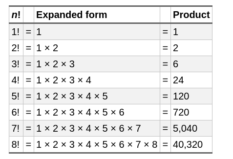

# Recursão VS. Iteração

> Nem a recursão nem a iteração são técnicas superiores em geral. Na verdade, qualquer código recursivo pode ser escrito como código iterativo com um loop e uma pilha. A recursão não tem nenhum poder especial que lhe permita realizar cálculos que um algoritmo iterativo não consegue. E qualquer loop iterativo pode ser reescrito como uma função recursiva.

## Sumário

- [Calculando Fatoriais](#calculando-fatoriais)

## Calculando Fatoriais

O fatorial de um número inteiro (vamos chamá-lo de n) é o produto de todos os números inteiros de 1 a n . Por exemplo, o fatorial de 4 é 4 × 3 × 2 × 1, ou 24. Um ponto de exclamação é a notação matemática para fatoriais, como em `4!`, que significa o fatorial de 4 .

Claro! Aqui está o texto aprimorado:

---

Fatoriais são usados em diversos tipos de cálculos, como para encontrar o número de permutações de um conjunto. Por exemplo, se você quiser saber quantas maneiras existem de ordenar quatro pessoas — Alice, Bob, Carol e David — em uma fila, a resposta é o fatorial de 4.

Para determinar isso:

1. Existem quatro opções para a primeira posição na fila (4).
2. Para cada uma dessas quatro opções, restam três pessoas que podem ocupar a segunda posição (4 × 3).
3. Para cada uma dessas configurações, restam duas pessoas para a terceira posição (4 × 3 × 2).
4. A última pessoa restante ocupará a quarta posição (4 × 3 × 2 × 1).

Portanto, o número de maneiras de ordenar essas quatro pessoas em fila — isto é, o número de permutações — é igual ao fatorial de 4 (4!).

