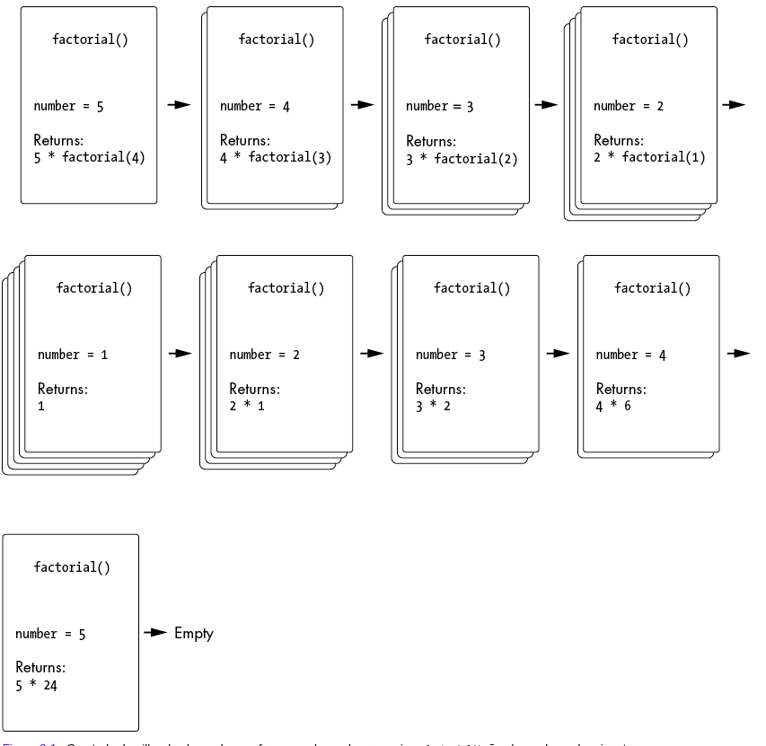
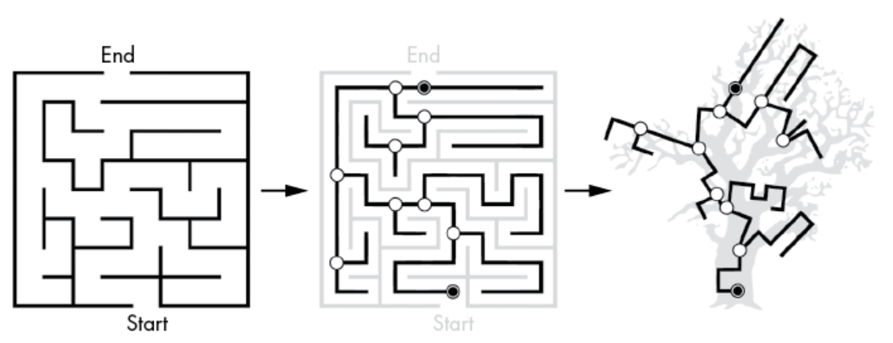
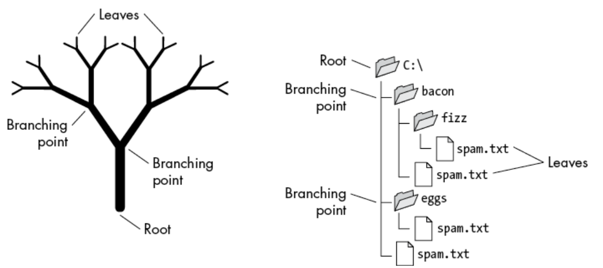

# Recursão VS. Iteração

> Nem a recursão nem a iteração são técnicas superiores em geral. Na verdade, qualquer código recursivo pode ser escrito como código iterativo com um loop e uma pilha. A recursão não tem nenhum poder especial que lhe permita realizar cálculos que um algoritmo iterativo não consegue. E qualquer loop iterativo pode ser reescrito como uma função recursiva.

## Sumário

- [Calculando Fatoriais](#calculando-fatoriais)
    - [O Algoritmo Fatorial Iterativo](#o-algoritmo-fatorial-iterativo)
    - [O Algoritmo Fatorial Recursivo](#o-algoritmo-fatorial-recursivo)
    - [Por que o algoritmo fatorial recursivo é terrível](#por-que-o-algoritmo-fatorial-recursivo-é-terrível)
- [Quando você precisa usar a recursão?](#quando-você-precisa-usar-a-recursão)
- [Criando Algoritmos Recursivos](#criando-algoritmos-recursivos)
- [Referências](#referências)

## Calculando Fatoriais

O fatorial de um número inteiro (vamos chamá-lo de n) é o produto de todos os números inteiros de 1 a n . Por exemplo, o fatorial de 4 é 4 × 3 × 2 × 1, ou 24. Um ponto de exclamação é a notação matemática para fatoriais, como em `4!`, que significa o fatorial de 4 .


Fatoriais são usados em diversos tipos de cálculos, como para encontrar o número de permutações de um conjunto. Por exemplo, se você quiser saber quantas maneiras existem de ordenar quatro pessoas — Alice, Bob, Carol e David — em uma fila, a resposta é o fatorial de 4.

Para determinar isso:

1. Existem quatro opções para a primeira posição na fila (4).
2. Para cada uma dessas quatro opções, restam três pessoas que podem ocupar a segunda posição (4 × 3).
3. Para cada uma dessas configurações, restam duas pessoas para a terceira posição (4 × 3 × 2).
4. A última pessoa restante ocupará a quarta posição (4 × 3 × 2 × 1).

Portanto, o número de maneiras de ordenar essas quatro pessoas em fila — isto é, o número de permutações — é igual ao fatorial de 4 (4!).

Vamos examinar uma abordagem iterativa e recursiva para calcular fatoriais.

### O Algoritmo Fatorial Iterativo

Calcular fatoriais iterativamente é bastante simples: basta multiplicar os inteiros de 1 até n, inclusive, em um loop. Algoritmos iterativos sempre utilizam um loop. Um programa chamado factorialByIteration.py pode ser escrito da seguinte forma:

```
def factorial(n):
    result = 1
    for i in range(1, n + 1):
        result *= i
    return result

# Exemplo de uso
print(factorial(5))  # Saída: 120

```
Não há nada de errado com a solução iterativa para calcular fatoriais; é simples e faz o trabalho. Mas vamos também dar uma olhada no algoritmo recursivo para obter insights sobre a natureza dos fatoriais e da própria recursão.

### O Algoritmo Fatorial Recursivo

Observe que o fatorial de 4 é 4 × 3 × 2 × 1, e o fatorial de 5 é 5 × 4 × 3 × 2 × 1. Então você poderia dizer que 5! = 5 × 4!. Isto é recursivo porque a definição do fatorial de 5 (ou qualquer número n ) inclui a definição do fatorial de 4 (o número n – 1). Por sua vez, 4! = 4 × 3!, e assim por diante, até que você precise calcular 1!, o caso base, que é simplesmente 1.

O programa em Python `factorialByRecursion.py` usa um algoritmo fatorial recursivo:

```
def factorial(number):
    if number == 1:
        # CASO BASE
        return 1
    else:
        # CASO RECURSIVO
        return number * factorial(number - 1)❶

print(factorial(5))
```

Quando você executa este código para calcular 5! recursivamente, a saída é:

```
120
```

Para muitos programadores, esse código recursivo pode parecer estranho. Você sabe que `factorial(5)` deve calcular 5 × 4 × 3 × 2 × 1, mas é difícil identificar exatamente onde essa multiplicação está ocorrendo no código.

A confusão surge porque o caso recursivo tem uma linha ❶, metade da qual é executada antes da chamada recursiva e a outra metade ocorre após o retorno da chamada recursiva. Não estamos acostumados com a ideia de apenas metade de uma linha de código ser executada por vez.

A primeira parte da linha é `factorial(number - 1)`. Isso envolve calcular `number - 1` e fazer uma chamada recursiva, criando um novo quadro na pilha de chamadas. Esta parte da execução acontece antes da chamada recursiva ser feita.

A próxima vez que o código continuar a partir do quadro antigo será após `factorial(number - 1)` retornar. Por exemplo, quando `factorial(5)` é chamado, `factorial(number - 1)` se torna `factorial(4)`, que eventualmente retorna 24. Nesse momento, a segunda metade da linha é executada. A expressão `return number * factorial(number - 1)` agora se parece com `return 5 * 24`.

Portanto, a multiplicação final só é resolvida após todas as chamadas recursivas terem retornado, seguindo a cadeia de retornos até a chamada original.

### Por que o algoritmo fatorial recursivo é terrível

A implementação recursiva para cálculo de fatoriais tem uma fraqueza crítica. Calcular o fatorial de 5 requer cinco chamadas de função recursivas. Isso significa que cinco objetos de quadro são colocados na pilha de chamadas antes que o caso base seja alcançado. Isso não escala.

Se você quiser calcular o fatorial de 1.001, a função recursiva `factorial()`  deverá fazer 1.001 chamadas de função recursiva. No entanto, é provável que seu programa cause um estouro de pilha antes de terminar, porque fazer tantas chamadas de função sem retornar excederia o tamanho máximo da pilha de chamadas do interpretador. *Isso é terrível*; você nunca iria querer usar uma função fatorial recursiva em código do mundo real.



Por outro lado, o algoritmo iterativo para calcular fatoriais completa o cálculo de forma rápida e eficiente. O estouro de pilha pode ser evitado usando uma técnica disponível em algumas linguagens de programação chamada *otimização de chamadas em cauda* (tail-call optimization, TCO). No entanto, essa técnica complica ainda mais a implementação da função recursiva. Para calcular fatoriais, a abordagem iterativa é a mais simples e direta.

## Quando você precisa usar a recursão?

A recursão nunca é uma necessidade absoluta. Nenhum problema de programação requer exclusivamente recursão. Este repositório demonstra que a recursão não possui um poder mágico que o código iterativo, utilizando loops e estruturas de dados como pilhas, não possa replicar. De fato, uma função recursiva pode muitas vezes ser uma solução desnecessariamente complexa para o problema que você está tentando resolver.

A recursão, no entanto, pode fornecer novos insights sobre como abordar nossos problemas de programação. Três características específicas de um problema o tornam especialmente adequado para uma abordagem recursiva:

- Envolve uma estrutura semelhante a uma árvore.
- Requer retrocesso.
- Não é tão profundamente recursivo a ponto de causar um estouro de pilha.

Uma árvore tem uma estrutura **autossimilar**: seus pontos de ramificação são semelhantes às raízes de subárvores menores. A recursão lida bem com essa autossemelhança e com problemas que podem ser divididos em subproblemas menores e semelhantes. Pense na raiz da árvore como a primeira chamada para uma função recursiva, os pontos de ramificação como as chamadas recursivas e as folhas como os casos base onde as chamadas recursivas param.

Um labirinto também é um excelente exemplo de problema que possui uma estrutura semelhante a uma árvore e requer retrocesso. Em um labirinto, os pontos de ramificação ocorrem onde você escolhe um dos muitos caminhos a seguir. Se você chegar a um beco sem saída, encontrou o caso base. Você deve então voltar a um ponto de ramificação anterior para selecionar um caminho diferente.



A imagem mostra o caminho de um labirinto visualmente transformado para se parecer com uma árvore biológica. Apesar da diferença visual entre os caminhos do labirinto e os caminhos em forma de árvore, seus pontos de ramificação estão relacionados de maneira semelhante. Matematicamente, esses gráficos são equivalentes.



Procurar um nome de arquivo específico em uma pasta é um problema recursivo: você pesquisa a pasta e, em seguida, pesquisa recursivamente as subpastas. Pastas sem subpastas são os casos base que fazem com que a pesquisa recursiva pare. Se o seu algoritmo recursivo não encontrar o nome do arquivo, ele voltará para uma pasta pai anterior e continuará a pesquisa a partir daí.

O terceiro ponto é uma questão de praticidade. Se sua estrutura de árvore tiver tantos níveis de ramificação que uma função recursiva causaria um estouro de pilha antes de atingir as folhas, então a recursão não é uma solução adequada.

Por outro lado, a recursão é a melhor abordagem para criar compiladores de linguagens de programação. O design de compiladores é um assunto amplo e não será abordado em detalhes aqui, mas as linguagens de programação têm um conjunto de regras gramaticais que podem dividir o código-fonte em uma estrutura de árvore, semelhante a como as regras gramaticais podem dividir frases em um diagrama de árvore. A recursão é uma técnica ideal para aplicar em compiladores.

Exploraremos muitos algoritmos recursivos neste conteúdo, e eles geralmente possuem uma estrutura semelhante a uma árvore ou características de retrocesso que se prestam bem à recursão.

## Criando Algoritmos Recursivos

Para criar um algoritmo recursivo com mais facilidade, o primeiro passo é sempre identificar o caso base e o caso recursivo. Você pode adotar uma abordagem de cima para baixo, dividindo o problema em subproblemas menores e semelhantes ao problema original; esse é o seu caso recursivo. Depois, considere quando os subproblemas são pequenos o suficiente para ter uma solução trivial; esse é o seu caso base. Sua função recursiva pode ter mais de um caso recursivo ou caso base, mas todas as funções recursivas sempre terão pelo menos um caso recursivo e pelo menos um caso base.


O algoritmo recursivo de Fibonacci é um bom exemplo. Um número de Fibonacci é a soma dos dois números de Fibonacci anteriores. Podemos dividir o problema de encontrar um número de Fibonacci nos subproblemas de encontrar dois números de Fibonacci menores. Sabemos que os dois primeiros números de Fibonacci são 1, o que fornece a resposta do caso base quando os subproblemas são pequenos o suficiente.


Às vezes, é útil adotar uma abordagem de baixo para cima, considerando primeiro o caso base e depois vendo como problemas maiores são construídos e resolvidos a partir daí. O problema do cálculo fatorial recursivo é um exemplo. O fatorial de 1! é 1. Isso forma o caso base. O próximo fatorial é 2!, e você o obtém multiplicando 1! por 2. O fatorial depois disso, 3!, é obtido multiplicando 2! por 3, e assim por diante. A partir desse padrão geral, podemos descobrir qual será o caso recursivo do nosso algoritmo.


## Referências

Livro: <a href="https://www.amazon.com.br/Algoritmos-Teoria-Pr%C3%A1tica-Thomas-Cormen/dp/8535236996" target="_blank">Thomas Cormen - Algoritmos: Teoria e Prática
</a>

Livro: <a href="https://novatec.com.br/livros/entendendo-algoritmos/">Entendendo Algoritmos</a>

Livro: <a href="https://nostarch.com/recursive-book-recursion">The Recursive Book of Recursion: Ace the Coding Interview with Python and JavaScript
</a>