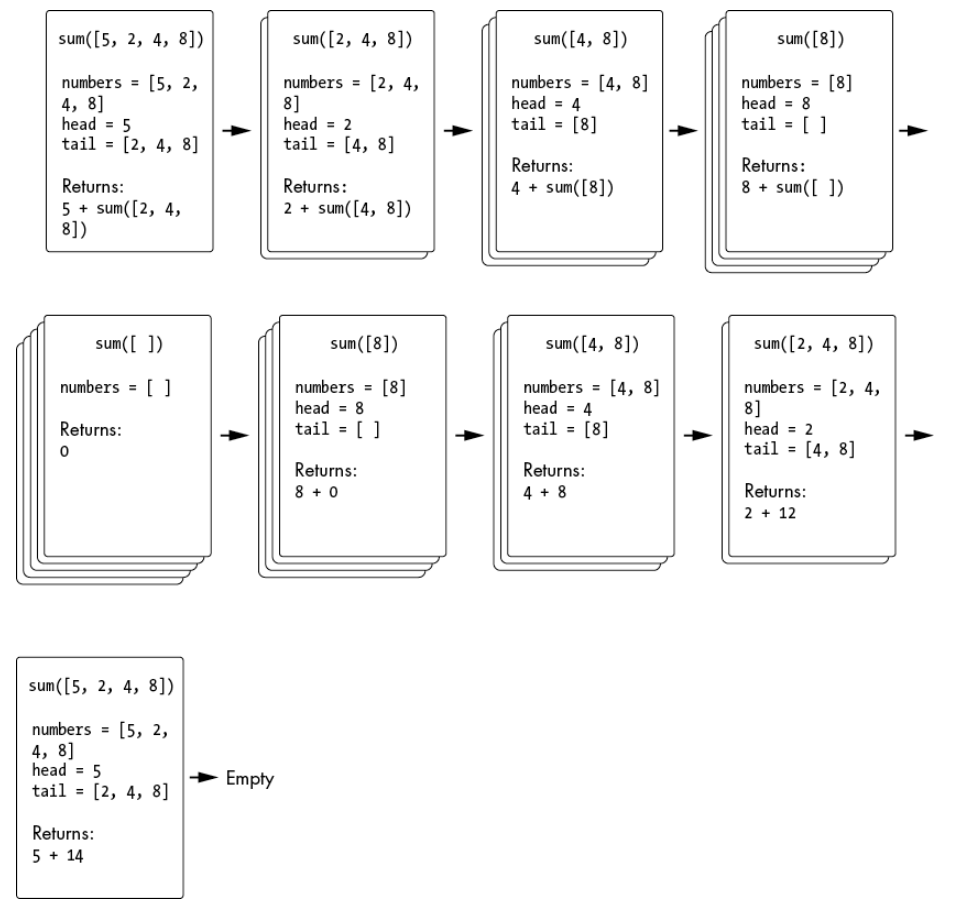
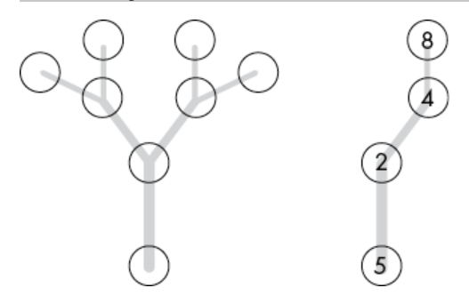
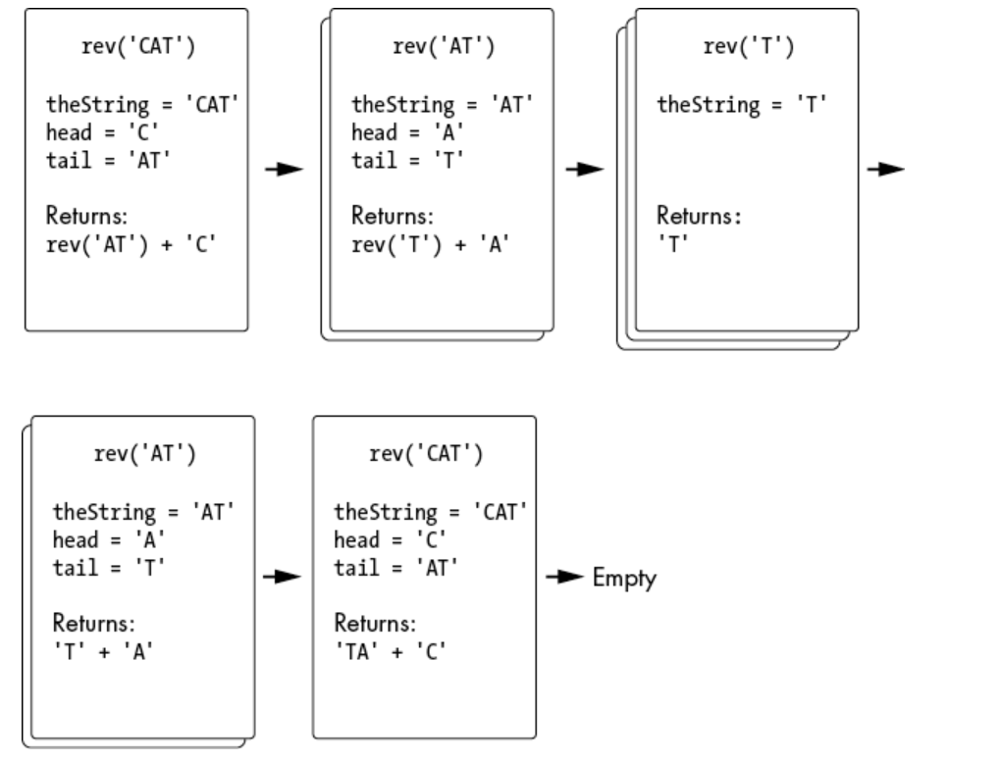

# Algoritmos de Recursão Clássicos

## Sumário

- [Somando números em uma matriz](#somando-números-em-uma-matriz)
    - [Análise do processo recursivo:](#análise-do-processo-recursivo)
    - [Resumo da Retomada das Chamadas:](#resumo-da-retomada-das-chamadas)

Vamos começar com três algoritmos simples: somar os números em um array, inverter uma string de texto e detectar se uma string é um palíndromo. Em seguida, exploramos um algoritmo para resolver o quebra-cabeça da Torre de Hanói, implementamos o algoritmo de preenchimento de regiões em desenhos e abordamos a complexa função de Ackermann, que é altamente recursiva.

Durante esse processo, você aprenderá sobre a técnica "head-tail" para dividir os dados nos argumentos da função recursiva. Além disso, faremos três perguntas cruciais ao tentar encontrar soluções recursivas:

1. Qual é o caso base?
2. Qual argumento é passado para a chamada de função recursiva?
3. Como os argumentos passados para as chamadas de função recursivas se aproximam do caso base?

À medida que você ganha mais experiência, responder a essas perguntas se tornará mais natural e intuitivo.

## Somando números em uma matriz

Nosso primeiro exemplo é simples: dada uma lista ou um array de inteiros, retorne a soma total de todos os inteiros. Por exemplo, uma chamada como ```sum([5, 2, 4, 8])``` deveria retornar **19**.

Embora isso seja fácil de resolver com um loop, resolvê-lo com recursão requer um pouco mais de reflexão. Como discutido anteriormente, você pode perceber que este algoritmo não se adapta bem à recursão a ponto de justificar a complexidade adicional. No entanto, somar números em uma lista (ou realizar outros cálculos baseados no processamento de dados em uma estrutura linear) é um problema comum em entrevistas de programação e merece nossa atenção.

Para resolver esse problema, vamos examinar a técnica **head-tail** para implementar funções recursivas. Definimos a função recursiva **sum()** para encontrar a soma dos inteiros da lista adicionando o primeiro elemento da lista (head) à soma dos elementos restantes (tail). Para calcular a soma do tail, chamamos recursivamente a função **sum()** com os elementos restantes da lista.

Como o tail é um elemento a menos que a lista original, eventualmente chamaremos a função recursiva com uma lista vazia. Uma lista vazia é trivial de somar, resultando em 0, e não requer mais chamadas recursivas. A partir desses fatos, nossas respostas às três perguntas são as seguintes:

1. **Qual é o caso base?** 
    - Uma lista vazia, cuja soma é 0.

2. **Qual argumento é passado para a chamada recursiva?** 
    - A parte da lista excluindo o primeiro elemento (tail).

3. **Como esse argumento se aproxima do caso base?** 
    - A lista diminui em um elemento a cada chamada recursiva até que se torne uma lista vazia.

Aqui está <a href="https://github.com/FabioHenriqueFarias/algorithms-And-Data-Dtructures/blob/main/Algorithms/Recursion/2_AlgoritmosRecursaoClassicos/sumHeadTail.py">``sumHeadTail.py``</a>, um programa Python para somar uma lista de números:

``` Python
def sum(numbers):
    if len(numbers) == 0:
        # Caso base: lista vazia tem soma 0
      ❶  return 0
    else:
        # Caso recursivo: soma o primeiro elemento com a soma dos elementos restantes
        ❷ head = numbers[0]
        ❸ tail = numbers[1:]
        ❹ return head + sum(tail)


# Testando a função
print(sum([5, 2, 4, 8]))  # Saída: 19
print(sum([]))            # Saída: 0
print(sum([1, 2, 3, 4, 5]))  # Saída: 15

```

Output:

```
# Saída: 19
# Saída: 0
# Saída: 15
```

Quando chamado com um argumento de lista vazio, o caso base da nossa função simplesmente retorna 0❶. No caso recursivo, formamos a cabeça (head)❷ e a cauda (tail)❸ a partir do argumento original `numbers`. Tenha em mente que o tipo de dados de `tail` é uma lista de números, assim como o argumento `numbers`. Mas o tipo de dados de `head` é apenas um único valor numérico, e não uma lista com um valor numérico. O valor de retorno da função `sum()` também é um valor numérico único e não uma lista de números; é por isso que podemos somar `head` e `sum(tail)` no caso recursivo.

Vamos analisar as partes importantes do código:

1. **Caso Base**: 
    ```python
    if len(numbers) == 0:
        return 0
    ```
    - Se a lista estiver vazia, retornamos 0. Este é o caso base que termina a recursão.

2. **Caso Recursivo**:
    ```python
    head = numbers[0]
    tail = numbers[1:]
    return head + sum(tail)
    ```
    - `head = numbers[0]`: Pegamos o primeiro elemento da lista.
    - `tail = numbers[1:]`: Pegamos todos os elementos restantes da lista.
    - `return head + sum(tail)`: Somamos o primeiro elemento (`head`) com a soma dos elementos restantes (`tail`), que é calculada pela chamada recursiva à função `sum()`.

Cada chamada recursiva passa um array cada vez menor para `sum()`, aproximando-o do caso base de um array vazio. Por exemplo, a imagem mostra o estado da pilha de chamadas para sum([5, 2, 4, 8]).



Na imagem, cada cartão na pilha representa uma chamada de função. No topo de cada cartão está o nome da função com o argumento que foi passado quando chamada. Abaixo, estão as variáveis ​​locais: o parâmetro `numbers` e as variáveis locais `head` e `tail` criadas durante a chamada. Na parte inferior do cartão está a expressão `head + sum(tail)` retornada pela chamada de função. Quando uma nova função recursiva é chamada, um novo cartão é colocado na pilha. Quando a chamada de função retorna, o cartão do topo é removido da pilha.

### Análise do processo recursivo:

1. **Chamada Inicial**: `sum([5, 2, 4, 8])`
   - `head = 5`
   - `tail = [2, 4, 8]`
   - Retorna `5 + sum([2, 4, 8])`

2. **Segunda Chamada**: `sum([2, 4, 8])`
   - `head = 2`
   - `tail = [4, 8]`
   - Retorna `2 + sum([4, 8])`

3. **Terceira Chamada**: `sum([4, 8])`
   - `head = 4`
   - `tail = [8]`
   - Retorna `4 + sum([8])`

4. **Quarta Chamada**: `sum([8])`
   - `head = 8`
   - `tail = []`
   - Retorna `8 + sum([])`

5. **Caso Base**: `sum([])`
   - Lista vazia
   - Retorna `0`

### Resumo da Retomada das Chamadas:

- `sum([])` retorna `0`
- `sum([8])` retorna `8 + 0 = 8`
- `sum([4, 8])` retorna `4 + 8 = 12`
- `sum([2, 4, 8])` retorna `2 + 12 = 14`
- `sum([5, 2, 4, 8])` retorna `5 + 14 = 19`

Podemos usar a função `sum()` como modelo para aplicar a técnica head-tail a outras funções recursivas. Por exemplo, podemos modificar a função `sum()` para criar uma função `concat()` que concatena uma lista de strings. O caso base retornaria uma string vazia para uma lista vazia, enquanto o caso recursivo retornaria a primeira string concatenada ao valor de retorno da chamada recursiva com o resto da lista.

Lembre-se de que a recursão é especialmente adequada para problemas que envolvem uma estrutura semelhante a uma árvore e retrocesso. Uma lista, string ou outra estrutura de dados linear pode ser considerada uma estrutura semelhante a uma árvore, embora seja uma árvore que possui apenas uma ramificação em cada nó, como mostrado na imagem abaixo:



Uma lista (direita) `[5, 2, 4, 8]` é análoga a uma estrutura de dados em árvore (esquerda) com apenas uma ramificação em cada nó.

A chave para identificar se nossa função recursiva é desnecessária é verificar se ela nunca retrocede nos dados que processa. Ela realiza uma única passagem sobre cada elemento da lista, do início ao fim, algo que um loop básico pode facilmente realizar.

Além disso, a função de soma recursiva em Python é cerca de 100 vezes mais lenta que um algoritmo iterativo simples. Mesmo que o desempenho não fosse um problema, a função `sum()` causaria um estouro de pilha se tentássemos somar uma lista com dezenas de milhares de números. A recursão é uma técnica avançada, mas nem sempre é a melhor abordagem.


## Invertendo uma String

Inverter uma string é um exemplo clássico de um algoritmo recursivo, embora a solução iterativa seja bastante direta. Como uma string é essencialmente um array de caracteres, podemos empregar a abordagem head-tail para nossa função `rev()`, assim como fizemos para o algoritmo de soma.
Para strings maiores, vamos tentar dividir a string em cabeça (apenas o primeiro caractere) e cauda (todos os caracteres após o primeiro). Para uma string de dois caracteres como 'XY', 'X'é a cabeça e 'Y'é a cauda. Para inverter a corda, precisamos colocar a cabeça atrás da cauda: 'YX'.

Para strings maiores, dividimos a string em cabeça (o primeiro caractere) e cauda (todos os caracteres após o primeiro). Por exemplo, para uma string de dois caracteres como 'XY', 'X' é a cabeça e 'Y' é a cauda. Para inverter a string, colocamos a cabeça atrás da cauda: 'YX'.

Mas será que esse algoritmo funciona para strings mais longas? Considere a string 'CAT'. Dividimos em cabeça 'C' e cauda 'AT'. Colocar a cabeça atrás da cauda simplesmente nos dá 'ATC', o que não é o que queremos. O que realmente queremos é inverter a cauda e então colocar a cabeça no final. Ou seja, 'AT' se torna 'TA' e adicionar 'C' ao final resulta em 'TAC'.

Então, como podemos inverter a cauda? Podemos fazer isso chamando recursivamente `rev()` passando a cauda como argumento. Vamos nos concentrar nas entradas e saídas da nossa função: `rev()` recebe uma string e retorna a string invertida.

Implementar uma função recursiva como `rev()` pode parecer complicado porque envolve um problema de ovo e galinha. Para escrever o caso recursivo de `rev()`, precisamos chamar uma função que inverte uma string – ou seja, `rev()` em si. Ao confiar na técnica do "salto de fé", podemos escrever nosso caso recursivo assumindo que a chamada para `rev()` retorna o valor correto, mesmo que ainda não tenhamos terminado de escrever a função.

O "salto de fé" não é uma técnica mágica que garante que seu código funcionará sem erros. É uma maneira de superar o bloqueio mental ao pensar em como implementar sua função recursiva. Essa técnica funciona quando você tem um entendimento claro dos argumentos e do valor de retorno da sua função recursiva.

Lembre-se de que o "salto de fé" ajuda apenas a escrever o caso recursivo. Você deve passar um argumento que esteja mais próximo do caso base a cada chamada recursiva. Não adianta passar o mesmo argumento repetidamente. Vamos ver como isso se aplica na prática com o exemplo da função `rev()`.

```python
def rev(theString): 
    return rev(theString) # Isso não funcionará magicamente.
```

Para continuar nosso exemplo 'CAT', ao passarmos a string 'AT' para a função `rev()`, a cabeça (primeiro caractere) é 'A' e a cauda (restante da string) é 'T' nessa chamada de função. Já sabemos que o inverso de uma string de um único caractere, como 'T', é simplesmente 'T'. Esse é o nosso caso base. Portanto, essa segunda chamada de `rev()` retornará 'TA' ao inverter 'AT', que é exatamente o que a chamada anterior de `rev()` precisa. A imagem abaixo mostra o estado da pilha de chamadas durante todas as chamadas recursivas para `rev()`.

Vamos fazer três perguntas sobre o algoritmo recursivo da função `rev()`:

1. **Qual é o caso base?**
   O caso base é uma string de zero ou um caractere.

2. **Qual argumento é passado para a chamada de função recursiva?**
   A cauda da string original, ou seja, a string original sem o primeiro caractere.

3. **Como esse argumento se aproxima do caso base?**
   A cada chamada recursiva, o argumento da string é reduzido em um caractere, aproximando-se assim do caso base, que é uma string de comprimento um ou zero.




Aqui está <a href="https://github.com/FabioHenriqueFarias/algorithms-And-Data-Dtructures/blob/main/Algorithms/Recursion/2_AlgoritmosRecursaoClassicos/reverseString.py">`reverseString.py`</a> , um programa Python para reverter uma string:

```python
def rev(theString):
  ❶ if len(theString) == 0 or len(theString) == 1:
        # CASO BASE
        return theString
    else:
        # CASO RECURSIVO
      ❷ head = theString[0]
      ❸ tail = theString[1:]
      ❹ return rev(tail) + head

print(rev('abcdef'))
print(rev('Hello, world!'))
print(rev(''))
print(rev('X'))
```

Aqui está a saída desse programa:

```
fedcba
!dlrow ,olleH

X
```

Nossa função recursiva `rev()` retorna a string que é o inverso do argumento, `theString`. Vamos considerar as strings mais simples de reverter: a string vazia e uma string de um único caractere. Ambas seriam “revertidas” para si mesmas. Esses são os casos base que utilizamos (embora os combinemos com um operador booleano `or` em ❶).

Para o caso recursivo, separamos o primeiro caractere da string em ❷ (`head`) e todos os caracteres após o primeiro em ❸ (`tail`). O caso recursivo então retorna o inverso de `tail` seguido pelo caractere `head` em ❹.

Vamos analisar detalhadamente:

1. **Caso Base**: Se a string é vazia ou contém apenas um caractere (`if len(theString) == 0 or len(theString) == 1`), retornamos a string como está.

2. **Caso Recursivo**: 
   - ❷ Separamos o primeiro caractere da string (`head = theString[0]`).
   - ❸ Pegamos todos os caracteres após o primeiro (`tail = theString[1:]`).
   - ❹ Retornamos o resultado da chamada recursiva para `rev(tail)`, adicionando `head` ao final (`return rev(tail) + head`).

## Detectando Palíndromos

Um palíndromo é uma palavra ou frase que tem a mesma grafia quando escrita para frente e para trás, como "radar" ou "A grama é amarga". Para detectar se uma string é um palíndromo, podemos escrever uma função recursiva chamada `isPalindrome()`.

O caso base é uma sequência de zero ou um caractere, que por natureza é sempre a mesma quando escrita para frente ou para trás. Usaremos uma abordagem semelhante à técnica de divisão em cabeça e cauda, exceto que, neste caso, dividiremos a string em três partes: cabeça (`head`), meio (`middle`) e última (`last`). Se o primeiro e o último caractere forem iguais e a parte do meio também for um palíndromo, então a string inteira é um palíndromo. A recursão acontece ao passarmos a string do meio para a função `isPalindrome()`.

Qual é o caso básico? Uma sequência de zero ou um caractere, que retorna Trueporque é sempre um palíndromo.

Qual argumento é passado para a chamada de função recursiva? Os caracteres do meio do argumento de string.

Como esse argumento se aproxima do caso base? O argumento string diminui em dois caracteres para cada chamada recursiva até se tornar uma string com zero ou um caractere.

1. **Qual é o caso base?** 
    - Uma lista vazia, cuja soma é 0.

2. **Qual argumento é passado para a chamada recursiva?** 
    - Os caracteres do meio do argumento da string.

3. **Como esse argumento se aproxima do caso base?** 
    - O argumento da string diminui em dois caracteres a cada chamada recursiva até se tornar uma string com zero ou um caractere.

Aqui está <a href="">`isPalindrome()`</a>, um programa Python para detectar palíndromos:

```
def isPalindrome(theString):
    if len(theString) == 0 or len(theString) == 1:
        # CASO BASE
        return True
    else:
        #  CASO RECURSIVO
      ❶ head = theString[0]
      ❷ middle = theString[1:-1]
      ❸ last = theString[-1]
      ❹ return head == last and isPalindrome(middle)

text = 'reviver'
print(text + ' is a palindrome: ' + str(isPalindrome(text)))
text = 'omissíssimo'
print(text + ' is a palindrome: ' + str(isPalindrome(text)))
text = 'romaeamor'
print(text + ' is a palindrome: ' + str(isPalindrome(text)))
text = 'saias'
print(text + ' is a palindrome: ' + str(isPalindrome(text)))
```

O caso base retorna `True` porque uma sequência de zero ou um caractere é sempre um palíndromo. Caso contrário, o argumento da string será dividido em três partes: o primeiro caractere ❶, o último caractere ❸, e os caracteres intermediários entre eles ❷.

A instrução `return` no caso recursivo ❹ faz uso de curto-circuito booleano, um recurso presente em quase todas as linguagens de programação. Em uma expressão com operadores booleanos `and` ou `&&`, se a expressão do lado esquerdo for `False`, não importa se a expressão do lado direito é `True` ou `False`, porque a expressão inteira será `False`. O curto-circuito booleano é uma otimização que ignora a avaliação da expressão do lado direito de um operador `and` se o lado esquerdo for `False`. Portanto, na expressão `head == last and isPalindrome(middle)`, se `head == last` for `False`, a chamada recursiva para `isPalindrome()` é ignorada. Isso significa que assim que os caracteres `head` e `last` não corresponderem, a recursão para e simplesmente retorna `False`.

Esse algoritmo recursivo ainda é sequencial, como as funções de soma e de inversão de string das seções anteriores, exceto que, em vez de percorrer os dados do início ao fim, ele percorre de ambas as extremidades em direção ao meio. A versão iterativa deste algoritmo, que usa um loop simples, é mais direta. No entanto, abordamos a versão recursiva neste livro porque é um problema comum em entrevistas de codificação.