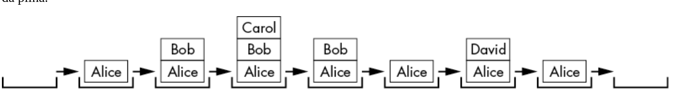

# Recursão

## Sumário

- [O que é Recursão?](#o-que-é-recursão)
    - [Definição](#definição)
    - [O que são funções?](#o-que-são-funções)
- [Referências](#referências)

## O que é Recursão?

 > A recursão tem uma reputação intimidante. É considerado difícil de entender, mas em sua essência depende apenas de duas coisas: chamadas de função e estruturas de dados de pilha.

A maioria dos novos programadores rastreia o que um programa faz seguindo a execução. É uma maneira fácil de ler código: basta colocar o dedo na linha de código na parte superior do programa e descer. 
Às vezes, seu dedo volta; outras vezes, ele irá pular para uma função e depois retornar. Isso facilita a visualização do que um programa faz e em que ordem.
b() # Segunda a ser chamada
    a() # Primeira a ser chamada Mas para entender a recursão, você precisa se familiarizar com uma estrutura de dados menos óbvia, chamada **pilha de chamadas**, responsável por gerenciar automaticamente as chamadas de função. Ela possui um funcionamento idêntico à estrutura de dados de uma <a href="https://github.com/FabioHenriqueFarias/algorithms-And-Data-Dtructures/tree/main/Data_Structures/Stack"> pilha convencional</a>, seguindo o princípio de último a entrar, primeiro a sair.

### Definição

>  A recursão é uma espécie de meta, auto-referência, sonho dentro de um sonho, tipo de coisa infinita de espelho em espelho. Podemos estabelecer uma definição concreta: uma coisa recursiva é algo cuja definição se inclui. Ou seja, possui uma definição autorreferencial.

Em um contexto de programação, uma função *recursiva* é uma função que chama a si mesma. Antes de explorarmos as funções recursivas, vamos dar um passo atrás e entender como funcionam as funções regulares.

As **chamadas de função** são tão comuns e tão integradas ao processo de programação que os programadores muitas vezes não precisam se preocupar com os detalhes internos de como elas são implementadas ou executadas pelo compilador ou pela linguagem de programação.

### O que são funções?

As funções podem ser descritas como miniprogramas dentro do seu programa. Eles são um recurso de quase todas as linguagens de programação. Se você precisar executar idênticoinstruções em três locais diferentes de um programa, em vez de copiar e colar o código-fonte três vezes, você pode escrever o código em uma função uma vez e chamar a função três vezes. 

O resultado benéfico é um programa mais curto e mais legível. O programa também é mais fácil de alterar: se você precisar corrigir um bug ou adicionar recursos, será necessário alterar o programa em apenas um lugar, em vez de três.

**Todas as linguagens de programação implementam quatro recursos em suas funções:**

1. As funções possuem código que é executado quando a função é chamada.

2. Argumentos (ou seja, valores) são passados ​​para a função quando ela é chamada. Esta é a entrada da função e as funções podem ter zero ou mais argumentos.

3. As funções retornam um valor de retorno . Esta é a saída da função, embora algumas linguagens de programação permitam que as funções não retornem nada ou retornem valores nulos como `undefined` ou `None`.

4. O programa lembra qual linha de código chamou a função e retorna a ela quando a função termina sua execução.

Diferentes linguagens de programação podem ter recursos adicionais ou diferentes opções de como chamar funções, mas todas possuem esses quatro elementos gerais. Você pode ver visualmente os três primeiros desses elementos porque os escreve no código-fonte, **mas como um programa controla para onde a execução deve retornar quando a função retornar?**

Para ter uma ideia melhor do problema, crie um programa functionCalls.py que tenha três funções: `a()`, que chama `b()`, que chama `c()`:

```
def a():
    print('a() was called.')
    b()
    print('a() is returning.')

def b():
    print('b() was called.')
    c()
    print('b() is returning.')

def c():
    print('c() was called.')
    print('c() is returning.')

a()
```

Quando você executa este código, a saída fica assim:

    a() was called.
    b() was called.
    c() was called.
    c() is returning.
    b() is returning.
    a() is returning.

A saída mostra o início das funções ``a()``, `b()` e ``c()``. Então, quando as funções retornam, a saída aparece na ordem inversa: ``c()``, ``b()`` e então ``a()``. Observe esse padrão: **ela lembra qual linha de código a chamou originalmente.** 

Começamos com a chamada da função `a()`, que imprime `'a() was called.'`. Em seguida, a função `b()` é invocada e imprime `'b() was called.'`, seguida pela chamada da função `c()`, que imprime `'c() was called.'`.

Pense nessas chamadas como uma pilha.

```
    c() # Terceira a ser chamada
    b() # Segunda a ser chamada
    a() # Primeira a ser chamada 
```

Agora, as funções estão retornando e sendo desempilhadas. Começamos com a função `c()`, que imprime `'c() is returning.'`. Neste momento, a função "lembra" de onde foi chamada e retorna para essa linha, sendo desempilhada da pilha de chamadas.
```
    b() # Segunda a ser chamada
    a() # Primeira a ser chamada 
```

A função `b()` também imprime `'b() is returning.'` e retorna ao ponto de chamada original, sendo então desempilhada da pilha de chamadas.

```
    a() # Primeira a ser chamada 
```

Por fim, a função `a()` imprime `'a() is returning.'`, e o código segue seu fluxo normal, com a pilha de chamadas vazia.

Mas como o programa lembra se foi `a()` ou `b()` que chamou `c()`? 

Este detalhe é tratado implicitamente pelo programa com uma **pilha de chamadas**. Para entender como as pilhas de chamadas lembram onde a execução retorna no final de uma chamada de função, precisamos primeiro entender o que é uma <a href="https://github.com/FabioHenriqueFarias/algorithms-And-Data-Dtructures/tree/main/Data_Structures/Stack"> Pilha</a>.

## O que são pilhas?

Para realmente entender a recursão, é fundamental compreender as pilhas.

Uma pilha é uma das **estruturas de dados** mais simples da ciência da computação. Ela armazena valores de forma semelhante a uma lista, mas com uma restrição: você só pode adicionar ou remover valores do topo da pilha.

Em implementações de pilhas usando listas ou arrays, o "topo" é o último item, localizado na extremidade direita da lista ou array. Adicionar valores é conhecido como *"empilhar"* ou *"empurrar"* valores para a pilha, enquanto remover valores é chamado de *"desempilhar"* ou *"pop"*.

Imagine que você está envolvido em uma conversa sinuosa com alguém. Você está falando sobre sua amiga Alice, o que então te lembra de uma história sobre seu colega de trabalho Bob, mas para que essa história faça sentido, primeiro você precisa explicar algo sobre sua prima Carol. 

Você termina sua história sobre Carol e volta a falar sobre Bob, e quando termina sua história sobre Bob, volta a falar sobre Alice. 
Então você se lembra de seu irmão David e conta uma história sobre ele. Eventualmente, você consegue terminar sua história original sobre Alice.



Em nossa pilha de conversas, os novos tópicos são adicionados ao topo da pilha e retirados à medida que são concluídos. Os tópicos anteriores são “lembrados” abaixo do tópico atual na pilha.

Pilhas são uma estrutura de dados **LIFO** , que significa último a entrar, primeiro a sair , uma vez que o último valor colocado na pilha é o primeiro valor retirado dela. Esse comportamento é semelhante ao botão Voltar do seu navegador. 

O histórico da guia do navegador funciona como uma pilha que contém todas as páginas que você visitou na ordem em que as visitou. O navegador está sempre exibindo a página da web no “topo” da “pilha” do histórico. Clicar em um link *empurra* uma nova página da web para a pilha de histórico, enquanto clicar no botão Voltar abre a página superior e revela a que está *“embaixo”*.

## O que é a pilha de chamadas?

Os programas também usam pilhas. A *pilha de chamadas* do programa , também chamada simplesmente de *pilha* , é criada durante a execução de um programa.

Uma pilha armazena quadros, também chamados de “quadros de pilha”.

uma pilha de objetos de quadro. Os *objetos Frame* , também chamados simplesmente de *frames*, contêm informações sobre uma única chamada de função, incluindo qual linha de código chamou a função, para que a execução possa voltar para lá quando a função retornar.


## Referências