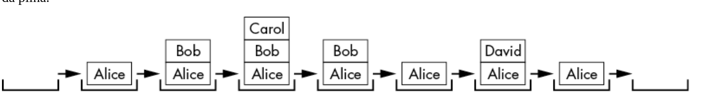
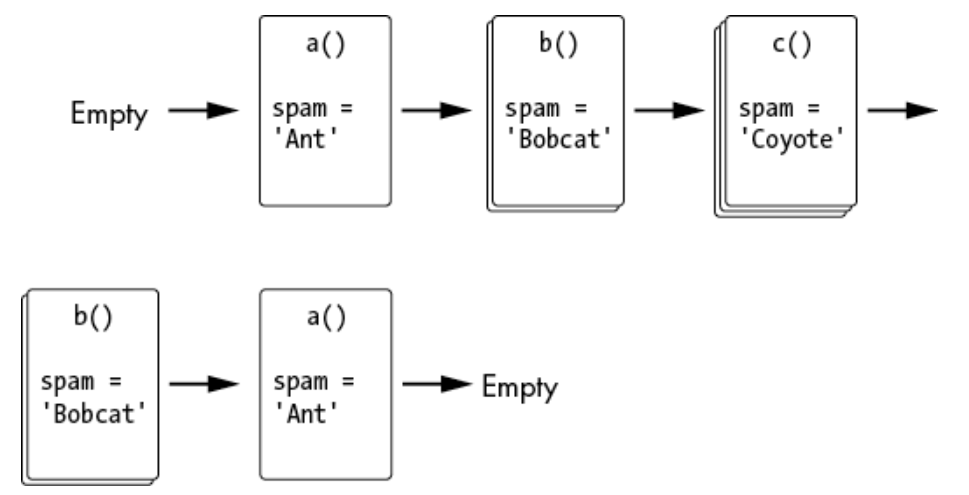
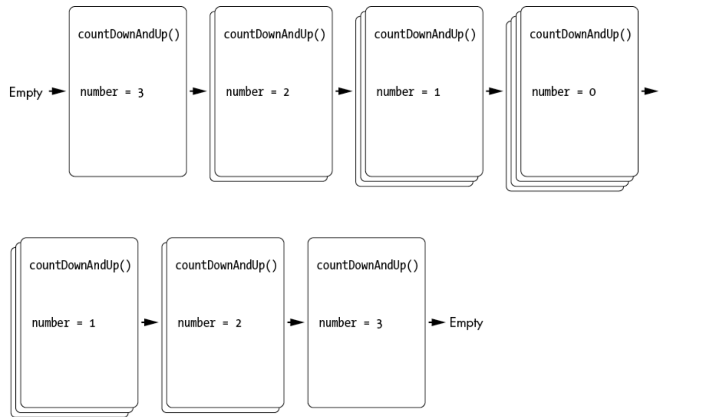

# Recursão

## Sumário

- [O que é Recursão?](#o-que-é-recursão)
    - [Definição](#definição)
    - [O que são funções?](#o-que-são-funções)
- [O que são pilhas?](#o-que-são-pilhas)
- [O que é a pilha de chamadas?](#o-que-é-a-pilha-de-chamadas)
- [O que são funções recursivas e estouros de pilha?](#o-que-são-funções-recursivas-e-estouros-de-pilha)
- [Casos Base e Casos Recursivos](#casos-base-e-casos-recursivos)
  - [Análise da Função](#análise-da-função)
    - [Caso Base](#caso-base)
    - [Caso Recursivo](#caso-recursivo)
  -[Comportamento do Programa](#comportamento-do-programa)
    -[Primeira Chamada: `shortestWithBaseCase(False)`](#primeira-chamada-shortestwithbasecasefalse)
    -[Segunda Chamada: `shortestWithBaseCase(True)`](#segunda-chamada-shortestwithbasecasetrue)
- [Código antes e depois da chamada recursiva](#código-antes-e-depois-da-chamada-recursiva)
  - [Análise do Funcionamento](#análise-do-funcionamento)
  - [Conceitos de Recursão](#conceitos-de-recursão)
  - [Execução Passo a Passo](#execução-passo-a-passo)
- [Referências](#referências)

## O que é Recursão?

 > A recursão tem uma reputação intimidante. É considerado difícil de entender, mas em sua essência depende apenas de duas coisas: chamadas de função e estruturas de dados de pilha.

A maioria dos novos programadores rastreia o que um programa faz seguindo a execução. É uma maneira fácil de ler código: basta colocar o dedo na linha de código na parte superior do programa e descer. 
Às vezes, seu dedo volta; outras vezes, ele irá pular para uma função e depois retornar. Isso facilita a visualização do que um programa faz e em que ordem.
b() # Segunda a ser chamada
    a() # Primeira a ser chamada Mas para entender a recursão, você precisa se familiarizar com uma estrutura de dados menos óbvia, chamada **pilha de chamadas**, responsável por gerenciar automaticamente as chamadas de função. Ela possui um funcionamento idêntico à estrutura de dados de uma <a href="https://github.com/FabioHenriqueFarias/algorithms-And-Data-Dtructures/tree/main/Data_Structures/Stack"> pilha convencional</a>, seguindo o princípio de último a entrar, primeiro a sair.

### Definição

>  A recursão é uma espécie de meta, auto-referência, sonho dentro de um sonho, tipo de coisa infinita de espelho em espelho. Podemos estabelecer uma definição concreta: uma coisa recursiva é algo cuja definição se inclui. Ou seja, possui uma definição autorreferencial.

Em um contexto de programação, uma função *recursiva* é uma função que chama a si mesma. Antes de explorarmos as funções recursivas, vamos dar um passo atrás e entender como funcionam as funções regulares.

As **chamadas de função** são tão comuns e tão integradas ao processo de programação que os programadores muitas vezes não precisam se preocupar com os detalhes internos de como elas são implementadas ou executadas pelo compilador ou pela linguagem de programação.

### O que são funções?

As funções podem ser descritas como miniprogramas dentro do seu programa. Eles são um recurso de quase todas as linguagens de programação. Se você precisar executar idêntica instruções em três locais diferentes de um programa, em vez de copiar e colar o código-fonte três vezes, você pode escrever o código em uma função uma vez e chamar a função três vezes. 

O resultado benéfico é um programa mais curto e mais legível. O programa também é mais fácil de alterar: se você precisar corrigir um bug ou adicionar recursos, será necessário alterar o programa em apenas um lugar, em vez de três.

**Todas as linguagens de programação implementam quatro recursos em suas funções:**

1. As funções possuem código que é executado quando a função é chamada.

2. Argumentos (ou seja, valores) são passados ​​para a função quando ela é chamada. Esta é a entrada da função e as funções podem ter zero ou mais argumentos.

3. As funções retornam um valor de retorno . Esta é a saída da função, embora algumas linguagens de programação permitam que as funções não retornem nada ou retornem valores nulos como `undefined` ou `None`.

4. O programa lembra qual linha de código chamou a função e retorna a ela quando a função termina sua execução.

Diferentes linguagens de programação podem ter recursos adicionais ou diferentes opções de como chamar funções, mas todas possuem esses quatro elementos gerais. Você pode ver visualmente os três primeiros desses elementos porque os escreve no código-fonte, **mas como um programa controla para onde a execução deve retornar quando a função retornar?**

Para ter uma ideia melhor do problema, crie um programa functionCalls.py que tenha três funções: `a()`, que chama `b()`, que chama `c()`:

```
def a():
    print('a() was called.')
    b()
    print('a() is returning.')

def b():
    print('b() was called.')
    c()
    print('b() is returning.')

def c():
    print('c() was called.')
    print('c() is returning.')

a()
```

Quando você executa este código, a saída fica assim:

    a() was called.
    b() was called.
    c() was called.
    c() is returning.
    b() is returning.
    a() is returning.

A saída mostra o início das funções ``a()``, `b()` e ``c()``. Então, quando as funções retornam, a saída aparece na ordem inversa: ``c()``, ``b()`` e então ``a()``. Observe esse padrão: **ela lembra qual linha de código a chamou originalmente.** 

Começamos com a chamada da função `a()`, que imprime `'a() was called.'`. Em seguida, a função `b()` é invocada e imprime `'b() was called.'`, seguida pela chamada da função `c()`, que imprime `'c() was called.'`.

Pense nessas chamadas como uma pilha.

```
    c() # Terceira a ser chamada
    b() # Segunda a ser chamada
    a() # Primeira a ser chamada 
```

Agora, as funções estão retornando e sendo desempilhadas. Começamos com a função `c()`, que imprime `'c() is returning.'`. Neste momento, a função "lembra" de onde foi chamada e retorna para essa linha, sendo desempilhada da pilha de chamadas.
```
    b() # Segunda a ser chamada
    a() # Primeira a ser chamada 
```

A função `b()` também imprime `'b() is returning.'` e retorna ao ponto de chamada original, sendo então desempilhada da pilha de chamadas.

```
    a() # Primeira a ser chamada 
```

Por fim, a função `a()` imprime `'a() is returning.'`, e o código segue seu fluxo normal, com a pilha de chamadas vazia.

Mas como o programa lembra se foi `a()` ou `b()` que chamou `c()`? 

Este detalhe é tratado implicitamente pelo programa com uma **pilha de chamadas**. Para entender como as pilhas de chamadas lembram onde a execução retorna no final de uma chamada de função, precisamos primeiro entender o que é uma <a href="https://github.com/FabioHenriqueFarias/algorithms-And-Data-Dtructures/tree/main/Data_Structures/Stack"> Pilha</a>.

## O que são pilhas?

Para realmente entender a recursão, é fundamental compreender as pilhas.

Uma pilha é uma das **estruturas de dados** mais simples da ciência da computação. Ela armazena valores semelhantemente a uma lista, mas com uma restrição: você só pode adicionar ou remover valores do topo da pilha.

Em implementações de pilhas usando listas ou arrays, o "topo" é o último item, localizado na extremidade direita da lista ou array. Adicionar valores é conhecido como *"empilhar"* ou *"empurrar"* valores para a pilha, enquanto remover valores é chamado de *"desempilhar"* ou *"pop"*.

Imagine que você está envolvido em uma conversa sinuosa com alguém. Você está falando sobre sua amiga Alice, o que então te lembra de uma história sobre seu colega de trabalho Bob, mas para que essa história faça sentido, primeiro você precisa explicar algo sobre sua prima Carol. 

Você termina sua história sobre Carol e volta a falar sobre Bob, e quando termina sua história sobre Bob, volta a falar sobre Alice. 
Então você se lembra de seu irmão David e conta uma história sobre ele. Eventualmente, você consegue terminar sua história original sobre Alice.



Em nossa pilha de conversas, os novos tópicos são adicionados ao topo da pilha e retirados à medida que são concluídos. Os tópicos anteriores são “lembrados” abaixo do tópico atual na pilha.

Pilhas são uma estrutura de dados **LIFO**, que significa último a entrar, primeiro a sair , uma vez que o último valor colocado na pilha é o primeiro valor retirado dela. Esse comportamento é semelhante ao botão Voltar do seu navegador. 

O histórico da guia do navegador funciona como uma pilha que contém todas as páginas que você visitou na ordem em que as visitou. O navegador está sempre exibindo a página da web no “topo” da “pilha” do histórico. Clicar em um link *empurra* uma nova página da web para a pilha de histórico, enquanto clicar no botão Voltar abre a página superior e revela a que está *“embaixo”*.

## O que é a pilha de chamadas?

Os programas também usam pilhas. A **pilha de chamadas** do programa, também chamada simplesmente de *pilha*, é criada durante a execução de um programa.

Uma pilha armazena coleções de **stack frames**, que são segmentos de memória do aplicativo usados para armazenar informações sobre a execução de funções ou métodos. 

Quando um programa é iniciado, um **stack frame** é inicialmente criado para representar a execução do programa principal.  
À medida que novas funções são chamadas durante a execução do programa, novos **stack frames** são criados e adicionados à pilha de chamadas para representar a ativação dessas funções. 

Cada **stack frame** contém informações essenciais para a execução da função ou método, como variáveis locais, parâmetros da função e o endereço de retorno, que indica onde a execução deve continuar após o término da função. 

Os programadores geralmente não precisam escrever código que lide diretamente com as **stack frames**, já que a linguagem de programação trata disso automaticamente. As stack frames são gerenciadas internamente pela linguagem, 
diferentes linguagens de programação têm maneiras diferentes de implementar as stack frames, mas, em geral, elas contêm:

1. O endereço de retorno, indicando para onde a execução deve se mover quando a função retornar.

2. Os argumentos passados para a chamada da função.

3. Um conjunto de variáveis locais criadas durante a execução da função.

Por exemplo, dê uma olhada no seguinte programa ``localVariables.py``, que possui três funções:

```
def a():
  ❶ spam = 'Ant'
  ❷ print('spam is ' + spam)
  ❸ b()
    print('spam is ' + spam)

def b():
  ❹ spam = 'Bobcat'
    print('spam is ' + spam)
  ❺ c()
    print('spam is ' + spam)

def c():
  ❻ spam = 'Coyote'
    print('spam is ' + spam)

❼ a()
```
Quando você executa este código, a saída fica assim:

```
spam is Ant
spam is Bobcat
spam is Coyote
spam is Bobcat
spam is Ant
```

Quando o programa chama a função `a()`❼ , um **stack frame** é criado e colocado no topo da pilha de chamadas. Este quadro armazena todos os argumentos passados para `a()`​​ (neste caso, não há nenhum), com a variável local `spam`❶ e o local para onde a execução deve ir quando a função `a()` retornar.

Quando `a()` é chamado, exibe o conteúdo de sua variável ``spam`` local, que é `Ant`❷ . Quando o código da função `a()` chama a função `b()`❸ , uma nova **stack frame** é criado e colocado na pilha de chamadas acima do objeto de quadro para `a()`. 

A função `b()` possui sua própria variável local `spam`❹ que exibe o seu conteúdo e chama a função `c()`❺ . Uma nova **stack frame** para a função `c()` é criado e colocado na pilha de chamadas, a função `c()` também contém a sua variável local ``spam``❻, que exibe seu valor. 

À medida que essas funções retornam, as **stack frames** saem da pilha de chamadas. A execução do programa sabe para onde retornar, pois essa informação de retorno é armazenada na **stack frame**. Quando a execução retorna de todas as chamadas de função, a pilha de chamadas fica vazia.



A figura acima mostra o estado da pilha de chamadas conforme cada função é chamada e retorna. Observe que todas as variáveis ​​locais possuem o mesmo nome: `spam`. Isso é usado para destacar que variáveis ​​locais são sempre variáveis ​​separadas com valores distintos, mesmo que tenham o mesmo nome que variáveis ​​locais em outras funções.

Como você pode ver, as linguagens de programação podem ter variáveis ​​locais separadas com o mesmo nome `( spam )` porque são mantidas em **stack frames** separados.  Quando uma variável local é referenciada no código-fonte, a variável com esse nome no **stack frame** em uso naquele momento de execução é utilizada. Isso segue a hierarquia de execução das funções, garantindo que cada função tenha seu próprio contexto de execução e suas variáveis locais não interfiram umas com as outras. 

Cada programa em execução possui uma pilha de chamadas e os programas *multithread* possuem uma pilha de chamadas para cada **thread**. Mas quando você olha o código-fonte de um programa, não consegue ver a pilha de chamadas no código. A pilha de chamadas não é armazenada em uma variável como outras estruturas de dados; ele é tratado automaticamente em segundo plano.

O fato de a pilha de chamadas não existir no código-fonte é o principal motivo pelo qual a recursão é tão confusa: a recursão depende de algo que o programador nem consegue ver! 

Revelar como funcionam as estruturas de dados da pilha e a pilha de chamadas remove grande parte do mistério por trás da recursão. Funções e pilhas são conceitos simples e podemos usá-los juntos para entender como funciona a recursão.

## O que são funções recursivas e estouros de pilha?

Uma função recursiva é uma função que chama a si mesma. Este shortest.py é o exemplo mais curto possível de uma função recursiva:

```
def shortest():
    shortest()

shortest()
```

A função **shortest()** não faz nada além de chamar a si mesma.<br>
Cada vez que isso acontece, ela chama a si mesma mais uma vez, criando um ciclo infinito de chamadas.

Como a pilha de chamadas utiliza a memória finita do computador, este programa não pode continuar para sempre, como acontece com um loop infinito. A única coisa que este programa faz é travar e exibir uma mensagem de erro.


A saída Python shortest.py é assim:
```
Traceback (most recent call last):
  File "shortest.py", line 4, in <module>
    shortest()
  File "shortest.py", line 2, in shortest
    shortest()
  File "shortest.py", line 2, in shortest
    shortest()
  File "shortest.py", line 2, in shortest
    shortest()
  [Previous line repeated 996 more times]
RecursionError: maximum recursion depth exceeded
```

Esse tipo de bug é chamado de **stack overflow** (É aqui que o popular site [https://stackoverflow.com](https://stackoverflow.com) recebeu seu nome).

As chamadas de função constantes sem retorno aumentam a pilha de chamadas até que toda a memória do computador alocada para a pilha de chamadas seja usada. Para evitar isso, o *interpretador* do Python trava o programa após um certo limite de chamadas de função que não retornam um valor.

Esse limite é chamado de *maximum recursion depth     (profundidade máxima de recursão 
)* ou *maximum call stack size (tamanho máximo da pilha de chamadas
)*

Estouros de pilha não danificam o computador. O computador apenas detecta que o limite de chamadas de função sem retorno foi atingido e encerra o programa. Na pior das hipóteses, você perderá qualquer trabalho não salvo que o programa tenha. Estouros de pilha podem ser evitados com algo chamado **caso base** , que é explicado a seguir.

## Casos Base e Casos Recursivos

O exemplo de estouro de pilha possui uma função `shortest()` que chama, ``shortest()`` mas nunca retorna nenhum valor. 
Para evitar essa situação, é essencial que exista um caso ou um conjunto de condições em que a função interrompa as chamadas recursivas e apenas retorne um resultado. Isso é conhecido como **caso base**. Já um caso em que a função chama a si mesma recursivamente é denominado **caso recursivo**.

Todas as funções recursivas requerem pelo menos um caso base e pelo menos um caso recursivo.
Se não houver *caso base*, a função nunca para de fazer chamadas recursivas e eventualmente causa um estouro de pilha. Se não houver *caso recursivo*, a função nunca chama a si mesma e é uma função comum, não recursiva. Quando você começa a escrever suas próprias funções recursivas, um bom primeiro passo é descobrir qual deve ser o caso base e o caso recursivo.

O programa `shortestWithBaseCase.py` define uma função recursiva mínima que evita o estouro de pilha:

```python
def shortestWithBaseCase(makeRecursiveCall):
    print('shortestWithBaseCase(%s) called.' % makeRecursiveCall)
    if not makeRecursiveCall:
        # CASO BASE
        print('Returning from base case.')
        return ❶
    else:
        # CASO RECURSIVO
        shortestWithBaseCase(False) ❷
        print('Returning from recursive case.')
        return

print('Calling shortestWithBaseCase(False):')
shortestWithBaseCase(False) ❸
print()
print('Calling shortestWithBaseCase(True):')
shortestWithBaseCase(True) ❹
```

Quando você executa este código, a saída é:

```
Calling shortestWithBaseCase(False):
shortestWithBaseCase(False) called.
Returning from base case.

Calling shortestWithBaseCase(True):
shortestWithBaseCase(True) called.
shortestWithBaseCase(False) called.
Returning from base case.
Returning from recursive case.
```

### Análise da Função

#### Caso Base

```python
if not makeRecursiveCall:
    # CASO BASE
    print('Returning from base case.')
    return
```

- **Condição**: Se `makeRecursiveCall` for `False`, a função entra no caso base.
- **Ação**: Imprime "Returning from base case." e retorna, encerrando a execução da função.

#### Caso Recursivo

```python
else:
    # CASO RECURSIVO
    shortestWithBaseCase(False)
    print('Returning from recursive case.')
    return
```

- **Condição**: Se `makeRecursiveCall` for `True`, a função entra no caso recursivo.
- **Ação Recursiva**: Chama a si mesma com o argumento `False`, que fará com que a próxima chamada entre diretamente no caso base.
- **Impressão Após Recursão**: Após a chamada recursiva retornar, imprime "Returning from recursive case." e então retorna.

### Comportamento do Programa

#### Primeira Chamada: `shortestWithBaseCase(False)`

- A função é chamada com `False`, entra no caso base, imprime as mensagens e retorna.

  Saída:
  ```
  Calling shortestWithBaseCase(False):
  shortestWithBaseCase(False) called.
  Returning from base case.
  ```

#### Segunda Chamada: `shortestWithBaseCase(True)`

- A função é chamada com `True`, entra no caso recursivo e chama `shortestWithBaseCase(False)`.
- A chamada recursiva com `False` entra no caso base, imprime as mensagens e retorna.
- Após retornar da chamada recursiva, imprime "Returning from recursive case." e retorna.

  Saída:
  ```
  Calling shortestWithBaseCase(True):
  shortestWithBaseCase(True) called.
  shortestWithBaseCase(False) called.
  Returning from base case.
  Returning from recursive case.
  ```

Esta função não faz nada de útil, exceto fornecer um pequeno exemplo de recursão. Quando a função `shortestWithBaseCase(False)`❸ é chamado, o caso base é executado e a função apenas retorna❶ . Porém, quando a função `shortestWithBaseCase(True)`❹ é chamado, o caso recursivo é executado e `shortestWithBaseCase(False)`❷ é chamado.

É importante observar que quando `shortestWithBaseCase(False)`❷ é chamada recursivamente e retorna, a execução não volta imediatamente para a chamada original em ❹. O código restante no caso recursivo, após a chamada recursiva, ainda é executado. Por isso, a mensagem "Returning from recursive case" aparece na saída. Retornar do caso base não encerra imediatamente todas as chamadas recursivas anteriores; apenas conclui a execução da chamada atual. É essencial ter isso em mente ao lidar com recursão.

## Código antes e depois da chamada recursiva

O código em um caso recursivo pode ser dividido em duas partes: o código antes da chamada recursiva e o código depois da chamada recursiva.

É importante entender que alcançar o caso base não significa necessariamente o fim do algoritmo recursivo. Significa apenas que, no caso base, a função não fará mais chamadas recursivas.

Por exemplo, considere este programa countDownAndUp.py, onde a função recursiva conta de qualquer número até zero e depois retorna ao número original:

```
def countDownAndUp(number):
  ❶ print(number)
    if number == 0:
        # BASE CASE
      ❷ print('Reached the base case.')
        return
    else:
        # RECURSIVE CASE
      ❸ countDownAndUp(number - 1)
      ❹ print(number, 'returning')
        return

❺ countDownAndUp(3)
```

Quando você executa este código, a saída fica assim:

```
3
2
1
0
Reached the base case.
1 returning
2 returning
3 returning
```

### Análise do Funcionamento

1. **Primeira Parte do Caso Recursivo**:
   - A função imprime o número atual (`print(number)`)❶.
   - Se o número for 0, entra no caso base, imprime "Reached the base case."❷ e retorna.

2. **Segunda Parte do Caso Recursivo**:
   - Se o número não for 0, a função chama a si mesma com `number - 1`❸.
   - Após a chamada recursiva retornar, imprime `<número> returning`❹ e retorna.

### Conceitos de Recursão

Toda vez que uma função é chamada, um novo quadro é criado e colocado na pilha de chamadas. Este quadro contém todas as variáveis e parâmetros locais (como `number`). Portanto, existe uma variável `number` separada para cada quadro na pilha de chamadas.

Isso é importante para entender a recursão: embora, pelo código-fonte, pareça que existe apenas uma variável `number`, na verdade, cada chamada de função tem sua própria instância da variável `number`.

Esse padrão de fazer chamadas de função recursivas consecutivas e depois retornar das chamadas recursivas é o que gera a contagem regressiva de números. Quando countDownAndUp(0) é chamada, o caso base é alcançado❷ e nenhuma chamada recursiva adicional é feita. No entanto, este não é o fim do programa! Quando o caso base é atingido, a variável local number é 0. Mas, quando esse caso base retorna e o quadro é removido da pilha de chamadas, o quadro abaixo dele ainda tem sua própria variável number local, com o valor que sempre teve, no caso, 1. À medida que a execução retorna aos quadros anteriores na pilha de chamadas, o código após a chamada recursiva é executado❹. Isso é o que faz com que a contagem crescente de números apareça.


### Execução Passo a Passo

- **Primeira Chamada**: `countDownAndUp(3)`❺
  - Imprime `3`❶ e faz uma chamada recursiva com `2`❸.
- **Segunda Chamada**: `countDownAndUp(2)`
  - Imprime `2`❶ e faz uma chamada recursiva com `1`❸.
- **Terceira Chamada**: `countDownAndUp(1)`
  - Imprime `1`❶ e faz uma chamada recursiva com `0`❸.
- **Quarta Chamada**: `countDownAndUp(0)`
  - Imprime `0`❶, entra no caso base, imprime "Reached the base case."❷ e retorna.
- **Retorno da Terceira Chamada**:
  - Imprime `1 returning`❹ e retorna.
- **Retorno da Segunda Chamada**:
  - Imprime `2 returning`❹ e retorna.
- **Retorno da Primeira Chamada**:
  - Imprime `3 returning`❹ e retorna.

A imagem a seguir ilustra como a pilha de chamadas é manipulada ao adicionar e remover dados durante a execução da função recursiva:



Lembre-se de que qualquer código após o caso recursivo ainda precisa ser executado.

Neste ponto, você pode estar pensando que a função recursiva `countDownAndUp()` é excessivamente complexa e difícil de seguir. Por que não usar uma solução iterativa para imprimir os números? Uma abordagem iterativa, que utiliza loops para repetir uma tarefa até que ela seja concluída, é geralmente considerada o oposto da recursão.

Sempre que você se perguntar: “Não seria mais fácil usar um loop?”, a resposta quase sempre é “Sim”, e você deve evitar a solução recursiva.

A recursão pode ser complicada tanto para programadores iniciantes quanto para experientes, e o código recursivo não é automaticamente "melhor" ou "mais elegante" do que o código iterativo. Código legível e fácil de entender é mais importante do que qualquer suposta elegância que a recursão possa oferecer.

No entanto, em algumas situações, um algoritmo se adapta claramente a uma abordagem recursiva. Algoritmos que envolvem estruturas de dados semelhantes a árvores e que requerem retrocesso são especialmente adequados para a recursão. Essas ideias serão exploradas com mais detalhes posteriormente.

## Referências

Livro: <a href="https://www.amazon.com.br/Algoritmos-Teoria-Pr%C3%A1tica-Thomas-Cormen/dp/8535236996" target="_blank">Thomas Cormen - Algoritmos: Teoria e Prática
</a>

Livro: <a href="https://novatec.com.br/livros/entendendo-algoritmos/">Entendendo Algoritmos</a>

Livro: <a href="https://nostarch.com/recursive-book-recursion">The Recursive Book of Recursion: Ace the Coding Interview with Python and JavaScript
</a>