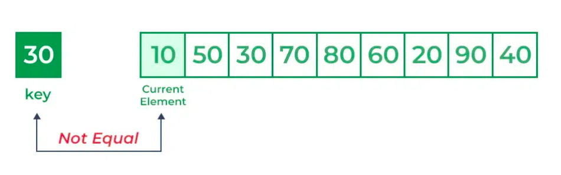
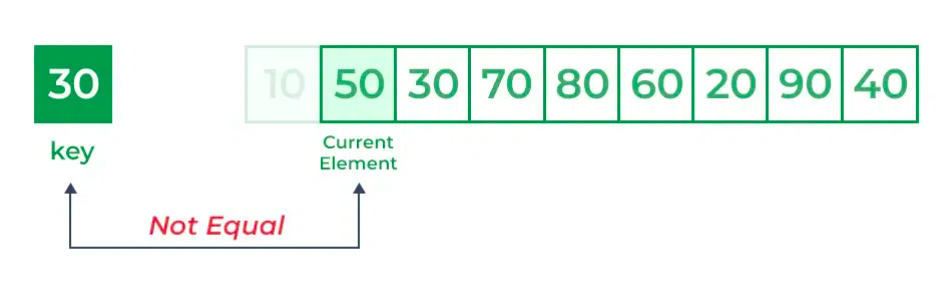
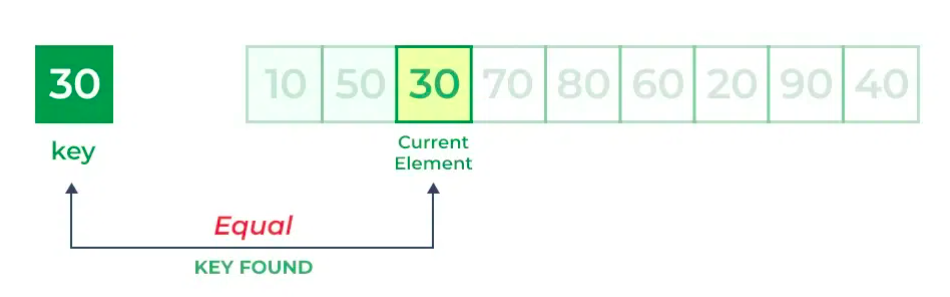

# Linear Search

## Sumário

- [O que é](#o-que-é)
- [Como Funciona?](#como-funciona)
  - [1° Passo:](#1°-passo)
  - [2° Passo:](#2°-passo)
- [Complexidade](#complexidade)
    - [Complexidade da Pesquisa Linear](#complexidade-da-pesquisa-linear)
- [Implementações](#implementações)
- [Referência](#referências)

## O que é?

A Pesquisa Linear, também conhecida como busca sequencial, é um algoritmo simples e direto utilizado para encontrar um elemento específico em um conjunto de dados. Diferente da Pesquisa Binária, que segue o paradigma de Divisão e Conquista, a Pesquisa Linear examina os itens um por um, comparando cada elemento com o valor desejado até encontrar uma correspondência.

Esse algoritmo inicia a busca em uma extremidade da lista e percorre cada elemento até encontrar o valor desejado. Se o elemento não for encontrado, a pesquisa continua até o final do conjunto de dados.

Esse é um método eficaz para conjuntos de dados pequenos ou não ordenados, mas pode ser ineficiente para conjuntos de dados maiores, já que o tempo de execução é proporcional ao número de elementos na lista.

## Como Funciona?

## Como Funciona?

O algoritmo de pesquisa linear pode ser dividido em algumas etapas:

1. **Início**: Comece no primeiro elemento da coleção.
2. **Comparar**: Compare o elemento atual com o elemento desejado.
3. **Encontrado**: Se o elemento atual for igual ao elemento desejado, retorne verdadeiro ou o índice do elemento.
4. **Mover**: Caso contrário, vá para o próximo elemento da coleção.
5. **Repetir**: Repita as etapas 2 a 4 até chegar ao final da coleção.
6. **Não encontrado**: Se o final da coleção for alcançado sem encontrar o elemento desejado, retorne que o elemento não está presente no array.

No algoritmo de pesquisa linear, cada elemento é considerado uma correspondência potencial para a chave e é verificado individualmente. Se algum elemento for igual à chave, a pesquisa será bem-sucedida e o índice desse elemento será retornado. Caso nenhum elemento corresponda à chave, a pesquisa retornará "Nenhuma correspondência encontrada".

Considere o array ``arr[] = {10, 50, 30, 70, 80, 20, 90, 40}`` e `key = 30`

### 1° Passo:

Comece no primeiro elemento (índice 0) e compare a chave com cada elemento (`arr[i]`).

- Comparando a chave com o primeiro elemento `arr[0]`. Como não é igual, o iterador passa para o próximo elemento como uma correspondência potencial.

- Comparando a chave com o próximo elemento `arr[1]`. Como não é igual, o iterador passa para o próximo elemento como uma correspondência potencial.

### 2° Passo:

Agora, ao comparar `arr[2]` com a chave, os valores correspondem. Portanto, o Algoritmo de Pesquisa Linear produzirá uma mensagem de sucesso e retornará o índice do elemento quando a chave for encontrada (neste caso, 2).

## Complexidade

A [Complexidade Assintótica](https://github.com/FabioHenriqueFarias/algorithms-And-Data-Dtructures/tree/main/Asymptotic_Notation) deste algoritmo é de `( O(n) )` no pior caso, tornando-o uma opção viável para conjuntos de dados pequenos ou não ordenados.

Outra característica é que sua eficiência é `( O(n) )` tanto para o pior caso quanto para o caso médio, com uma complexidade de melhor caso de `( O(1) )`. Isso significa que a Pesquisa Linear possui uma complexidade de tempo mínima de `( Omega(1) )`, no caso médio de `( Theta(n) )` e também tem uma cota superior de `( O(n) )`.

### Complexidade da Pesquisa Linear

| Caso           | Complexidade |
|----------------|------------|
| Melhor caso    | `( Omega(1) )`|
| Caso médio     | `( Theta(n) )`|
| Pior caso      | `( O(n) )`   |

## Implementações

Neste repositório, você encontrará a implementação de um algoritmo de uma Pesquisa Linear em três diferentes tecnologias: <a href="https://github.com/FabioHenriqueFarias/algorithms-And-Data-Dtructures/tree/main/Algorithms/Search/2_LinearSearch/C">C</a>, <a href="https://github.com/FabioHenriqueFarias/algorithms-And-Data-Dtructures/tree/main/Algorithms/Search/2_LinearSearch/Python">Python</a> e <a href="https://github.com/FabioHenriqueFarias/algorithms-And-Data-Dtructures/tree/main/Algorithms/Search/2_LinearSearch/Rust">Rust</a>

## Referência

Livro: <a href="https://novatec.com.br/livros/entendendo-algoritmos/">Entendendo Algoritmos</a>

Livro: <a href="https://www.novatec.com.br/livros/cientista-da-computacao-autodidata/">Cientista da Computação Autodidata</a>  

Livro: <a href="https://www.grupogen.com.br/e-book-algoritmos-thomas-cormen-9788595159914">Algoritmos: Teoria e Prática</a> 

GeeeksforGeeks: <a href="https://www.geeksforgeeks.org/linear-search/#what-is-linear-search">Linear Search</a>