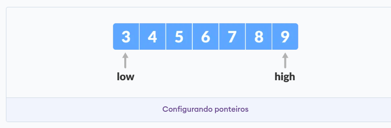
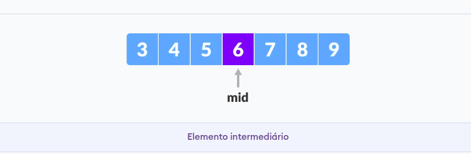
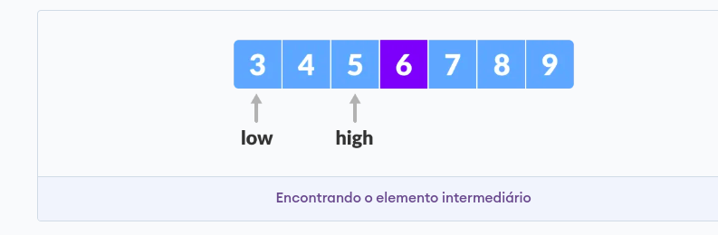

# Binary Search

## Sumário

- [O que é]()
- [Como Funciona?]()
- [Complexidade]()
- [Referência]()

## O que é?

A Pesquisa Binária, também conhecida como busca binária, é um algoritmo eficiente utilizado para encontrar um elemento específico em um conjunto de dados ordenados. Ao contrário da busca sequencial, que examina os itens um por um, a busca binária adota o paradigma de Divisão e Conquista, dividindo repetidamente o espaço de busca pela metade e reduzindo drasticamente o número de elementos a serem considerados.

Essa técnica só pode ser aplicada em conjuntos de dados que estejam previamente classificados, já que depende da capacidade de dividir o conjunto em subconjuntos ordenados para funcionar corretamente.

## Como Funciona?

A pesquisa binária compara o elemento do meio da lista com o valor procurado e ajusta os limites da pesquisa com base nessa comparação.

Inicialmente, o algoritmo verifica o elemento do meio da lista e o compara com o valor desejado. Se o valor desejado for menor que o elemento do meio, o algoritmo redefine o limite superior como a posição atual do meio menos um e mantém o limite inferior. Se for maior, o limite inferior é atualizado para a posição do meio mais um, e o limite superior permanece o mesmo.

Esses passos são repetidos até que o valor desejado seja encontrado ou até que os limites se sobreponham, indicando que o valor não está presente na lista. Se o valor for encontrado, a posição correspondente na lista é retornada; caso contrário, o algoritmo indica que o valor não está presente.

Consideremos um array com os seguintes dados: `[3, 4, 5, 6, 7, 8, 9]`, onde os elementos estão previamente ordenados.

O número que estamos procurando é número `4`.

### 1° Passo:

Inicialmente, são definidas duas variáveis: `low` para representar o limite inferior e `high` para representar o limite superior. Estas variáveis vão ajudar a delimitar a área de busca durante o processo de pesquisa binária.

### 2° Passo:

Agora, é necessário calcular o índice do elemento que está no meio do array, utilizando a fórmula `(low + high) / 2`. Neste caso, o elemento na posição 4, com o valor `6`, será o elemento do meio. Esse valor é armazenado na variável `mid`.

Depois de calcular o índice do elemento do meio, podemos compará-lo com o valor que estamos procurando, representado por x.

#### Se (x == mid) 

Isso significa que encontramos o valor desejado. Portanto, retornamos mid, que é a posição do elemento encontrado na lista.

#### Se (x > mid) 

Isso indica que o valor que procuramos é maior que o elemento do meio. Nesse caso, precisamos ajustar o limite inferior para mid + 1, para continuar a busca na metade superior da lista.

#### Se (x < mid) 

Isso indica que o valor que procuramos é menor que o elemento do meio. Aqui, ajustamos o limite superior para mid - 1, para continuar a busca na metade inferior da lista.

### 3° Passo:

Como estamos procurando pelo valor `4` e constatamos que ele é menor que o elemento do meio, que é `6`, ajustamos o limite superior, representado pela variável `high`, como `high = mid - 1`. 

### 4° Passo:

Calculamos o índice do elemento que está no meio do array novamente, utilizando a fórmula `(low + high) / 2`.

Neste caso, o elemento na posição 2, com o valor `4`, será o elemento do meio. Esse valor é armazenado na variável `mid`.

Podemos então comparar novamente o elemento do meio com o valor que estamos procurando, representado por `x`.

Como `x == mid`, isso significa que encontramos o valor desejado. Portanto, retornamos a posição de `mid`.

## Complexidade?

## Referências

