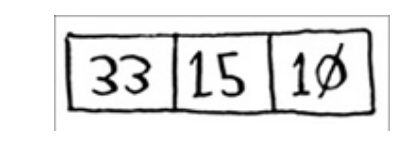

# Quick Sort

## Sumário

- [O que é o algoritmo Quick Sort?](#o-que-é-o-algoritmo-quick-sort)
- [Como Funciona?](#como-funciona)
- [Complexidade](#complexidade)
  - [Complexidade do Quick Sort](#complexidade-do-merge-sort)
- [Implementações](#implementações)
- [Referências](#referências)

## O que é o algoritmo Quick Sort?

O QuickSort é um algoritmo de ordenação recursivo baseado no paradigma de **Divisão e Conquista**. Sua abordagem consiste em selecionar um pivô e reorganizar o array de forma que todos os elementos menores que o pivô fiquem à esquerda e todos os elementos maiores fiquem à direita. Este processo é chamado de *particionamento*. 

Após o particionamento, o QuickSort é aplicado recursivamente às sublistas dos elementos à esquerda e à direita do pivô. Essas sublistas são ordenadas independentemente. Como o processo é recursivo, eventualmente todas as sublistas serão reduzidas a um único elemento ou ficarão vazias. Nesse ponto, o array estará completamente ordenado.

O QuickSort é amplamente utilizado devido à sua baixa **complexidade**. Apesar de pertencer à mesma classe de complexidade do MergeSort e do HeapSort, o QuickSort é, na prática, o mais rápido entre eles, pois suas constantes são menores. No entanto, é importante destacar que, em seu pior caso, o QuickSort tem complexidade **(O(n^2))**, enquanto o MergeSort e o HeapSort garantem **(O(n log n))** para todos os casos.

## Como Funciona?

Primeiro, identificamos o caso base, onde o array vazio ou o array com um elemento é considerado já ordenado.



### 1 - Divisão:

- Inicialmente, escolha um elemento do array para ser o pivô. Neste exemplo, utilizaremos o primeiro item do array como pivô. Existem várias formas de escolher um bom pivô.

  ```python
  # Pivô escolhido: 33
  [33, 15, 10]
  ```

- Encontre os elementos que são menores do que o pivô e também os elementos que são maiores. Isso é chamado de particionamento.

  ```python
  # Após particionamento:
  [15, 10] >33< []
  ```

- Aqui já temos o caso base dos números maiores que o nosso pivô:

  ```python
  # Caso Base
  []
  ```

### 2 - Conquista

- Aplique recursivamente o mesmo processo para os subarrays contendo elementos menores e maiores do que o pivô.

  ```python
  # Aplicando recursivamente para o subarray [15, 10]:

  # Pivô escolhido: 15
  [15, 10]

  # Após particionamento:
  [10] >15< []
  ```

- Chegamos ao nosso caso base:

  ```python
  # Caso Base
  [10]
  ```

### 3 - Combinação:

- Agora o algoritmo volta mesclando os subarrays:

  ```python
  # Mesclado:
  [10, 15]
  ```

- E então mescla novamente com o pivô original:

  ```python
  # Mesclado:
  [10, 15, 33]
  ```
  
  > Agora que concluiu todas as mesclagens, você tem uma lista única e ordenada.
## Complexidade

A [Complexidade Assintótica](https://github.com/FabioHenriqueFarias/algorithms-And-Data-Dtructures/tree/main/Asymptotic_Notation) do algoritmo QuickSort é de \(O(n^2)\) no pior caso, tornando esse algoritmo ineficiente para certas entradas específicas. Essa situação ocorre quando o pivô escolhido é sempre o menor ou o maior elemento restante, resultando em partições extremamente desequilibradas.

Uma característica importante do QuickSort é que sua eficiência pode ser muito melhor na maioria dos casos. A complexidade de tempo no melhor caso é \(O(n log n)\). Isso acontece quando o pivô escolhido divide o array em duas partes aproximadamente iguais em cada etapa da recursão. Neste cenário, a profundidade da recursão é \(log n\), e a cada nível da recursão, todos os \(n\) elementos são processados, resultando em \(O(n log n)\).

A complexidade de tempo no caso médio também é \(O(n log n)\). Na maioria das vezes, a escolha do pivô resulta em partições relativamente equilibradas, de modo que a profundidade da recursão é aproximadamente \(log n\), e em cada nível, processamos todos os \(n\) elementos. Embora possa haver variações, a análise probabilística mostra que a complexidade esperada permanece \(O(n log n)\).


### Por que a complexidade de melhor caso do QuickSort é melhor do que a do Merge Sort?

A complexidade do melhor caso para o QuickSort é \(O(n log n)\), assim como para o Merge Sort. No entanto, a constante oculta na notação \(O(n log n)\) é geralmente menor para o QuickSort. Isso significa que, na prática, QuickSort tende a ser mais rápido devido aos fatores constantes menores associados às suas operações.

Os fatores constantes refletem que diferentes operações com a mesma complexidade assintótica podem levar diferentes quantidades de tempo para serem executadas. Por exemplo, realizar três operações de adição leva um pouco mais de tempo do que realizar uma única operação de adição. Outro exemplo é que, embora a busca binária em uma matriz e a inserção em um conjunto ordenado sejam ambas \(O(log n)\), a busca binária é visivelmente mais rápida.

Os fatores constantes são totalmente ignorados na notação Big O. Na maioria das vezes, isso é aceitável, mas pode ser crucial quando os limites de tempo são particularmente apertados. Nesse caso, mesmo um algoritmo com a complexidade correta pode receber um "Time Limit Exceeded" (TLE). Nessas situações, é importante considerar os fatores constantes..


## Implementações

Neste repositório, você encontrará a implementação de um algoritmo de Quick Sort em três diferentes tecnologias:<a href="https://github.com/FabioHenriqueFarias/algorithms-And-Data-Dtructures/tree/main/Algorithms/Sorting/2_QuickSort/C">C</a>, <a href="https://github.com/FabioHenriqueFarias/algorithms-And-Data-Dtructures/tree/main/Algorithms/Sorting/2_QuickSort/Python">Python</a> e <a href="https://github.com/FabioHenriqueFarias/algorithms-And-Data-Dtructures/tree/main/Algorithms/Sorting/2_QuickSort/Rust">Rust</a>

## Referências

Livro: <a href="https://novatec.com.br/livros/entendendo-algoritmos/">Entendendo Algoritmos</a> 

Livro: <a href="https://www.novatec.com.br/livros/cientista-da-computacao-autodidata/">Cientista da Computação Autodidata</a> 

Livro: <a href="https://www.grupogen.com.br/e-book-algoritmos-thomas-cormen-9788595159914">Algoritmos: Teoria e Prática</a> 

Quicksort: <a href="https://www.ime.usp.br/~pf/analise_de_algoritmos/aulas/quick.html">Ordenação: Quicksort</a> 