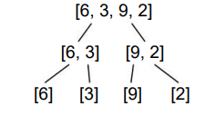

# Merge Sort 

## Sumário

- [O que é](#o-que-é-o-algoritmo-merge-sort)
- [Como Funciona?](#como-funciona)
    - [Divisão](#1---divisão)
    - [Conquista](#2---conquista)
- [Complexidade](#complexidade)
- [Implementações](#implementações)
- [Referências](#referências)

## O que é o algoritmo Merge Sort?

O Merge Sort é um algoritmo de ordenação recursivo baseado no paradigma de <a href="#divisão-e-conquista">Divisão e Conquista</a>.  Sua abordagem consiste em dividir um array em sub-arrays menores, ordenar cada sub-array e, em seguida, mesclar os sub-arrays ordenados para obter o array final ordenada.

O Merge Sort é amplamente utilizado, muito devido sua baixa <a href="#complexidade">Complexidade</a>. Uma aplicação comum do Merge Sort é na preparação de dados para a busca binária, onde a lista precisa estar ordenada para que a busca seja eficiente. A capacidade do Merge Sort de garantir uma ordenação estável e sua complexidade de tempo garantida de ``O(n log n)`` para o pior caso o torna uma escolha ideal para essa finalidade.

## Como Funciona?

Primeiro, você usa a recursão para
quebrar continuamente sua lista pela metade até que sua lista original se torne uma ou mais sublistas contendo apenas um número.



### 1 - Divisão:
- Iniciamos dividindo a lista original em duas sublistas de tamanho igual:<br>
``[6, 3] e [9, 2]``. <br>
- Ela é dividiva novamente até cada lista possuir somente um elemento.<br>
``[6], [3], [9], [2]``.

### 2 - Conquista
- Cada sublista é ordenada recursivamente usando o mesmo algoritmo Merge Sort.<br>
- Depois de classificar as listas contendo um item cada, você mescla suas sublistas duas de cada vez, comparando o primeiro item de cada lista. Mesclar suas listas significa combiná-las em ordem de
classificação.

- Primeiro, você mescla ``[6]`` e ``[3]``, depois mescla ``[9]`` e ``[2]``.<br> 
    > Neste caso, cada lista contém apenas um número, então você compara os dois números e coloca o menor número no início da sua nova lista mesclada e o número maior no final.<br>

- Agora, você tem duas listas
classificadas:<br>
``[3, 6] e [2, 9]`` 
- Em seguida, você mescla essas duas listas:        
    ```
    # Não mesclado: [3, 6], [2, 9]
    # Mesclado: []

    > Primeiro, você compara 3 e 2. Como 2 é menor, ele entra na sua lista mesclada:

    # Não mesclado: [3, 6], [9]
    # Mesclado: [2]

    > Agora você compara 3 e 9. Como 3 é menor, ele vai para sua lista mesclada:

    # Não mesclado: [6], [9]
    # Mesclado: [2,3]

    > Finalmente, você compara 6 e 9. Como 6 é menor, ele vai para a sua lista mesclada. Então você coloca o 9 na lista mesclada:

    # Não mesclado: []
    # Mesclado: [2,3,6,9]

    > Agora que concluiu todas as mesclagens, você tem uma lista única e ordenada.


    ```


## Complexidade

A <a href="https://github.com/FabioHenriqueFarias/algorithms-And-Data-Dtructures/tree/main/Asymptotic_Notation">Complexidade Assintótica</a> deste Algoritmo é de ``O(n * log n)`` no pior caso, tornando esse algoritmo uma ótima  opção para algoritmos de ordenação.

Uma característica importante é que sua eficiência é ``(n∗log n)``
tanto para o melhor caso, pior caso quanto para o caso médio. Isso significa que não apenas o Merge Sort possui uma complexidade de tempo mínima ``Ω(n∗log n)``,  mas também de caso médio de ``Θ(n∗log n)`` e tem uma cota superior de ``O(n * log n)``. Essa propriedade vai nos oferecer a garantia de que, independentemente da disposição dos dados no array, a ordenação será realizada de maneira eficiente.

## Implementações

Neste repositório, você encontrará a implementação de um algoritmo de Merge Sort em três diferentes tecnologias: <a href="https://github.com/FabioHenriqueFarias/algorithms-And-Data-Dtructures/tree/main/Algorithms/Sorting/MergeSort/C">C</a>, <a href="https://github.com/FabioHenriqueFarias/algorithms-And-Data-Dtructures/tree/main/Algorithms/Sorting/MergeSort/Python">Python</a> e <a href="https://github.com/FabioHenriqueFarias/algorithms-And-Data-Dtructures/tree/main/Algorithms/Sorting/MergeSort/Rust">Rust</a>

## Referências

Livro: <a href="https://novatec.com.br/livros/entendendo-algoritmos/">Entendendo Algoritmos</a> 

Livro: <a href="https://www.novatec.com.br/livros/cientista-da-computacao-autodidata/">Cientista da Computação Autodidata</a> 

Livro: <a href="https://www.grupogen.com.br/e-book-algoritmos-thomas-cormen-9788595159914">Algoritmos: Teoria e Prática</a> 

João Arthur: <a href="https://joaoarthurbm.github.io/eda/posts/merge-sort/">Ordenação por Comparação: Merge Sort
</a> 

Khan Academy: <a href="https://pt.khanacademy.org/computing/computer-science/algorithms/merge-sort/a/analysis-of-merge-sort">Análise do merge sort</a> 
