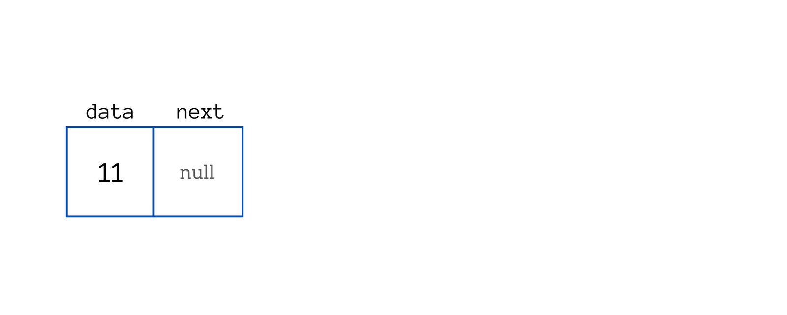
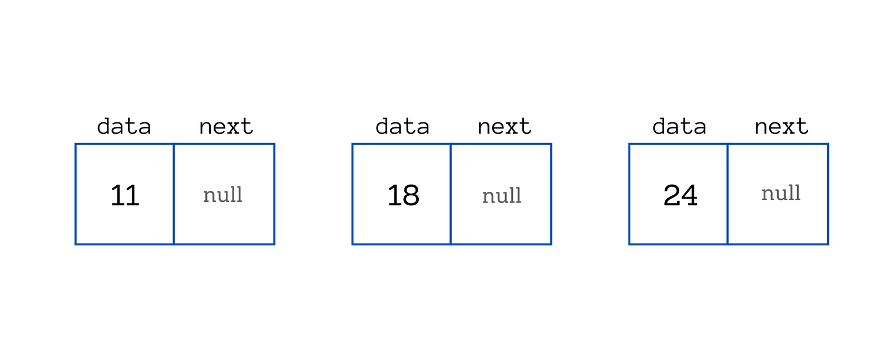

# Linked List

## Sumário

- [O que é uma Linked List?](#o-que-é-uma-linked-list)
- [O que é um Nó?](#o-que-é-um-nó)
- [Vincular os nós em uma lista encadeada](#vincular-os-nós-em-uma-lista-encadeada)
- [Operações comuns em Listas Encadeadas](#operações-comuns-em-listas-encadeadas)
     - [Inserção de um Novo Nó](#inserção-de-um-novo-nó)
     - [Remoção de um Nó Existente](#remoção-de-um-nó-existente)
     - [Leitura da Lista](#leitura-da-lista)
     - [Complexidades](#complexidades)
- [Implementações](#implementações)
- [Referências](#referências)

## O que é uma Linked List?

Uma lista encadeada é uma estrutura de dados linear usada para armazenar uma coleção de elementos. Ao contrário dos arrays, as listas encadeadas usam `nós` para armazenar elementos que não estão armazenados em locais de memória contíguos.

Uma lista encadeada é uma estrutura de dados que consiste em uma sequência de elementos, chamados de `nós`. Cada nó contém dados e um ponteiro (ou referência) para o próximo nó na lista. Essa característica de "vinculação" entre os `nós` é fundamental para a estrutura, permitindo que os elementos sejam organizados de forma dinâmica na memória.

Ao contrário de estruturas de dados estáticas, como arrays, onde os elementos são armazenados em posições contíguas de memória, os `nós` de uma lista encadeada podem estar dispersos em diferentes locais da memória. Isso confere flexibilidade à lista, pois novos elementos podem ser adicionados ou removidos de forma eficiente, sem a necessidade de realocação contígua de memória.

Essa flexibilidade torna as listas encadeadas uma escolha popular em muitas aplicações, especialmente quando o tamanho da lista é desconhecido antecipadamente ou sujeito a alterações frequentes. No entanto, é importante notar que o acesso aos elementos em uma lista encadeada pode ser menos eficiente do que em estruturas de dados estáticas, já que o acesso sequencial pode exigir a travessia de todos os `nós` anteriores até chegar ao desejado.


Aqui você pode ver que os endereços dos `nós` não são necessariamente sequenciais imediatamente. O primeiro nó tem um endereço 200 e o segundo nó tem um endereço 801, em vez de 201 como seria de esperar.

Então, como os `nós` são armazenados linearmente?

Mesmo que os `nós` não estejam em uma memória contígua, os `nós` são armazenados linearmente através de links. Cada nó possui o endereço do nó seguinte. É assim que cada nó pode acessar o nó seguinte.

## O que é um Nó?

Um Nó (Node) é a unidade básica de uma lista encadeada (Linked List) em computação.  Imagine a lista como uma corrente onde cada elo é um Nó.



Cada Nó possui pelo menos dois componentes:

- Dados: Essa é a informação que o Nó armazena. Pode ser um número, um texto, um objeto, ou qualquer tipo de dado que a Lista precisa armazenar.

- Referência (pointer): Esta referência aponta para o próximo Nó na lista. É o que dá o sentido de "ligação" à Lista Ligada, pois une os `Nós` sequencialmente.

Cada Nó é ligado formando uma lista encadeada. Veja como pode ser criado um Nó:

```c
struct Node {

    int data;           // Dados armazenados no Nó
    struct Node* next;  // Ponteiro para o próximo Nó
};
```
A struct Node representa um nó em uma lista encadeada, com duas variáveis: data (mantém os dados armazenados no nó) e next (mantém uma referência ao próximo nó na lista).

Agora você pode criar `nós` e adicionas dados a eles:

```c
int main() {

    // Criando novos Nós
    struct Node* newNode1 = (struct Node*)malloc(sizeof(struct Node));
    struct Node* newNode2 = (struct Node*)malloc(sizeof(struct Node));
    struct Node* newNode3 = (struct Node*)malloc(sizeof(struct Node));

    // Verificando se a alocação de memória foi bem-sucedida
    if (newNode1 == NULL || newNode2 == NULL || newNode3 == NULL) {
        printf("Erro: Falha ao alocar memória para o novo Nó.\n");
        return 1;  // Encerra o programa com código de erro
}

    // Atribuindo valores aos dados do Nó
    newNode1->data = 11;     
    newNode2->data = 18;     
    newNode3->data = 24;  

    // Inicialmente, o próximo Nó é NULL
    newNode1->next = NULL;   
    newNode2->next = NULL;   
    newNode3->next = NULL;   
}
```

Crianmos 3 `nós`.



## Vincular os nós em uma lista encadeada

Após criar e adicionar os dados nos `nós`, é necessário estabelecer as ligações entre eles para formar a lista encadeada.

Para conectar os `nós` em uma lista encadeada, o processo envolve atribuir o endereço de memória do próximo nó ao ponteiro next do nó atual. Isso cria uma cadeia de referências que conecta cada nó ao seu sucessor na lista.

Por exemplo, suponha que temos três `nós`, newNode1, newNode2, e newNode3, com dados distintos armazenados neles. Para vincular esses `nós`, podemos usar a seguinte abordagem:

```c
newNode1->next = newNode2;
newNode2->next = newNode3;
```

Nesse caso, newNode1 aponta para newNode2 como seu próximo nó, e newNode2 aponta para newNode3. Isso cria uma sequência ordenada em que cada nó conhece o próximo nó na lista.


## Operações comuns em Listas Encadeadas

Algumas Operações comuns em listas encadeadas.

### Inserção de um Novo Nó

A inserção de um novo nó em uma lista encadeada envolve atualizar os ponteiros dos nós vizinhos para garantir que o novo nó seja corretamente inserido na sequência. Dependendo do caso, o nó pode ser inserido no **início**, no **final** ou em uma **posição específica** da lista.

A operação de inserção pode ser considerada **O(1)** quando estamos adicionando um nó no início ou no final da lista, já que o único ajuste necessário é atualizar o ponteiro do nó anterior para apontar para o novo nó (no caso do início) ou atualizar o ponteiro do nó anterior para o novo nó (no caso do final). No entanto, se a inserção precisar ocorrer em uma posição intermediária, será necessário primeiro percorrer a lista até encontrar o local desejado, o que aumenta a complexidade para **O(n)**, pois é preciso iterar pela lista até chegar no ponto certo. 

Em resumo, se já soubermos onde o nó precisa ser inserido, a operação é bastante eficiente, ocorrendo em **O(1)**. Caso contrário, a busca pela posição correta pode tornar a inserção mais demorada.

### Remoção de um Nó Existente

Na remoção de um nó em uma lista encadeada, o processo envolve ajustar os ponteiros dos nós vizinhos para que o nó a ser removido seja "pulando", ou seja, o nó anterior passa a apontar para o próximo nó do nó removido. Dessa forma, o nó que será excluído deixa de ser acessível, podendo então ser liberado da memória para evitar vazamentos.

Embora o processo de remoção de um nó em si seja simples, a complexidade da operação pode variar dependendo do contexto. Se o nó a ser removido for o **primeiro** (cabeça) ou o **último** da lista, o ajuste dos ponteiros é direto e rápido. No entanto, se o nó a ser removido estiver no **meio** da lista, é necessário primeiro encontrar o nó anterior, o que exige percorrer a lista até o ponto desejado. Isso torna a operação de remoção **O(n)** no pior caso, já que é preciso iterar pelos nós para localizá-lo.

No entanto, se já tivermos uma referência ao nó anterior, como no caso da remoção da cabeça (primeiro nó) ou quando mantemos um ponteiro direto para o nó anterior, a remoção pode ser feita em **O(1)**, ou seja, de forma imediata e sem a necessidade de percorrer a lista.

### Leitura da Lista

Na lista ligada, a operação de leitura de um elemento tem complexidade **O(n)**, pois é necessário percorrer os nós sequencialmente, começando do primeiro até o nó desejado. Diferente de estruturas como arrays, que permitem acesso direto aos elementos por índice, na lista ligada não há essa possibilidade, exigindo a iteração de cada nó até encontrar o desejado. Esse processo é eficiente em termos de memória, já que não há necessidade de alocar espaço contínuo para os elementos, mas pode ser ineficiente em termos de tempo quando a lista cresce.

Embora o acesso sequencial seja simples e eficiente em termos de uso de memória, ele se torna um ponto fraco quando o objetivo é acessar elementos rapidamente. Para encontrar o **n-ésimo** elemento, é necessário percorrer a lista até o nó desejado, o que pode ser demorado, especialmente em listas grandes.

Para melhorar o desempenho em casos de leituras frequentes, algumas estratégias podem ser adotadas. Uma delas é o uso de **índices auxiliares** ou **ponteiros adicionais**, que mantêm referências a nós específicos, reduzindo o número de passos necessários para acessar determinados elementos. Outra abordagem seria o uso de **listas duplamente ligadas**, que permitem percorrer a lista tanto da cabeça para a cauda quanto da cauda para a cabeça, oferecendo maior flexibilidade no acesso. 

Porém, apesar dessas melhorias, o acesso direto em listas ligadas nunca será tão rápido quanto em outras estruturas de dados, como arrays ou tabelas de hash, onde a complexidade de leitura é **O(1)**. Em casos onde o acesso rápido é crucial, pode ser mais eficiente considerar outras estruturas, como arrays dinâmicos ou árvores balanceadas, que proporcionam um acesso mais rápido e otimizado aos elementos.


### Complexidades

**Listas Encadeadas** são uma estrutura de dados fundamental onde os elementos são armazenados de forma sequencial, mas cada elemento contém uma referência (ou ponteiro) para o próximo elemento. Isso permite uma flexibilidade nas operações de inserção e remoção, mas impacta a eficiência de outras operações, como leitura e pesquisa. Vamos explorar como essas operações se comportam em termos de [complexidade assintótica](https://github.com/FabioHenriqueFarias/algorithms-And-Data-Dtructures/tree/main/Asymptotic_Notation).

| Operação       | Complexidade |
|----------------|--------------|
| Inserção       | O(1)         |
| Remoção        | O(1)         |
| Leitura        | O(n)         |
| Pesquisa       | O(n)         |


## Implementações

Neste repositório, você encontrará a implementação da estrutura de dados Linked List em três diferentes tecnologias: <a href="https://github.com/FabioHenriqueFarias/algorithms-And-Data-Dtructures/tree/main/Data_Structures/2_Linked-List/C">C</a>, <a href="https://github.com/FabioHenriqueFarias/algorithms-And-Data-Dtructures/tree/main/Data_Structures/2_Linked-List/Python">Python</a> e <a href="https://github.com/FabioHenriqueFarias/algorithms-And-Data-Dtructures/tree/main/Data_Structures/2_Linked-List/Rust">Rust</a>

## Referências

Palistha: <a href="https://www.freecodecamp.org/news/how-linked-lists-work/" target="_blank" >How Does a Linked List Work?</a>

João Arthur Brunet: <a href="https://joaoarthurbm.github.io/eda/posts/linkedlist/" target="_blank" >Listas Ligadas (LinkedList)
</a>

Livro: <a href="https://www.amazon.com.br/Algoritmos-Teoria-Pr%C3%A1tica-Thomas-Cormen/dp/8535236996" target="_blank">Thomas Cormen - Algoritmos: Teoria e Prática | Capítulo 10.2
</a>

Livro: <a href="https://novatec.com.br/livros/entendendo-algoritmos/">Entendendo Algoritmos</a>

Livro: <a href="https://www.grupogen.com.br/livro-algoritmos-e-estruturas-de-dados-em-linguagem-c-andre-backes-editora-ltc-9788521638308">Algoritmos e Estruturas de Dados em Linguagem C</a>