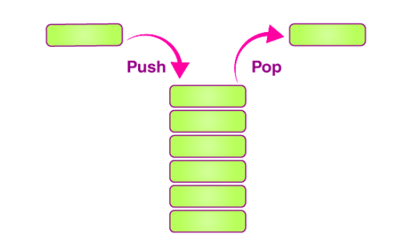
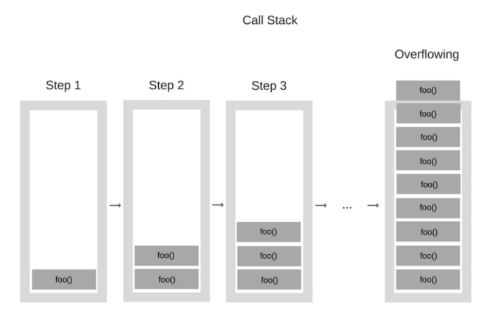

# Stack

## Sumário

- [O que é uma Stack?](#o-que-é-uma-stack)
- [Usos de uma stack:](#usos-de-uma-stack)
    - [Call Stack](#call-stack)
    - [Compiladores](#compiladores)
    - [Backtracking](#backtracking)
- [Operações comuns em Stack](#operações-comuns-em-stack)
    - [Inserção](#inserção)
        - [Complexidades de Inserção](#complexidades-de-inserção)
    - [Remoção](#remoção)
        - [Complexidades de Remoção](#complexidades-de-remoção)
    - [Leitura](#leitura)
        - [Complexidades de Leitura](#complexidades-de-leitura)
    - [Complexidades](#complexidades)
- [Implementações](#implementações)
- [Referências](#referências)

## O que é uma Stack?
Uma pilha é uma estrutura de *dados linear* e *abstrada* que segue o princípio `Last-In-First-Out` **(LIFO)** . 
> LIFO (Last-In-First-Out), ou Último a Entrar, Primeiro a Sair, é um princípio em estruturas de dados onde o último elemento adicionado é o primeiro a ser removido.

É como uma pilha de pratos: você adiciona um novo prato no topo da pilha e, quando precisa remover um prato, você retira o que está no topo, ou seja, o último adicionado.

As pilhas têm duas operações principais: `push` e `pop`. `Pushing` um item em uma pilha significa colocar um novo item nela. `Popping` um item de uma pilha significa remover o último item dela. As pilhas também podem ter operações adicionais, como `peek`, que significa olhar para o elemento superior de uma pilha sem o remover.


Para implementar uma estrutura de dados como essa, é necessário manter um ponteiro para o topo da pilha. Este ponteiro indica onde está o último elemento que foi inserido, permitindo acessar e manipular apenas o elemento mais recente adicionado à pilha.




As pilhas podem ser limitadas ou ilimitadas. Uma pilha limitada é uma pilha que limita quantos itens você pode adicionar a ela, enquanto uma pilha ilimitada é uma pilha que não limita quantos elementos você pode adicionar a ela. 

Se você continua confuso sobre a diferença entre um tipo de dados abstrato e uma estrutura de dados, uma pilha pode ajudá-lo a entender a diferença. O tipo de dados abstrato pilha descreve a ideia de uma estrutura de dados que permite acessar apenas o item mais recente colocado nela. 

No entanto, existem várias maneiras diferentes de criar uma estrutura de dados como esta. Por exemplo, você pode criar uma pilha definindo uma classe que usa internamente uma lista vinculada ou um array para rastrear os itens da pilha. Ao escrever o código para uma pilha usando um array ou uma lista vinculada, **você passou da ideia abstrata de uma pilha para uma estrutura de dados: a implementação real de um tipo de dados abstrato.**

## Usos de uma stack:

As pilhas são uma das estruturas de dados mais utilizadas na computação. 

### Call Stack

As **call stack (pilha de chamadas)**, são essenciais em diversas linguagens de programação para controlar as chamadas de funções durante a execução do código.

A pilha de chamadas é estabelecida na memória do programa no início da execução do código. Cada vez que uma função é chamada, um novo quadro de ativação, também conhecido como frame de pilha, é criado e colocado no topo da pilha de chamadas. Esse quadro de ativação armazena informações cruciais, como os parâmetros da função, variáveis locais e o endereço de retorno, indicando de onde a execução deve continuar após a conclusão da função.

Imagine um prédio em construção, cada nova função chamada é como adicionar um novo andar ao prédio, empilhando tijolos. Assim como não é possível remover um tijolo do meio do prédio sem que o topo desabe, as funções devem ser executadas e removidas em ordem, da mais recente para a mais antiga, para que o processo ocorra sem problemas.

Conforme as funções são chamadas dentro de outras funções, novos quadros de ativação são gerados e empilhados na pilha de chamadas. O último quadro empilhado corresponde à função atualmente em execução, enquanto os quadros anteriores correspondem às funções que aguardam retorno.

Quando uma função encerra sua execução, seu quadro de ativação é desempilhado da pilha de chamadas, e o controle retorna para a função chamadora, utilizando o endereço de retorno armazenado no quadro desempilhado.

No entanto, é importante observar que a pilha de chamadas possui uma capacidade limitada. Quando ocorrem muitas chamadas de funções aninhadas, pode ocorrer um problema conhecido como "overflowing", onde a pilha de chamadas excede sua capacidade de armazenamento, geralmente resultando em uma exceção ou erro de estouro de pilha.



### Compiladores

Os compiladores usam pilhas para analisar expressões, especialmente quando você tem expressões que usam pares de parênteses aninhados, como em expressões aritméticas padrão, ou pares de colchetes ou colchetes aninhados. 

Quando um compilador analisa uma expressão matemática ou qualquer outra expressão que envolva delimitadores aninhados, como `( )`, `[ ]` ou `{ }`, ele precisa garantir que esses delimitadores estejam corretamente balanceados. Isso significa que cada delimitador de abertura tenha um delimitador correspondente de fechamento e que eles estejam aninhados corretamente.

Para fazer essa verificação, os compiladores geralmente usam uma pilha. Durante o processo de análise, quando um delimitador de abertura é encontrado, ele é empilhado na pilha. Conforme o compilador encontra os delimitadores de fechamento, ele os compara com os delimitadores no topo da pilha. Se os delimitadores correspondentes forem encontrados, eles são desempilhados. Se não, o compilador sabe que ocorreu um erro de sintaxe devido a delimitadores mal balanceados.

### Backtracking

Na área de **Machine Learning** e em outras áreas de inteligência artificial, os cientistas da computação frequentemente se deparam com problemas que requerem a implementação de algoritmos de retrocesso, também conhecidos como algoritmos de backtracking. 

Os algoritmos de retrocesso é uma técnica para explorar todas as possíveis soluções para um determinado problema, testando sistematicamente diferentes opções até encontrar uma solução viável.

A estratégia de retrocesso envolve tentar uma série de opções, fazendo uma escolha em cada passo e, em seguida, retrocedendo (backtracking) quando uma solução não é encontrada ou quando se atinge um beco sem saída. Isso significa que, ao encontrar uma solução inválida ou uma condição que impeça a solução, o algoritmo retrocede para o estado anterior e tenta uma alternativa diferente.

Durante a execução de um algoritmo de retrocesso, as decisões tomadas em cada etapa são armazenadas em uma pilha. Por exemplo, se estivermos explorando um espaço de soluções, as escolhas feitas em cada nível da árvore de busca são empilhadas. Se uma determinada escolha levar a um beco sem saída, podemos desempilhar as escolhas anteriores e tentar uma alternativa diferente.

Como adicionar e remover elementos de uma pilha são `O(1)`, eles são uma excelente escolha sempre que você adiciona e remove elementos de dados com frequência. 

## Operações comuns em Stack

Para manipular uma pilha, diversas operações são oferecidas para a estrutura de dados **Stack**, que incluem:


### Inserção

Quando utilizamos a operação ``push``, um novo elemento é adicionado no topo da pilha, tornando-se o elemento mais recente da estrutura. 

#### Complexidades de Inserção

A operação de inserção em uma pilha, realizada através da operação ``push``, possui uma complexidade de tempo constante no pior caso, expressa como ``O(1)``. Isso significa que a quantidade de operações necessárias para inserir um elemento na pilha não depende do número total de elementos já presentes na pilha. Independentemente do tamanho da pilha, a inserção de um novo elemento ocorre em tempo constante.

### Remoção

Quando utilizamos a operação `pop`, o elemento que está no topo da pilha é removido, resultando na retirada do elemento mais recentemente adicionado à estrutura. 

#### Complexidades de Remoção

A operação de remoção de uma pilha, é realixada por meio da operação ``pop`` possui uma complexidade de tempo constante no pior caso, expressa como ``O(1)``. Isso significa que a quantidade de operações necessárias para remover um elemento na pilha não depende do número total de elementos já presentes na pilha. Independentemente do tamanho da pilha, a remoção de um  elemento ocorre em tempo constante.

### Leitura

Quando realizamos a operação de leitura em uma pilha, estamos obtendo o último elemento inserido na pilha, ou seja, o elemento que está no topo da pilha. Essa operação de leitura, também conhecida como ```espiar```, ```peek``` ou ```top```, permite acessar o elemento mais recente sem removê-lo da pilha.

#### Complexidades de Leitura

A operação de leitura em uma pilha é geralmente realizada por meio das operações `peek` ou `top`. Essa operação tem uma complexidade de tempo constante no pior caso, expressa como ``O(1)``. Isso significa que levará um tempo constante para retornar o elemento no topo da pilha de uma **Stack**.

### Complexidades

O tempo de realização das operações de inserção, remoção e leitura em uma Stack é uma das razões pelas quais elas são amplamente utilizadas em diferentes contextos na computação.

| Operação | Complexidade |
|---|---|
| Inserção (push) | O(1) |
| Remoção (pop) | O(1) |
| Leitura (peek ou top) | O(1) |

Essas complexidades de tempo constante (O(1)) indicam que o tempo necessário para realizar cada uma dessas operações não depende do tamanho total da pilha. Independentemente do número de elementos presentes na pilha, a inserção, remoção e leitura podem ser executadas em tempo constante, tornando as pilhas uma escolha eficiente e eficaz para muitas aplicações computacionais.

## Implementações

Neste repositório, você encontrará a implementação da estrutura de dados Stack em três diferentes tecnologias: <a href="https://github.com/FabioHenriqueFarias/algorithms-And-Data-Dtructures/tree/main/Data_Structures/3_Stack/C">C</a>, <a href="https://github.com/FabioHenriqueFarias/algorithms-And-Data-Dtructures/tree/main/Data_Structures/3_Stack/Python">Python</a> e <a href="https://github.com/FabioHenriqueFarias/algorithms-And-Data-Dtructures/tree/main/Data_Structures/3_Stack/Rust">Rust</a>

## Referências

Livro: <a href="https://www.amazon.com.br/Algoritmos-Teoria-Pr%C3%A1tica-Thomas-Cormen/dp/8535236996" target="_blank">Algoritmos: Teoria e Prática - Thomas Cormen 
</a>

Geeks for Geeks: <a href="https://www.geeksforgeeks.org/basic-operations-in-stack-data-structure-with-implementations/" target="_blank">Basic Operations in Stack Data Structure with Implementations
</a>


Livro: <a href="https://www.novatec.com.br/livros/cientista-da-computacao-autodidata/">Cientista da Computação Autodidata</a> 

Livro: <a href="https://novatec.com.br/livros/entendendo-algoritmos/">Entendendo Algoritmos</a>

Livro: <a href="https://www.amazon.com.br/Algoritmos-Teoria-Pr%C3%A1tica-Thomas-Cormen/dp/8535236996" target="_blank">Thomas Cormen - Algoritmos: Teoria e Prática
</a>

Geeks for Geeks: <a href="https://www.geeksforgeeks.org/stack-data-structure/" target="_blank">Stack Data Structure
</a>

Programiz: <a  href="https://www.geeksforgeeks.org/stack-data-structure/" target="_blank">Stack Data Structure
</a>