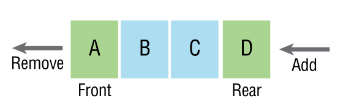
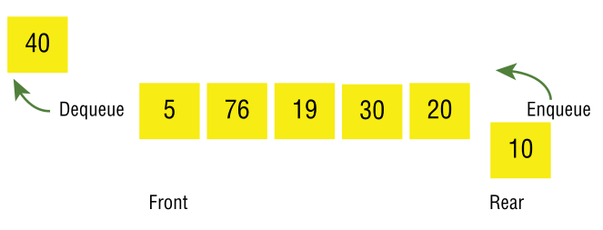

# Queue

## Sumário 

- [O que é uma Queue?](#o-que-é-uma-queue)
- [Usos de uma Queue](#usos-de-uma-queue)

## O que é uma Queue?

Uma fila (ou Queue, em inglês) é um tipo de dado abstrato e uma estrutura de dados linear onde os itens são adicionados no final e removidos do início. Em outras palavras, os elementos entram pela parte de trás da fila e saem pela frente, seguindo o princípio `FIFO (First In, First Out) - primeiro a entrar, primeiro a sair`.

Como mostra a imagem abaixo, o conceito de fila pode ser comparado a uma fila de pessoas em um supermercado: a primeira pessoa a entrar na fila é a primeira a ser atendida no caixa, enquanto as pessoas que chegam depois devem esperar no final da fila.

As filas, assim como as <a href="https://github.com/FabioHenriqueFarias/algorithms-And-Data-Dtructures/tree/main/Data_Structures/3_Stack"> pilhas</a>, são estruturas de dados de acesso limitado. As filas têm duas operações principais: **Inclusão (enqueue)** e **Remoção (dequeue)**. Enfileirar (enqueue) significa adicionar um item ao final da fila, enquanto desenfileirar (dequeue) significa remover um item do início da fila.

Como ilustrado na imagem, você enfileira os elementos no final da fila e os retira da fila pela frente.

Existem várias maneiras de implementar o tipo de dado abstrato de fila como uma estrutura de dados. Assim como as pilhas, você pode implementar uma fila usando um <a href="https://github.com/FabioHenriqueFarias/algorithms-And-Data-Dtructures/tree/main/Data_Structures/1_Arrays">array</a> ou uma <a href="https://github.com/FabioHenriqueFarias/algorithms-And-Data-Dtructures/tree/main/Data_Structures/2_Linked-List">Linked List</a>. Além disso, as filas podem ser classificadas como limitadas ou ilimitadas. 

Uma fila limitada restringe a quantidade de itens que podem ser adicionados, enquanto uma fila ilimitada não impõe essa restrição. Por exemplo, você pode criar uma fila limitada usando um array, onde o tamanho máximo é predefinido. Por outro lado, uma fila ilimitada pode ser implementada usando uma lista ligada, permitindo adicionar itens indefinidamente até que a memória seja esgotada. Também é possível implementar uma fila limitada usando uma lista ligada, desde que se controle o número de itens armazenados.

## Usos de uma stack
