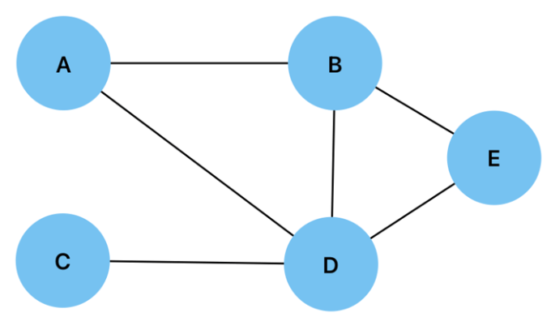
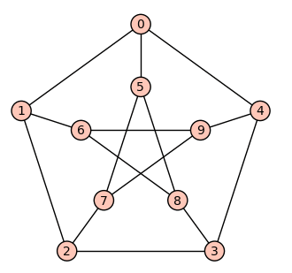

# Graphs

## Sumário

- [O que é uma Graph?](#o-que-é-uma-graph)
- [Elementos de um Grafo](#elementos-de-um-grafo)
  - [Vértices](#vértices)
  - [Arestas](#arestas)
  - [Graus de Vértices](#grau-de-um-vértice)
- [Tipos de Grafos](#tipos-de-grafos)
  - [Grafo direcionado:](#grafo-direcionado)
  - [Grafo não direcionado:](#grafo-não-direcionado)
  - [Grafo trivial](#grafo-trivial)
  - [Grafo cíclico](#grafo-cíclico)
  - [Grafo pesado](#grafo-pesado)
  - [Grafo não pesado](#grafo-não-pesado)
  - [Grafo bipartido](#grafo-bipartido)
  - [Grafo plano](#grafo-plano)
  - [Grafo não plano](#grafo-não-plano)
- [Entendendo os conceitos](#entendendo-os-conceitos)
  - [Adjacência](#adjacência)
  - [Caminho](#caminho)
  - [Conectividade](#conectividade)
  - [Subgrafos](#subgrafos)
  - [Diferença entre Grafos e Árvores](#diferença-entre-grafos-e-árvores)
  - [Grafos Planos e Não Planos](#grafos-planos-e-não-planos)
  - [Conceito de Caminho Mínimo](#conceito-de-caminho-mínimo)
  - [Buscas em Grafos: BFS e DFS](#buscas-em-grafos-bfs-e-dfs)
  - [Como Representar Grafos](#como-representar-grafos)
- [Operações Comuns em um Grafo](#operações-comuns-em-um-grafo)
  - [Inserção](#inserção)
  - [Remoção](#remoção)
  - [Pesquisa](#pesquisa)
  - [Outras Operações Úteis](#outras-operações-úteis)
  - [Complexidades](#complexidades)
- [Implementações](#implementações)
- [Referências](#referências)

## O que é uma Graph?

Já pensou em como elementos do nosso dia a dia se conectam? Seja um grupo de amigos no WhatsApp, um mapa de rodovias ou uma rede social, essas conexões contam histórias sobre relações e interações. É aqui que entra o conceito de **Grafos**.

<div align="center">
  
</div>

Um **grafo** é como uma ferramenta mágica que usamos para organizar e entender essas conexões. Ele é composto de dois elementos principais:  
- **Vértices (ou Nodes):** Representam os elementos individuais, como pessoas, cidades ou páginas de internet.  
- **Arestas (ou Edges):** Representam as conexões entre os vértices, como amizades, estradas ou links.

**Entendendo os Grafos com um Exemplo**

Imagine que você está planejando uma viagem de carro por várias cidades. Cada cidade é um **vértice** e as estradas que ligam essas cidades são as **arestas**. O grafo ajuda a visualizar os caminhos possíveis e como as cidades estão conectadas.

***Representação do Grafo:***
```
(1) → (2) → (4)
 ↓
(3) → (5) → (6)
```

Se você começa na **Cidade 1**, pode visualizar duas possibilidades de rota. Imagine que você tem um destino final, mas precisa decidir como chegar lá, levando em conta fatores como tempo, distância ou até mesmo paisagens que gostaria de ver no caminho.

1. **Partindo da Cidade 1:**
   - Você tem **duas opções** iniciais:
     - **Seguir para a Cidade 2:** Um caminho direto e possivelmente mais rápido, mas com menos opções de desvios no futuro.
     - **Seguir para a Cidade 3:** Um trajeto que pode ser um pouco mais longo, mas oferece mais alternativas de rota no meio do caminho.

2. **Escolhendo a Cidade 2:**
   - Ao optar por esse trajeto, você segue para a **Cidade 4**.
   - Esse caminho é linear, sem bifurcações, o que pode ser vantajoso se a prioridade for simplicidade e rapidez.

3. **Escolhendo a Cidade 3:**
   - Esse caminho abre novas possibilidades, levando você até a **Cidade 5**.
   - Ao chegar na Cidade 5, surge mais uma conexão: a estrada até a **Cidade 6**, que é o seu destino final.

Cada escolha de rota reflete diferentes cenários do mundo real:
- Se você precisa de uma solução direta e objetiva (como no planejamento de uma entrega ou na execução de uma tarefa), o caminho pela Cidade 2 e Cidade 4 pode ser o ideal.
- Por outro lado, se a flexibilidade é importante (como em uma viagem turística ou na análise de alternativas em um projeto), o trajeto passando pela Cidade 3 e Cidade 5 permite explorar mais opções antes de concluir a jornada.

Essa estrutura pode ajudar a ***modelar problemas complexos*** e ***visualizar soluções***, seja no planejamento de trajetos, na otimização de redes de transporte, ou até mesmo na análise de fluxos de trabalho. Ao pensar em vértices e arestas, você pode planejar estratégias, prever resultados e tomar decisões mais informadas.

## Elementos de um Grafo

Os elementos de um grafo são como as peças de um quebra-cabeça que, juntas, mostram como as coisas estão conectadas. Temos os **vértices**, que são os "pontos" representando os objetos ou lugares, como cidades, pessoas ou computadores. E temos as **arestas**, que são as "linhas" que ligam esses pontos, mostrando as relações ou caminhos entre eles, como estradas, amizades ou cabos de rede. Cada vértice também tem algo chamado **grau**, que é como contar quantas conexões ele possui. Por exemplo, em uma cidade, o grau seria o número de estradas que chegam ou saem dela. É uma forma de medir o quão "conectado" cada ponto está dentro do grafo. Esses dois elementos — vértices e arestas —, junto com o conceito de grau, trabalham juntos para ajudar a entender e visualizar como tudo está interligado.

### Vértices

Como já mencionamos antes, os **vértices** são os "pontos" do grafo, representando os elementos que estão sendo conectados. Em uma analogia com uma viagem, cada cidade seria um vértice, um local de interesse ou um destino. Esses vértices podem ser qualquer tipo de entidade que estamos modelando, como pessoas, computadores, lugares ou até mesmo conceitos. São eles que definem os "pontos de partida" ou os "alvos" das conexões no grafo, e a partir deles é que conseguimos entender como as coisas se relacionam entre si. Cada vértice tem seu próprio papel, e a maneira como estão conectados por meio das arestas vai nos mostrar a estrutura e a dinâmica do sistema que estamos analisando.

### Arestas

Como já mencionamos antes, as **arestas** são as "linhas" que conectam os vértices, ou seja, as relações entre os pontos. Para tornar mais claro, imagine que as arestas são as estradas que ligam as cidades em uma viagem. Elas são o que permite que você se mova de um lugar para outro, fazendo a ligação entre diferentes pontos. No grafo, essas conexões mostram como as coisas estão relacionadas ou como elas podem interagir. Assim como uma estrada pode ser de uma única direção ou ter pedágio, as arestas também podem ter características como direção (quando o caminho tem um sentido específico) ou peso (se há algum custo ou valor associado à conexão). Elas ajudam entender como a rede funciona, já que são as "pontes" que conectam os diferentes elementos entre si.

### Graus de Vértices

O grau de um vértice é o número de conexões (arestas) que ele tem em um grafo. Pense em um vértice como uma cidade em um mapa, e as arestas como estradas ligando essa cidade a outras. O grau do vértice é o total de estradas que chegam ou saem dessa cidade.

<div align="center">
  
</div>

  No caso de um **grafo não direcionado** (como o da imagem), cada aresta conta como uma conexão, independentemente da direção. Por exemplo:

  - O vértice A está conectado aos vértices B e D. Portanto, o grau de A é 2.
  - O vértice B está conectado aos vértices A, D e E. Portanto, o grau de B é 3.

  Em um **grafo direcionado**:

  <div align="center">
    
  </div>

<br/>

  - **Grau de entrada**: o número de arestas que chegam ao vértice. Por exemplo, o vértice 2 recebe arestas dos vértices 1 e 4, então o grau de entrada de 2 é 2.
  - **Grau de saída**: o número de arestas que saem do vértice. Por exemplo, o vértice 2 tem arestas que saem para os vértices 0 e 3, então o grau de saída de 2 é 2.

  O grau de um vértice é uma medida usada em teoria dos grafos para entender a conectividade e a estrutura de um grafo. Em grafos não direcionados, o grau é apenas o número de conexões que um vértice tem com outros. Já em grafos direcionados, há duas maneiras de medir o grau: o grau de entrada, que conta quantas arestas entram no vértice, e o grau de saída, que conta quantas arestas saem dele. Isso ajuda a entender melhor como os vértices estão interligados de diferentes maneiras.


## Tipos de Grafos

Existem diversos tipos de grafos, cada um com suas características específicas e aplicabilidades em contextos distintos. Vamos explorar os principais tipos, entendendo como cada um pode ser útil na prática. Seja para modelar redes sociais, otimizar rotas de entrega ou resolver problemas complexos na ciência da computação, os grafos se mostram uma ferramenta poderosa e intuitiva. Eles nos ajudam a visualizar relações, conexões e fluxos de forma clara, permitindo resolver desafios do mundo real de maneira mais eficiente e estratégica.

### **Grafo direcionado**: 

Um **grafo direcionado** é uma estrutura em que as conexões entre os vértices têm uma direção específica. Isso significa que, se há uma ligação de \( A \) para \( B \), o caminho só pode ser seguido nesse sentido, a menos que exista uma outra ligação separada permitindo o percurso de \( B \) para \( A \). Esse tipo de grafo é muito útil em situações onde a direção das relações importa, como em redes sociais (onde uma pessoa segue outra, mas não necessariamente ao contrário), diagramas de fluxo ou mapas de trânsito.

<div align="center">
  
</div>

Na imagem acima, podemos ver um exemplo claro desse tipo de grafo. Por exemplo, a conexão de \( 5 \) para \( 7 \) permite que se vá de \( 5 \) para \( 7 \), mas o caminho inverso só é possível porque existe uma seta apontando de \( 7 \) para \( 5 \). Já o vértice \( 6 \) pode ser alcançado a partir dos vértices \( 2 \), \( 4 \) e \( 0 \), mas não há conexões diretas que permitam que \( 6 \) retorne a esses vértices. Também podemos observar ciclos, como o que envolve \( 5 \), \( 7 \) e \( 4 \), onde é possível percorrer esses vértices e voltar ao ponto de partida seguindo as direções indicadas pelas setas.

### **Grafo não direcionado**: 
Um **grafo não direcionado** é uma estrutura composta por **vértices** (ou nós) e **arestas**, onde as conexões entre os vértices não têm direção, ou seja, podemos percorrê-las em qualquer sentido.

Na imagem abaixo, temos um exemplo de grafo não direcionado com cinco vértices, representados pelas letras A, B, C, D e E. As arestas conectam esses vértices, e se há uma aresta entre A e E, podemos ir de A para E e também de E para A. O grafo é **conexo**, pois é possível alcançar qualquer vértice a partir de outro, como no caminho A → E → D.

<div align="center">
  
</div>

Um exemplo de uso de grafo não direcionado é em **redes de comunicação**, onde a troca de informações pode ocorrer em ambas as direções entre os dispositivos conectados.


### **Grafo trivial**: 
Um **grafo trivial** é o tipo mais simples de grafo, composto por um único vértice e nenhuma aresta. Nesse caso, não há conexões entre vértices, pois o grafo é formado por um único ponto isolado. Como não existem arestas, não é possível formar caminhos ou ciclos, já que não há travessia entre vértices. O grafo trivial é uma representação mínima, muitas vezes utilizada como exemplo básico em conceitos da teoria dos grafos ou como caso base em algoritmos e definições.

Por exemplo, em um algoritmo de busca em grafos, o grafo trivial pode ser usado como o caso base, onde não há necessidade de busca, pois não há arestas para percorrer. Na imagem abaixo, podemos ver um grafo trivial representado por um único ponto (vértice) sem nenhuma linha (aresta) conectando a outros pontos. Esse único vértice é o único componente do grafo, ilustrando de forma simples a ausência de conexões que caracteriza um grafo trivial.


<div align="center">
  
</div>

### **Grafo cíclico**: 

Um **grafo cíclico** é um tipo de grafo que contém pelo menos um ciclo — ou seja, uma sequência de vértices conectados por arestas, onde o caminho retorna ao ponto de partida, formando um loop. Nesse ciclo, todos os vértices e arestas são únicos, sem repetições ao longo do percurso. Esse tipo de grafo é útil para representar situações em que há uma conexão contínua e repetitiva entre os elementos, como em processos ou sistemas que se retroalimentam ou seguem um ciclo sem fim.

Os grafos cíclicos podem ser **dirigidos** ou **não dirigidos**. Em um **grafo cíclico não direcionado**, as arestas não possuem direção, permitindo uma conexão bidirecional entre os vértices. Já em um **grafo cíclico dirigido**, as arestas têm uma direção específica, estabelecendo um caminho orientado ao longo do ciclo. Esses grafos podem ter ciclos de diferentes comprimentos e podem ser simples, ou seja, não contêm arestas múltiplas entre os mesmos vértices, ou até mesmo serem multigrafos, onde podem existir várias arestas entre dois vértices.

Os grafos cíclicos são frequentemente usados para modelar sistemas com feedback, como em redes de comunicação, onde a informação pode retornar ao ponto de origem por meio de um ciclo. 

Na imagem abaixo, podemos ver exemplos de grafos cíclicos tanto dirigidos quanto não dirigidos. O grafo **direcionado** apresenta as arestas com uma direção específica, formando um ciclo orientado. Já o grafo **não direcionado** apresenta arestas sem direção, permitindo que o caminho percorra em qualquer sentido entre os vértices, criando também um ciclo, mas de forma bidirecional.


<div align="center">
  
</div>

### **Grafo pesado:**

Um **grafo pesado** é como um mapa em que cada estrada tem um valor associado. Esse valor pode ser algo prático, como a distância entre dois lugares, o custo de uma viagem ou o tempo necessário para percorrer o caminho. Imagine olhar para um mapa onde cada estrada mostra quantos quilômetros você precisa viajar ou quanto custará o pedágio. Isso é exatamente o que um grafo pesado representa.  

Esses grafos são muito úteis para resolver problemas reais. Por exemplo, se você quer descobrir a rota mais rápida ou barata para ir de casa ao trabalho, pode usar um grafo pesado para isso. Os pesos das conexões (arestas) indicam o que você deve levar em conta, como tempo, custo ou distância. Algoritmos como **Dijkstra** e **Bellman-Ford** ajudam a calcular essas rotas de forma eficiente.  

Na imagem abaixo, temos um exemplo de grafo pesado. Os círculos representam os **vértices** (como cidades, por exemplo), e as linhas entre eles são as **arestas**, com os números indicando os pesos. Esses pesos podem simbolizar a distância entre os pontos, o custo para ir de um lugar ao outro, ou qualquer outro valor relevante.  

<div align="center">
  
</div>

Os grafos pesados podem ser de dois tipos:  
- **Grafo pesado não dirigido:** As conexões não têm direção, ou seja, você pode ir e voltar entre os pontos, e o peso será o mesmo. Pense em uma estrada de mão dupla com o mesmo custo ou distância nos dois sentidos.  
- **Grafo pesado dirigido:** Aqui, as conexões têm uma direção específica. É como uma estrada de mão única, onde o custo ou o tempo pode ser diferente dependendo do sentido que você percorre.  

Com grafos pesados, é possível entender não apenas se os pontos estão conectados, mas também como estão conectados e o que isso significa em termos de custo, tempo ou qualquer outra métrica que você precisa analisar. 

### **Grafo não pesado:**

Um **grafo não pesado** é como um mapa em que as estradas entre os lugares não possuem valores associados, ou seja, não há uma medida de custo, distância ou tempo. Ele apenas indica se existe ou não uma conexão entre dois pontos, sem se preocupar com a "intensidade" dessa conexão. Imagine um mapa em que você sabe se dois lugares estão conectados diretamente por uma estrada, mas não sabe a distância ou o tempo que levaria para viajar entre eles. Isso é exatamente o que um grafo não pesado representa.

Esses grafos são úteis quando o que importa é apenas a presença ou ausência de uma conexão entre os pontos, sem levar em conta nenhum valor adicional. Eles são frequentemente usados em problemas como verificação de conectividade, redes de comunicação, ou até em jogos de redes sociais para identificar relações entre pessoas.

Na imagem abaixo, temos um exemplo de grafo não pesado. Os círculos representam os **vértices** (como cidades, por exemplo), e as linhas entre eles são as **arestas**, que simplesmente indicam se existe uma conexão entre os vértices, sem qualquer peso associado.

<div align="center">
  
</div>

Os grafos não pesados podem ser de dois tipos:  
- **Grafo não pesado não dirigido:** As conexões não têm direção, ou seja, você pode ir de um ponto a outro e voltar, mas sem considerar a direção de cada conexão. Pense em ruas de mão dupla, onde é possível percorrer os dois sentidos de forma equivalente.
- **Grafo não pesado dirigido:** Aqui, as conexões têm uma direção específica. Isso significa que você pode ir de um ponto para outro em um sentido, mas não necessariamente poderá retornar. Imagine uma estrada de mão única, onde a direção das conexões importa, mas não há um peso associado a essas conexões.

Com grafos não pesados, você consegue entender como os pontos estão conectados entre si, mas não há informações adicionais sobre o "custo" ou a "distância" dessas conexões. Eles são usados principalmente quando a relação entre os vértices é mais importante do que a intensidade ou o valor dessas relações.

### **Grafo bipartido:**

Um **grafo bipartido** é uma forma especial de grafo onde os vértices podem ser divididos em dois grupos distintos, de forma que **nenhuma aresta** liga dois vértices dentro do mesmo grupo. Ou seja, todas as conexões (arestas) sempre vão de um vértice de um grupo para um vértice do outro grupo.

Imagine que você tem dois times de futebol. No primeiro time, estão os jogadores de ataque e, no segundo, os jogadores de defesa. Em um grafo bipartido, as arestas representariam as possíveis trocas de passes entre os jogadores, mas sempre com a regra de que o passe deve ir de um jogador de ataque para um jogador de defesa, e nunca entre dois jogadores do mesmo time.

Esses grafos são úteis para representar situações onde há duas categorias de elementos que se relacionam de forma específica, como:

- **Relacionamentos de contratos:** Em um cenário onde temos empresas e funcionários, um grafo bipartido poderia mostrar quais funcionários trabalham em quais empresas, com as arestas representando esses vínculos de trabalho.
- **Recomendações de amigos:** Imagine uma rede social onde um grafo bipartido pode ser usado para mostrar, de um lado, os usuários e, do outro, os interesses ou hobbies. A conexão entre um usuário e um interesse indicaria que aquela pessoa gosta daquele hobby.

Na imagem abaixo, podemos ver um exemplo de um grafo bipartido. Os dois conjuntos de círculos representam os dois grupos de vértices, e as linhas entre eles mostram as conexões, sempre cruzando de um grupo para o outro.

<div align="center">
  
</div>

Esse tipo de grafo é muito usado em algoritmos de **fluxo de redes**, **sistemas de recomendação** e até em **análise de redes sociais** para entender como diferentes grupos estão interconectados. O mais interessante é que, por ter essa estrutura de dois grupos bem definidos, ele facilita a análise e a solução de problemas envolvendo conexões entre diferentes tipos de elementos.

**Propriedades importantes dos grafos bipartidos:**

1. **2-coloribilidade**: Uma das propriedades mais notáveis dos grafos bipartidos é que eles são **sempre 2-coloríveis**. Isso significa que você pode colorir todos os vértices do grafo com apenas duas cores, de forma que vértices conectados por uma aresta tenham cores diferentes. Isso acontece porque os vértices dentro de um grupo não estão conectados entre si, e as arestas só ligam vértices de grupos diferentes. Portanto, ao atribuir uma cor a cada grupo, é garantido que nenhum vértice adjacente terá a mesma cor.

2. **Ausência de ciclos ímpares**: Outra característica importante dos grafos bipartidos é que **eles nunca possuem ciclos ímpares**. Isso acontece porque, em um grafo bipartido, os vértices são alternadamente divididos entre os dois grupos, e um ciclo ímpar violaria essa alternância.

Em resumo, os grafos bipartidos são estruturas que representam relações entre dois grupos distintos de elementos, onde as arestas sempre conectam vértices de grupos diferentes. Suas propriedades, como a 2-coloribilidade e a ausência de ciclos ímpares, facilitam a análise e a resolução de problemas. 

### **Grafo Plano:**

Um **grafo plano** é um tipo de grafo onde podemos desenhar suas arestas de forma que **nenhuma aresta se cruze** com outra. Ou seja, é possível representar o grafo em uma superfície plana, como uma folha de papel ou uma tela de computador, sem que as arestas se sobreponham ou se intersectem, exceto nos vértices onde elas se conectam.

Imagine um conjunto de cidades e as estradas entre elas. Se você conseguir desenhar essas cidades e estradas no mapa de maneira que as estradas não se cruzem, então você tem um **grafo plano**. Esse tipo de grafo facilita muito a visualização e a análise, pois as conexões ficam claras e sem confusão.

Na imagem abaixo, podemos ver um exemplo de um grafo plano. As arestas entre os vértices estão desenhadas de forma a **não se cruzar**, mostrando que ele pode ser representado de maneira simples e sem interferências.

<div align="center">
  
</div>

Esse tipo de grafo é muito útil em situações práticas, como **planejamento de redes de transporte**, **design de circuitos eletrônicos** e até **visualização de mapas**, onde é importante garantir que as conexões não se sobreponham.

**Propriedades importantes dos grafos planos:**

1. **Curvas sem cruzamentos**: A principal característica de um grafo plano é que suas arestas podem ser desenhadas sem que se cruzem. Isso facilita a análise do grafo e torna mais claro como as conexões entre os vértices acontecem.

2. **Teorema de Kuratowski**: Um grafo é considerado **não plano** se ele contiver um subgrafo que seja uma versão do **grafo K5** (um grafo completo com 5 vértices) ou do **grafo K3,3** (um grafo bipartido com dois conjuntos de 3 vértices, onde todas as arestas conectam vértices de conjuntos diferentes). Ou seja, grafos que contêm esses subgrafos não podem ser desenhados no plano sem que as arestas se cruzem.

3. **Fórmula de Euler**: Uma propriedade interessante dos grafos planos é a **fórmula de Euler**, que relaciona o número de vértices \(V\), arestas \(E\) e faces \(F\) (as regiões delimitadas pelas arestas) de um grafo plano. A fórmula é:
   \[
   V - E + F = 2
   \]
   Essa fórmula ajuda a entender como as diferentes partes de um grafo plano estão interligadas e como as arestas e faces estão distribuídas no grafo.

Em resumo, os grafos planos são estruturas em que as arestas podem ser desenhadas no plano sem se cruzarem, facilitando a visualização das conexões entre os vértices. Eles são usados em várias áreas, como no planejamento de redes de transporte, onde é necessário garantir que as vias não se sobreponham, ou no design de circuitos, onde é importante que as conexões não interfiram umas nas outras.

### **Grafo Não Plano:**

Um **grafo não plano** é um tipo de grafo que **não pode ser desenhado** em uma superfície plana sem que as arestas se cruzem. Ou seja, não há como representar esse grafo de forma que todas as conexões entre os vértices sejam feitas sem que alguma aresta se sobreponha ou se intersecte com outra.

Imagine que você tem um conjunto de cidades e as estradas entre elas. Se, ao tentar desenhar esse mapa, você se deparar com a necessidade de fazer as estradas se cruzarem, então você está lidando com um **grafo não plano**. Isso ocorre quando a estrutura do grafo é complexa demais para ser representada de maneira simples em uma superfície plana.

Na imagem abaixo, podemos ver um exemplo de um grafo não plano. A presença de cruzamentos entre as arestas mostra que ele não pode ser desenhado sem interferências em um plano simples.

<div align="center">
  
</div>

Esse tipo de grafo aparece em várias situações onde a estrutura do grafo é mais complexa ou não pode ser simplificada para se ajustar à definição de grafos planos. Por exemplo, quando há muitas conexões entre vértices que exigem cruzamentos para serem representadas.

**Propriedades importantes dos grafos não planos:**

1. **Presença de subgrafos K5 ou K3,3**: Um grafo é considerado **não plano** se ele contém um subgrafo que seja uma versão do **grafo K5** (um grafo completo com 5 vértices) ou do **grafo K3,3** (um grafo bipartido com dois conjuntos de 3 vértices, onde todas as arestas conectam vértices de conjuntos diferentes). Esses dois grafos são exemplos de estruturas que não podem ser desenhadas no plano sem que suas arestas se cruzem.

2. **Não pode ser desenhado sem cruzamentos**: A característica fundamental dos grafos não planos é que não há como desenhá-los em uma superfície plana sem que as arestas se sobreponham. Isso acontece porque a complexidade das conexões entre os vértices exige que algumas arestas se cruzem.

3. **Desafios na visualização**: Devido aos cruzamentos inevitáveis, a visualização de grafos não planos pode ser mais difícil. Em algumas áreas, como na teoria de redes e no design de circuitos, é necessário recorrer a representações alternativas, como a utilização de múltiplas camadas ou a projeção do grafo em uma superfície tridimensional.

Em resumo, os grafos não planos são aqueles cujas arestas não podem ser desenhadas de maneira que não se cruzem em uma superfície plana. Esse tipo de grafo surge quando a estrutura do grafo é mais complexa, com muitas conexões que exigem cruzamentos para serem representadas. Isso ocorre, por exemplo, em problemas de redes ou em situações que envolvem múltiplas interações entre elementos de um sistema.


## Entendendo os conceitos

Um **grafo**, como já vimos, é uma maneira prática de organizar informações e mostrar como diferentes elementos estão conectados. Para deixar tudo mais claro, vamos explorar alguns conceitos e termos essenciais que vão ajudar a entender como essa estrutura funciona e como ela pode ser útil no dia a dia.

### ***Adjacência*** 

Um vértice é dito adjacente a outro vértice se há uma aresta conectando-os. Por exemplo, os vértices 3 e 2 são adjacentes porque há uma linha que os conecta diretamente.

<div align="center">
  
</div>

<br/>

### ***Caminho*** 

Uma sequência de conexões (arestas) que nos permite ir de um ponto a outro. Por exemplo, no caso do vértice 5, existem diferentes maneiras de chegar ao vértice 2, passando por outros vértices, como 5-2, 5-1, 5-4 e depois 3-2. Essas são as rotas possíveis que podemos seguir a partir do vértice 5 para alcançar o vértice 2.

### ***Conectividade***


A **conectividade** nos grafos mostra como seus vértices e arestas estão ligados e nos ajuda a entender se é possível ir de um ponto a outro. Um grafo pode ser **conexo**, quando todos os vértices estão conectados de alguma forma, ou **desconexo**, quando existem partes separadas, onde alguns vértices não têm nenhuma ligação com outros. 

**Grafos Conexos**

Um grafo é considerado **conexo** quando existe um caminho entre qualquer par de vértices. Em outras palavras, é possível viajar de qualquer vértice para qualquer outro vértice do grafo, seja direta ou indiretamente. Isso significa que todos os vértices estão interligados de alguma forma, formando um único conjunto conectado.

**Exemplo:**

Imagine uma cidade com cinco bairros (A, B, C, D e E), onde as ruas (arestas) conectam os bairros da seguinte forma:
- A está conectado a B e E.
- B está conectado a C.
- C está conectado a D.
- D está conectado a E.

Nesse caso, o grafo é **conexo**, pois é possível ir de qualquer bairro a qualquer outro. Por exemplo:
- Para ir de A ao D, podemos seguir o caminho A → E → D.
- Para ir de A ao C, podemos seguir A → B → C.

Como todos os bairros estão interligados, o grafo forma uma única rede conectada, chamada de **componente conexa**.


**Grafos Desconexos**

Um grafo é chamado de **desconexo** quando nem todos os vértices estão conectados entre si. Isso significa que existem pares de vértices que não possuem nenhum caminho ligando-os. Quando isso ocorre, o grafo é formado por partes separadas chamadas **componentes conexas**.

 ***O que são Componentes Conexas?***

As **componentes conexas** são subpartes de um grafo onde todos os vértices estão conectados de alguma forma internamente, mas não possuem ligação com vértices de outras partes do grafo. Cada componente conexa é, por si só, um grafo conexo.

**Exemplo:**

Imagine os mesmos cinco bairros (A, B, C, D e E), mas as conexões entre eles mudaram:
- A está conectado apenas a B.
- C está conectado a D e E.
- Não há conexão entre os grupos {A, B} e {C, D, E}.

Neste caso, o grafo é **desconexo**, pois os bairros estão divididos em dois grupos sem ligação entre si:

1. A primeira **componente conexa** é formada pelos bairros A e B.
2. A segunda **componente conexa** é formada pelos bairros C, D e E.

Por exemplo:
- Podemos ir de C para E pelo caminho C → D → E.
- Porém, não é possível ir de A para C, pois eles pertencem a diferentes componentes conexas.

Resumidamente, temos:  

- **Grafo conexo**: Todos os pontos (vértices) estão conectados de alguma forma, ou seja, é possível ir de qualquer vértice a outro. Exemplo: todos os bairros de uma cidade estão interligados por ruas.  
- **Grafo desconexo**: Nem todos os pontos estão conectados, formando grupos separados. Exemplo: bairros de uma cidade divididos em dois ou mais grupos sem ligação entre eles.  
- **Componentes conexas**: Em um grafo desconexo, cada grupo isolado de pontos conectados forma uma componente conexa. Dentro de cada componente, é possível ir de um vértice a outro, como se fosse um grafo separado.  

### Subgráfico

Um **subgráfico** é um gráfico formado por um subconjunto de **vértices** e **arestas** de um gráfico maior. Ou seja, ele pega parte do gráfico original e mantém as conexões entre os vértices, mas com menos elementos. Isso significa que, ao selecionar alguns vértices e as arestas que os conectam, você cria um subgráfico que mantém a estrutura de relações do gráfico original, mas com menos componentes.

***Exemplo de Subgráfico:***

Imagine que você está em uma **cidade**, onde as **ruas** são as **arestas** e os **bairros** são os **vértices**. Agora, pense que a cidade inteira é o **gráfico original**, com muitos bairros conectados por ruas.

Se você decidir explorar apenas alguns bairros específicos, mantendo as ruas que os conectam, você está criando um **subgráfico**. Nesse caso, os bairros selecionados são os vértices e as ruas entre eles são as arestas. Mesmo sendo um grupo menor de bairros, as ruas que ligam esses bairros continuam existindo, ou seja, a conexão entre eles é mantida, mas em uma versão reduzida da cidade original.

Por exemplo, imagine que na cidade existem 4 bairros (A, B, C e D) e várias ruas conectando-os. Se você escolher explorar apenas os bairros A, B e D, e decidir andar pelas ruas que ligam A a B, A a D e B a D, você estará criando um subgráfico, com os bairros A, B e D as ruas entre eles.

<div align="center">
  
</div>

<br/>

Em resumo, um **subgráfico** é como escolher explorar um conjunto menor de bairros de uma cidade, mas mantendo as ruas que conectam esses bairros. Ele é uma versão simplificada da cidade original, com menos bairros e ruas, mas ainda assim mantendo as conexões entre eles.

### Diferença entre Grafos e Árvores

Ambos, grafos e árvores, são **estruturas de dados** usadas para mostrar como os dados se conectam e se relacionam. O que os diferencia está principalmente na **estrutura** e no tipo de uso para o qual são mais adequados.

Os **grafos** funcionam como **redes**, onde temos **nós** (pessoas, lugares, coisas) ligados por **arestas** (as conexões entre os nós). Essas conexões podem ser de várias formas, o que torna os grafos bem **flexíveis**.

Entre as características principais dos grafos:
- **Ciclos**: É possível seguir um caminho e voltar ao ponto de partida, ou seja, **eles podem ter ciclos**.
- **Desconexão**: Um grafo pode ser **desconectado**, o que significa que algumas partes podem não se conectar com outras.
- **Relacionamentos flexíveis**: Não existe uma regra fixa de como os nós se conectam. Cada nó pode se ligar a vários outros nós ou até nenhum.

Um exemplo de grafo são as **redes sociais**. Cada pessoa (nó) pode ter múltiplos amigos (arestas), e essas conexões podem ser diferentes, como amizades, seguidores, curtidas, etc. Não há uma única forma de como essas conexões acontecem, e é possível que algumas pessoas estejam mais conectadas que outras ou até isoladas de algumas partes da rede.

Já as **árvores** têm uma estrutura mais **organizada** e **hierárquica**. Elas não possuem ciclos e as conexões seguem um padrão mais claro. Em uma árvore, sempre começamos com um **nó raiz**, que não tem pai, e a partir dele, os outros nós se conectam de maneira única.

As principais características das árvores são:
- **Sem ciclos**: Não tem como voltar ao ponto de partida. As conexões seguem sempre em linha reta, sem retorno.
- **Hierarquia clara**: Começa com um nó raiz e, a partir dele, cada nó tem exatamente **um pai** (nó anterior). As conexões se ramificam de forma organizada.
- **Conexões organizadas**: Cada nó se conecta de forma bem definida a outros nós, criando uma **árvore**.

Imagine uma **árvore genealógica** de uma família. Cada pessoa (nó) tem seus pais (nós anteriores), e tudo começa com um antepassado comum, sem ciclos ou conexões aleatórias. Outro exemplo seria a estrutura de **pastas no computador**, onde existe uma pasta principal (raiz) e várias subpastas dentro dela.

Resumindo, embora ambos mostrem como os dados se conectam, eles fazem isso de maneiras bem diferentes:

- **Grafos** são mais **flexíveis**, permitindo **ciclos** e **várias formas de conexão** entre os nós. Eles podem ser **desconectados** e não seguem uma hierarquia rígida.
  
- **Árvores** são mais **organizadas e hierárquicas**, sem ciclos e com uma **única estrutura de conexão**. Elas sempre começam com uma raiz, e as conexões entre os nós seguem um padrão claro e direto.


### Grafos Planos e Não Planos

Uma forma de classificar grafos é em **grafos planos** e **não planos**. Isso basicamente diz respeito à possibilidade de desenhar o grafo no papel sem que as linhas se cruzem. Vamos ver com mais detalhes o que isso significa.

#### Grafos Planos

Um **grafo plano** é aquele em que podemos desenhar os nós e as arestas em um **plano** (ou seja, em uma superfície como uma folha de papel, por exemplo) de tal forma que **nenhuma aresta se cruza com outra**. Em outras palavras, todos os nós e as conexões entre eles podem ser organizados de maneira que as arestas não se interceptem, mesmo se tentarmos desenhar o grafo de diferentes formas.

Imagine uma **rede de amizade** onde as pessoas são os nós e as amizades são as arestas. Se você puder desenhar essa rede sem que as linhas das amizades se cruzem, então esse grafo é considerado **plano**.

#### Grafos Não Planos

Já os **grafos não planos** são aqueles em que, **independentemente de como tentamos desenhá-los**, sempre teremos **arestas se cruzando**. Ou seja, esses grafos não podem ser representados em um plano de forma que todas as arestas fiquem separadas, sem se interceptarem.

Uma maneira simples de entender isso é imaginar o grafo como uma rede de cidades conectadas por estradas. Em um grafo não plano, não há como arranjar as estradas de modo que elas não se cruzem em algum momento. Isso pode ocorrer, por exemplo, em um grafo onde as conexões entre os nós são complexas ou muito entrelaçadas.

#### Como Saber Se um Grafo é Plano ou Não?

Para saber se um grafo é plano, usamos um conceito matemático chamado **teorema de Kuratowski**, que nos diz que um grafo será plano se não contiver certas configurações de subgrafos que são conhecidos por não poderem ser desenhados de forma plana. São elas:

1. **K5**: Um grafo completo com 5 nós, onde cada nó está conectado a todos os outros.
2. **K3,3**: Um grafo bipartido com 3 nós de um conjunto conectados a 3 nós de outro conjunto.

Se o grafo contiver esses subgrafos, então ele **não é plano**. Caso contrário, ele pode ser desenhado de forma plana.

**Exemplo de Grafo Plano e Não Plano**

- **Grafo Plano**: Imagine uma rede de conexões entre amigos onde ninguém tem mais de 3 amigos em comum. Esse grafo pode ser desenhado em um papel sem as linhas se cruzarem.
  
- **Grafo Não Plano**: Um exemplo clássico de grafo não plano é o **grafo K5**. Esse grafo, com 5 nós todos conectados entre si, sempre vai ter arestas que se cruzam quando tentamos desenhá-lo de forma plana.

Resumindo, **grafos planos** são aqueles em que conseguimos desenhar os nós e as arestas de forma que elas não se cruzem, em um plano. Já os **grafos não planos** são aqueles em que, não importa como tentemos desenhá-los, sempre haverá arestas se cruzando.

### Conceito de Caminho Mínimo

Como já vimos, um **grafo** é como um mapa de conexões: ele é feito de **pontos** (chamados de vértices) ligados por **linhas** (as arestas). Agora, imagine que você está nesse "mapa" e precisa ir de um ponto a outro. Não basta só saber se existe um caminho, mas também **qual é o melhor caminho** — aquele que te leva lá mais rápido, com menos esforço ou custo. É exatamente para isso que serve o conceito de **caminho mínimo**, uma ideia útil para resolver problemas do dia a dia, como encontrar a rota mais rápida no trânsito ou planejar entregas de forma eficiente.

Pense que você quer ir da sua casa até o mercado. Existem várias rotas possíveis, mas você quer escolher o caminho mais curto, seja em distância, tempo ou custo. Esse "caminho mais curto" é o que chamamos de **caminho mínimo**.

Em um grafo, o caminho mínimo é a sequência de arestas que conectam dois vértices (pontos) com o menor "peso" total. Esse "peso" pode representar distância, tempo, custo ou qualquer outra medida que faça sentido para o problema.

**Exemplo:**

1. **Pontos (vértices):** Casa, Padaria, Mercado.
2. **Conexões (arestas):**
   - Casa -> Padaria: 5 minutos.
   - Casa -> Mercado: 15 minutos.
   - Padaria -> Mercado: 5 minutos.

    Se você quer ir da Casa ao Mercado, pode escolher:
    - Ir direto: 15 minutos.
    - Passar pela Padaria: 5 minutos (Casa -> Padaria) + 5 minutos (Padaria -> Mercado) = 10 minutos.

  Nesse caso, o caminho mínimo é **Casa -> Padaria -> Mercado**, porque leva apenas 10 minutos.

**Algoritmos para Encontrar o Caminho Mínimo**

Existem alguns métodos (algoritmos) famosos para calcular o caminho mínimo em grafos. Dois dos mais conhecidos são:

1. **Algoritmo de Dijkstra:** 
   - Funciona bem quando os "pesos" das arestas são positivos.
   - Ele vai explorando os caminhos mais curtos passo a passo, como se estivesse "espalhando" a busca a partir do ponto inicial.

2. **Algoritmo de Bellman-Ford:**
   - Funciona mesmo quando há pesos negativos (mas sem ciclos negativos).
   - Ele verifica todas as possibilidades de caminho, ajustando os valores até encontrar o menor.

Resumidamente, o **caminho mínimo em grafos** nos ajuda a tomar decisões mais inteligentes e eficientes, seja para escolher o trajeto mais rápido no GPS, otimizar entregas ou até mesmo planejar redes de comunicação. 

### Buscas em Grafos: BFS e DFS

Quando falamos de grafos, nem sempre queremos apenas encontrar o caminho mais curto. Às vezes, precisamos **explorar** o grafo para entender como os pontos estão conectados, descobrir se existe um caminho entre dois lugares ou até resolver problemas como labirintos. Para isso, usamos duas técnicas muito conhecidas: a **Busca em Largura (BFS)** e a **Busca em Profundidade (DFS)**. Vamos ver como elas funcionam e para que servem.

#### Busca em Largura (BFS)

A **Busca em Largura**, ou *Breadth-First Search* (BFS), é como jogar uma pedra em um lago e ver as ondas se espalhando. Ela começa em um ponto (um vértice) e visita **todos os pontos diretamente conectados** a ele antes de seguir para os pontos mais distantes. É uma exploração organizada, camada por camada.

**Como funciona?**

Imagine que você está em uma cidade e quer visitar todas as cidades vizinhas antes de ir para as mais afastadas. A BFS faz isso:
- Começa em um vértice inicial.
- Visita todos os seus "vizinhos" (os vértices conectados por uma aresta).
- Depois, visita os vizinhos dos vizinhos, e assim por diante.
- Para não se perder, ela usa uma **fila**, como uma lista de espera, para lembrar quem visitar próximo.

**Exemplo:**

Pense em uma rede social. Você quer saber quem está a dois graus de distância de você (seus amigos e os amigos deles). A BFS começa com você, lista seus amigos diretos e depois os amigos deles, garantindo que ninguém seja esquecido. Se fosse um mapa de cidades, seria como explorar todas as cidades a 1 km de distância, depois as que estão a 2 km, e assim por diante.

**Quando usar?**

A BFS é perfeita para:
- Encontrar o **caminho mais curto** em grafos **não ponderados** (onde todas as arestas têm o mesmo "custo", como 1).
- Verificar se todos os pontos de um grafo estão conectados.
- Resolver problemas como "qual é a menor quantidade de passos para chegar de A a B?".

#### Busca em Profundidade (DFS)

A **Busca em Profundidade**, ou *Depth-First Search* (DFS), é como explorar um labirinto: você segue um caminho até onde ele te leva, e, se não der certo, volta e tenta outro. Ela mergulha fundo em uma direção antes de explorar outras opções.

**Como funciona?**

É como se você estivesse em uma aventura:
- Começa em um vértice.
- Escolhe um vizinho e segue para ele, depois para o vizinho desse vizinho, indo o mais longe possível.
- Se chegar a um ponto sem saída, volta e tenta outro caminho.
- A DFS usa uma **pilha** (muitas vezes de forma automática, com recursão) para lembrar por onde passou.

**Exemplo:**

Imagine que você está tentando resolver um quebra-cabeça, como transformar a palavra "SOL" em "LUA" mudando uma letra por vez. A DFS tenta um caminho (por exemplo, SOL → SÓ → LÓ → LUA) e, se não funcionar, volta e testa outro (SOL → SAL → MAL → LUA). Em um grafo de cidades, seria como seguir uma estrada até o fim antes de voltar e tentar outra rota.

**Quando usar?**

A DFS é ótima para:
- Encontrar **grupos conectados** em um grafo (como ilhas de cidades que estão ligadas entre si).
- Detectar **ciclos** (quando um caminho volta ao mesmo ponto).
- Resolver problemas onde você quer explorar todas as possibilidades, como labirintos ou jogos.

#### BFS vs. DFS: Qual escolher?

- **BFS** é ideal quando você quer o **caminho mais curto** em grafos não ponderados ou precisa explorar tudo de forma organizada. Mas pode precisar de mais memória, porque guarda muitos pontos na fila.
- **DFS** é melhor para explorar caminhos longos ou quando você quer uma resposta rápida sem se preocupar com o "mais curto". Ela usa menos memória, mas pode se perder em grafos muito grandes.

**Exemplo prático:**

Vamos imaginar um grafo que representa conexões entre quatro cidades: **A**, **B**, **C** e **D**. As estradas (arestas) entre elas são:

- A está conectada a B e C.
- B está conectada a D.
- C está conectada a D.

Podemos visualizar o grafo assim:

```
   A
  / \
 B   C
  \ /
   D
```

Ou, como uma lista de conexões:
- A → B
- A → C
- B → D
- C → D

Agora, suponha que você quer viajar da cidade **A** até a cidade **D**. Vamos ver como a **BFS** e a **DFS** exploram esse grafo para encontrar um caminho.

- **BFS (Busca em Largura):**
  A BFS começa na cidade A e explora as cidades mais próximas primeiro, camada por camada:
  1. Começa em A e coloca seus vizinhos (B e C) na fila.
  2. Visita B (o próximo da fila) e adiciona seus vizinhos (D) à fila.
  3. Visita C (o próximo da fila) e adiciona seus vizinhos (D, mas D já está na fila, então ignora).
  4. Visita D (o próximo da fila) e encontra o destino!

  Ordem de visita: A → B → C → D.  
  Caminho encontrado: **A → B → D** (ou **A → C → D**), ambos com 2 passos. Como o grafo não tem pesos, esse é o caminho mais curto, garantido pela BFS.

- **DFS (Busca em Profundidade):**
  A DFS mergulha em um caminho até o fim antes de tentar outro:
  1. Começa em A e escolhe um vizinho, digamos B (a escolha pode variar).
  2. De B, vai para D (o único vizinho de B).
  3. Chega em D e encontra o destino!

  Ordem de visita (neste caso): A → B → D.  
  Caminho encontrado: **A → B → D**.  
  Mas, se a DFS tivesse escolhido C primeiro, iria de A → C → D. A DFS não garante o caminho mais curto, apenas que vai encontrar um caminho (se ele existir). A ordem depende de qual vizinho ela escolhe primeiro.

Resumindo, **BFS** e **DFS** são como duas estratégias para explorar um mapa de conexões. A BFS é sistemática e acha o caminho mais curto em grafos simples, enquanto a DFS é aventureira e mergulha fundo em cada possibilidade. Ambas são ferramentas poderosas para resolver problemas com grafos!

### Como Representar Grafos

Como já comentamos antes, os grafos podem ser **ponderados** (com pesos nas arestas) ou **não ponderados** (sem pesos nas arestas), e essa diferença tem um grande impacto na forma como os representamos. A escolha da forma de representação do grafo vai depender do tipo de problema que queremos resolver e das operações que precisamos realizar. Entre as formas mais comuns de representar um grafo, estão a **matriz de adjacência** e a **lista de adjacência**, e a escolha entre elas pode variar bastante dependendo da situação.


### Grafos Não Ponderados

Em grafos não ponderados, as arestas apenas indicam a existência de uma conexão entre dois vértices, sem valores associados. Vamos ver como representá-los.

**1. Matriz de Adjacência**

A matriz de adjacência é uma tabela onde cada linha e cada coluna representam um vértice do grafo. Se houver uma conexão entre dois vértices, marcamos com **1**. Se não houver conexão, marcamos com **0**.

**Exemplo:**
- Vértices: A, B, C
- Conexões: A-B, B-C

A matriz de adjacência ficaria assim:

|   | A | B | C |
|---|---|---|---|
| A | 0 | 1 | 0 |
| B | 1 | 0 | 1 |
| C | 0 | 1 | 0 |

**Quando usar?**
- Quando o grafo é **denso** (tem muitas conexões).
- Quando precisamos verificar rapidamente se há uma conexão entre dois vértices.

**Vantagens:**
- Fácil de implementar.
- Consulta rápida para verificar se há uma aresta entre dois vértices.

**Desvantagens:**
- Ocupa mais espaço, especialmente se o grafo for grande e tiver poucas conexões.

**2. Lista de Adjacência**

Na lista de adjacência, para cada vértice, criamos uma lista dos vértices que estão diretamente conectados a ele.

**Exemplo:**
- Vértices: A, B, C
- Conexões: A-B, B-C

A lista de adjacência ficaria assim:
- A: [B]
- B: [A, C]
- C: [B]

**Quando usar?**
- Quando o grafo é **esparso** (tem poucas conexões).
- Quando queremos economizar espaço.

**Vantagens:**
- Ocupa menos espaço.
- É eficiente para percorrer os vizinhos de um vértice.

**Desvantagens:**
- Consultar se há uma aresta entre dois vértices pode ser mais lento.


### Grafos Ponderados

Em grafos ponderados, as arestas têm pesos associados, que podem representar distância, custo, tempo, etc. A representação é similar à dos grafos não ponderados, mas agora incluímos os pesos.

**1. Matriz de Adjacência**

Na matriz de adjacência, em vez de usar **1** para indicar uma conexão, usamos o peso da aresta. Se não houver conexão, marcamos com **0** (ou um valor que indique a ausência de conexão, como infinito).

**Exemplo:**
- Vértices: A, B, C
- Conexões: A-B (peso 3), B-C (peso 5)

A matriz de adjacência ficaria assim:

|   | A | B | C |
|---|---|---|---|
| A | 0 | 3 | 0 |
| B | 3 | 0 | 5 |
| C | 0 | 5 | 0 |

**Quando usar?**
- Quando o grafo é **denso** e precisamos acessar os pesos das arestas rapidamente.

**Vantagens:**
- Fácil de implementar.
- Consulta rápida para verificar o peso de uma aresta.

**Desvantagens:**
- Ocupa mais espaço, especialmente se o grafo for grande e tiver poucas conexões.

**2. Lista de Adjacência**

Na lista de adjacência, além de listar os vértices conectados, armazenamos também o peso da conexão.

**Exemplo:**
- Vértices: A, B, C
- Conexões: A-B (peso 3), B-C (peso 5)

A lista de adjacência ficaria assim:
- A: [(B, 3)]
- B: [(A, 3), (C, 5)]
- C: [(B, 5)]

**Quando usar?**
- Quando o grafo é **esparso** e queremos economizar espaço.
- Quando precisamos percorrer os vizinhos de um vértice com frequência.

**Vantagens:**
- Ocupa menos espaço.
- É eficiente para percorrer os vizinhos de um vértice.

**Desvantagens:**
- Consultar o peso de uma aresta específica pode ser mais lento.

---

Resumidamente,  **matriz de adjacência** funciona como uma tabela que mostra todas as conexões de uma vez, enquanto a **lista de adjacência** é como uma lista de amigos para cada vértice. Para grafos **não ponderados**, usamos **1** ou **0** na matriz para indicar a presença ou ausência de conexões, ou simplesmente listamos os vértices conectados na lista de adjacência. Já para grafos **ponderados**, utilizamos os pesos das arestas na matriz ou incluímos esses pesos na lista de adjacência. A escolha entre uma representação e outra depende do tipo de grafo (se é denso ou esparso) e das operações que precisamos realizar, como consultas rápidas ou economia de espaço. 

## Operações Comuns em um Grafo

As operações em grafos permitem manipular e analisar suas estruturas de conexões de forma eficiente. Entre as mais frequentes, destacam-se a inserção e remoção de vértices e arestas, que modificam os nós e suas ligações. Buscas, como a em largura (BFS) e em profundidade (DFS), são usadas para explorar o grafo, localizar elementos ou traçar caminhos. Além disso, é possível verificar a conectividade entre vértices, confirmando a existência de relações diretas ou indiretas. Outras operações incluem o cálculo de distâncias em grafos ponderados, para determinar o menor caminho entre pontos, e a detecção de ciclos, que identifica sequências de conexões que retornam ao ponto de origem. 

### Inserção

A **inserção** é o processo de adicionar algo novo ao grafo. Podemos inserir dois tipos de coisas:

- **Inserção de vértices**: É como colocar um novo ponto no mapa. Por exemplo, se o grafo representa uma rede social, adicionar um vértice seria como cadastrar uma nova pessoa.
- **Inserção de arestas**: Aqui, criamos uma conexão entre dois vértices. Na mesma rede social, seria como dizer que duas pessoas agora são amigas.

#### Como funciona?

Quando inserimos um vértice, ele geralmente começa "solto", sem conexões. Já para inserir uma aresta, precisamos dizer quais dois vértices ela vai ligar. Em grafos direcionados, também definimos a direção (quem aponta para quem). Se o grafo tiver pesos (como distâncias ou custos), a aresta pode incluir esse valor.

**Exemplo de inserção**:

Imagine um grafo com três vértices, **A**, **B** e **C**, onde **A** está conectado a **B**.

- **Antes da inserção**:
  ```
  Vértices: A, B, C
  Arestas: A -- B
  ```

- **Inserção de um vértice (D)**:
  - Ação: Adicionamos um novo vértice chamado **D**.
  - Visual:
  ```
  Vértices: A, B, C, D
  Arestas: A -- B
  ```

- **Inserção de uma aresta (B -- C)**:
  - Ação: Conectamos **B** a **C** com uma nova aresta.
  - Visual:
  ```
  Vértices: A, B, C, D
  Arestas: A -- B, B -- C
  ```

#### Complexidade da Inserção
- **Vértice**: Adicionar um vértice é bem rápido, geralmente com complexidade **O(1)**, porque é só incluir um novo ponto na estrutura (como numa lista ou matriz).
- **Aresta**: Inserir uma aresta depende de como o grafo está organizado:
  - Em uma **matriz de adjacência**, marcamos a conexão em uma posição específica, o que leva **O(1)**.
  - Em uma **lista de adjacência**, adicionamos a aresta na lista de um vértice, o que também é **O(1)** na maioria dos casos.
  - No pior caso, se precisarmos verificar se a aresta já existe, pode levar **O(n)**, onde *n* é o número de vértices.

### Remoção

A **remoção** é o oposto: tiramos algo do grafo. Podemos remover:

- **Vértices**: É como apagar um ponto do mapa. Se o vértice tem conexões, todas as arestas ligadas a ele também somem.
- **Arestas**: Aqui, só apagamos a conexão entre dois vértices, mantendo os pontos intactos.

#### Como funciona?
Para remover um vértice, precisamos primeiro cortar todas as suas arestas, o que exige checar suas conexões. Remover uma aresta é mais simples: apenas desfazemos o vínculo entre os dois vértices.

**Exemplo de remoção**:

Usando o grafo do exemplo anterior, temos **A -- B -- C**, com **D** isolado.

- **Antes da remoção**:
  ```
  Vértices: A, B, C, D
  Arestas: A -- B, B -- C
  ```

- **Remoção da aresta (B -- C)**:
  - Ação: Apagamos a conexão entre **B** e **C**.
  - Visual:
  ```
  Vértices: A, B, C, D
  Arestas: A -- B
  ```

- **Remoção do vértice (B)**:
  - Ação: Removemos o vértice **B** e todas as suas conexões.
  - Visual:
  ```
  Vértices: A, C, D
  Arestas: (nenhuma)
  ```

#### Complexidade da Remoção
- **Vértice**: Depende da estrutura:
  - Em uma **matriz de adjacência**, precisamos limpar a linha e a coluna do vértice, o que leva **O(n)**.
  - Em uma **lista de adjacência**, removemos o vértice e suas arestas, o que pode levar **O(n + m)**, onde *m* é o número de arestas.
- **Aresta**: 
  - Na **matriz de adjacência**, é só apagar a posição correspondente, em **O(1)**.
  - Na **lista de adjacência**, precisamos encontrar e remover a aresta na lista do vértice, o que pode levar **O(n)** no pior caso.

### Pesquisa (ou Busca)

A **pesquisa** é o processo de explorar um grafo para encontrar um vértice específico, entender como os pontos estão conectados ou até descobrir um caminho entre dois lugares. Como vimos na seção sobre buscas em grafos, as duas formas mais conhecidas são a **Busca em Largura (BFS)** e a **Busca em Profundidade (DFS)**. Vamos revisar como elas funcionam e conectá-las com o que já aprendemos.

- **Busca em Largura (BFS)**: Começa em um vértice e explora todos os seus vizinhos antes de avançar para os vizinhos dos vizinhos. É como as ondas se espalhando em um lago, visitando o grafo camada por camada.
- **Busca em Profundidade (DFS)**: Parte de um vértice e segue o mais longe possível por um caminho, voltando para tentar outro só quando necessário. É como explorar uma caverna, indo até o fim de cada túnel.

#### Como funciona?

Na **BFS**, usamos uma **fila** para organizar a visita aos vértices, garantindo que exploramos os mais próximos primeiro. Já na **DFS**, usamos uma **pilha** (muitas vezes de forma automática, com recursão) para mergulhar fundo em cada ramo do grafo. Ambas podem ser usadas para:
- Encontrar um vértice específico, como uma cidade em um mapa.
- Verificar se dois pontos estão conectados, como amigos em uma rede social.
- Calcular o menor caminho em grafos não ponderados (especialmente com BFS, como vimos antes).

**Exemplo de busca**:

Vamos usar o mesmo grafo do exemplo prático anterior, com quatro cidades (**A**, **B**, **C**, **D**) e as seguintes conexões:

```
   A
  / \
 B   C
  \ /
   D
```

Ou, como uma lista de conexões:
- A → B
- A → C
- B → D
- C → D

Queremos buscar a cidade **D** começando da cidade **A**, como fizemos antes.

- **Busca em Largura (BFS)**:
  - Passo a passo:
    - Começa em **A** e coloca seus vizinhos (**B** e **C**) na fila.
    - Visita **B** (o próximo da fila) e adiciona seu vizinho (**D**) à fila.
    - Visita **C** (o próximo da fila) e não adiciona novos vizinhos, pois **D** já está na fila.
    - Visita **D** (o próximo da fila) e encontra o destino!
  - Visual do progresso:
    ```
    Passo 1: Visitado: A
             Fila: B, C
    Passo 2: Visitado: A, B
             Fila: C, D
    Passo 3: Visitado: A, B, C
             Fila: D
    Passo 4: Visitado: A, B, C, D
             Fila: (vazia, encontrou D)
    ```
  - Resultado: Encontra **D** pelo caminho **A → B → D** (ou **A → C → D**), que é o menor caminho com 2 passos, como esperado em grafos não ponderados.

- **Busca em Profundidade (DFS)**:
  - Passo a passo:
    - Começa em **A** e escolhe um vizinho, digamos **B**.
    - De **B**, vai para **D** (o único vizinho de **B**).
    - Chega em **D** e encontra o destino!
  - Visual do progresso:
    ```
    Passo 1: Visitado: A
             Pilha: B
    Passo 2: Visitado: A, B
             Pilha: D
    Passo 3: Visitado: A, B, D
             Pilha: (vazia, encontrou D)
    ```
  - Resultado: Encontra **D** pelo caminho **A → B → D**. Se tivesse escolhido **C** primeiro, o caminho seria **A → C → D**. A DFS não garante o menor caminho, mas neste caso simples chega ao destino rapidamente.

*Nota*: Nesse grafo, os caminhos encontrados por BFS e DFS são parecidos porque ele tem poucas ramificações. Em grafos mais complexos, como redes sociais ou mapas maiores, a BFS exploraria de forma mais sistemática, enquanto a DFS poderia seguir caminhos bem diferentes, dependendo das escolhas.

#### Complexidade da Pesquisa

A complexidade de BFS e DFS depende de como o grafo é representado:
- Em uma **matriz de adjacência**, checar os vizinhos de um vértice leva **O(n)**, então a busca completa (visitando todos os vértices) é **O(n²)**, onde *n* é o número de vértices.
- Em uma **lista de adjacência**, visitamos cada vértice e suas arestas, o que resulta em **O(n + m)**, onde *n* é o número de vértices e *m* é o número de arestas. Essa é a forma mais comum para grafos grandes.
- No melhor caso, se encontramos o vértice desejado logo no início (como **A** sendo o destino), a busca termina em **O(1)**, mas isso é raro.

Resumindo, **BFS** e **DFS** são ferramentas poderosas para explorar grafos, como já vimos no exemplo das cidades. A BFS brilha quando queremos o caminho mais curto em grafos simples, enquanto a DFS é ótima para mergulhar fundo em caminhos longos ou explorar todas as possibilidades.

### Outras Operações Úteis

Além das operações básicas, há outras coisas que fazemos com grafos:

- **Verificar Conectividade**: Descobrir se existe um caminho entre dois vértices. Podemos usar BFS ou DFS, com complexidade **O(n + m)** em listas de adjacência.
- **Calcular Distâncias**: Em grafos ponderados, usamos algoritmos como Dijkstra ou Bellman-Ford para encontrar o menor caminho entre vértices. Para Dijkstra, a complexidade é **O((n + m) log n)** com uma fila de prioridade.
- **Detectar Ciclos**: Verificar se o grafo tem um caminho que volta ao ponto inicial. Usando DFS, isso leva **O(n + m)**.

#### Exemplo Visual: Verificar Conectividade
No grafo **A -- B -- C -- D**, queremos saber se **A** está conectado a **D**.

- **Estrutura**:
  ```
  Vértices: A, B, C, D
  Arestas: A -- B, B -- C, C -- D
  ```

- **Processo (usando BFS)**:
  ```
  Passo 1: Começa em A, fila: B
  Passo 2: Visita B, fila: C
  Passo 3: Visita C, fila: D
  Passo 4: Visita D, encontrou!
  Resultado: Conectado
  ```

---

### Complexidades

| Operação | Complexidade (Lista de Adjacência) | Complexidade (Matriz de Adjacência) |
|----------|------------------------------------|-------------------------------------|
| Inserção de Vértice | O(1) | O(1) |
| Inserção de Aresta | O(1) | O(1) |
| Remoção de Vértice | O(n + m) | O(n) |
| Remoção de Aresta | O(n) | O(1) |
| Pesquisa (BFS/DFS) | O(n + m) | O(n²) |


## Implementações

Neste repositório, você encontrará a implementação de uma estrutura de dados baseada em grafos em três linguagens de programação distintas: <a href="https://github.com/FabioHenriqueFarias/algorithms-And-Data-Dtructures/tree/main/Data_Structures/6_Graphs/C">C</a>, <a href="https://github.com/FabioHenriqueFarias/algorithms-And-Data-Dtructures/tree/main/Data_Structures/6_Graphs/Python">Python</a> e <a href="https://github.com/FabioHenriqueFarias/algorithms-And-Data-Dtructures/tree/main/Data_Structures/6_Graphs/Rust">Rust</a>.

## Referências

Livro: <a href="https://www.grupogen.com.br/livro-algoritmos-e-estruturas-de-dados-em-linguagem-c-andre-backes-editora-ltc-9788521638308">Algoritmos e Estruturas de Dados em Linguagem C</a>