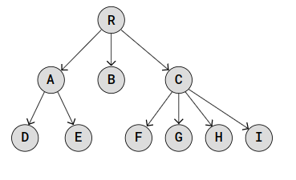

# Tree

## Sumário

- [O que é uma Tree?](#o-que-é-uma-tree)
- [Implementações](#implementações)
- [Referências](#referências)

## O que é uma Tree?

Uma **Tree** (ou **Árvore**)  é uma estrutura de dados em forma de árvore que se assemelha às [**Linked Lists**](https://github.com/FabioHenriqueFarias/algorithms-And-Data-Dtructures/tree/main/Data_Structures/2_Linked-List). Assim como nas listas encadeadas, cada nó em uma árvore contém dados e pode estar conectado a outros nós, formando uma estrutura hierárquica.

Como já discutimos anteriormente, algumas estruturas de dados possuem uma organização linear. Estruturas como [**Arrays**](https://github.com/FabioHenriqueFarias/algorithms-And-Data-Dtructures/tree/main/Data_Structures/1_Arrays), [**Linked Lists**](https://github.com/FabioHenriqueFarias/algorithms-And-Data-Dtructures/tree/main/Data_Structures/2_Linked-List) e [**Stacks**](https://github.com/FabioHenriqueFarias/algorithms-And-Data-Dtructures/tree/main/Data_Structures/3_Stack) seguem uma sequência, onde cada elemento é seguido por outro, formando uma cadeia ordenada de dados.

Essas estruturas são consideradas lineares porque os elementos são organizados em uma linha reta, um após o outro. Isso significa que há um início e um fim claros, e cada elemento tem um único sucessor (exceto o último) e um único antecessor (exceto o primeiro). Essa linearidade facilita a navegação sequencial através dos elementos, mas pode limitar a flexibilidade em termos de como os dados podem ser acessados e manipulados.

Em uma árvore, entretanto, um único elemento pode ter vários elementos 'filhos', permitindo que a estrutura de dados se ramifique em várias direções. Isso torna a organização de uma árvore muito mais flexível. Em vez de seguir uma sequência linear, como nas estruturas de dados lineares, um nó em uma árvore pode estar conectado a múltiplos nós, criando uma estrutura hierárquica. Essa hierarquia permite representar relações mais complexas entre os dados, como as relações de parentesco em uma árvore genealógica ou a estrutura de diretórios em um sistema de arquivos.

## Implementações

## Referências