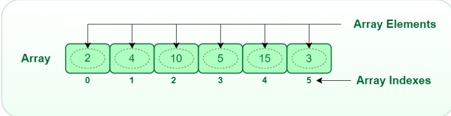
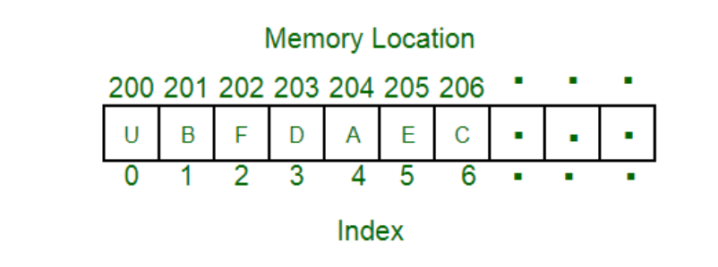
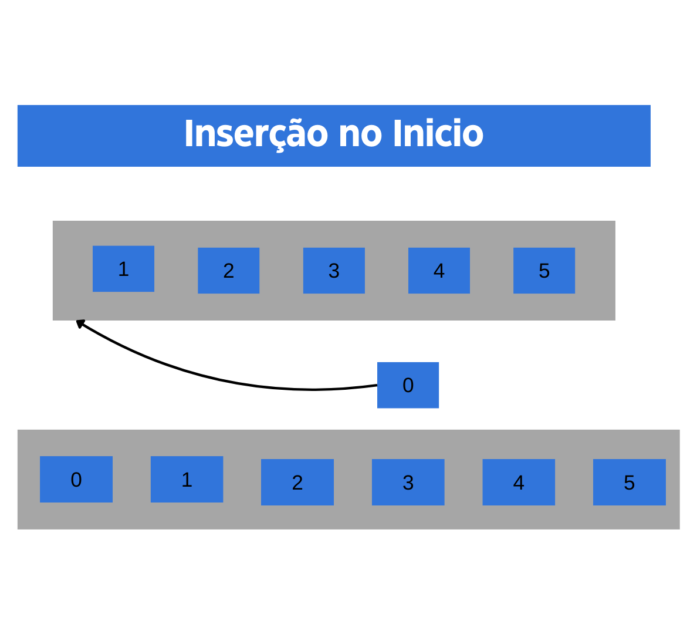
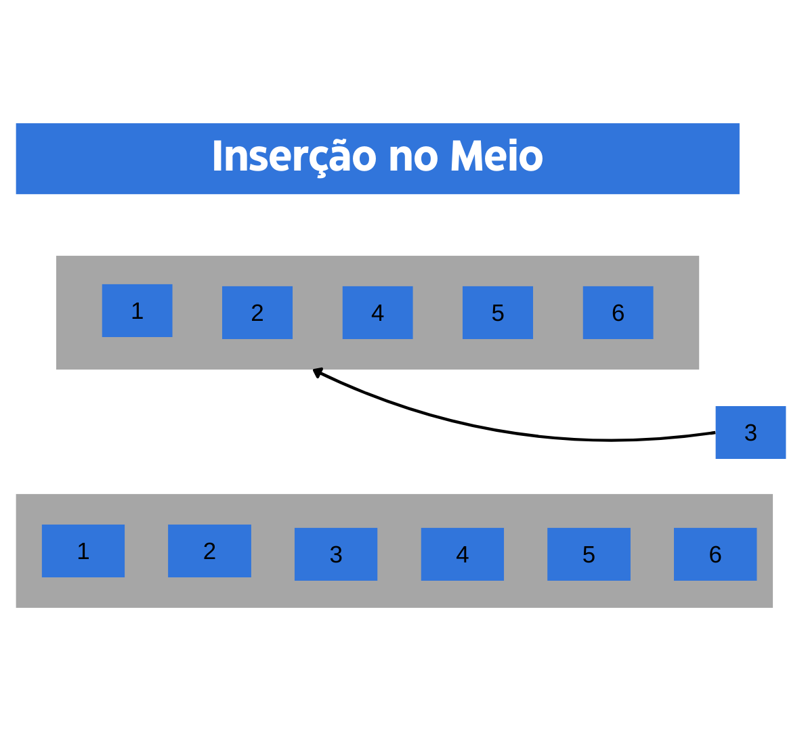
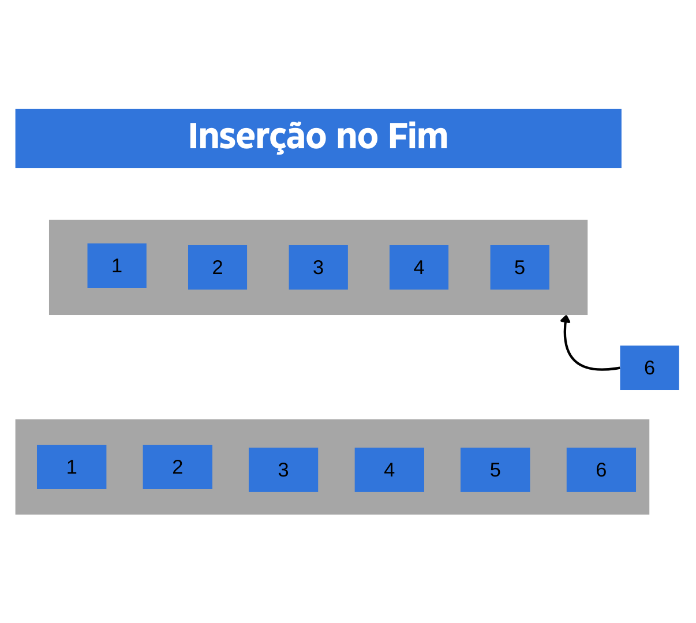
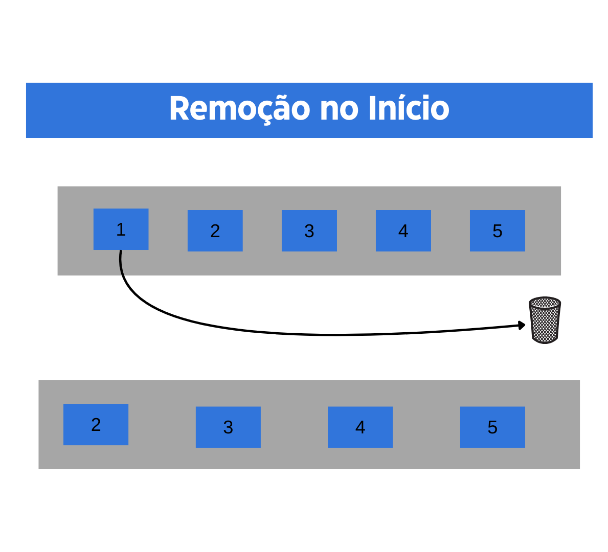
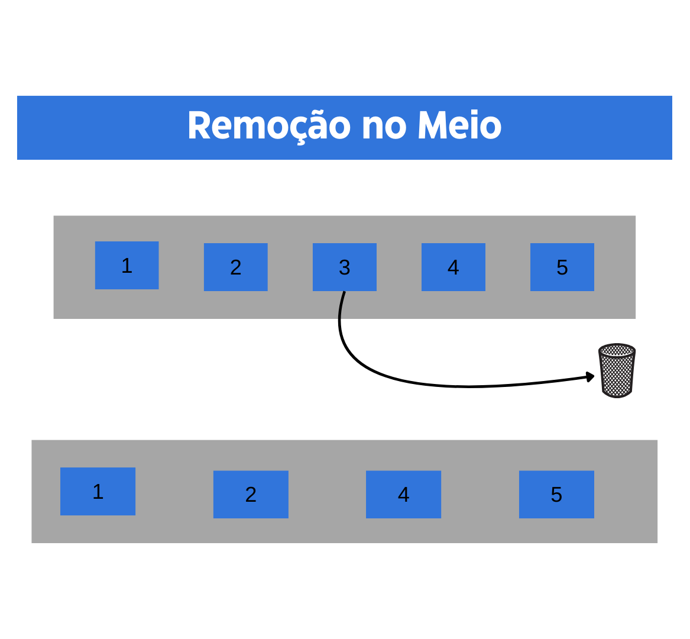
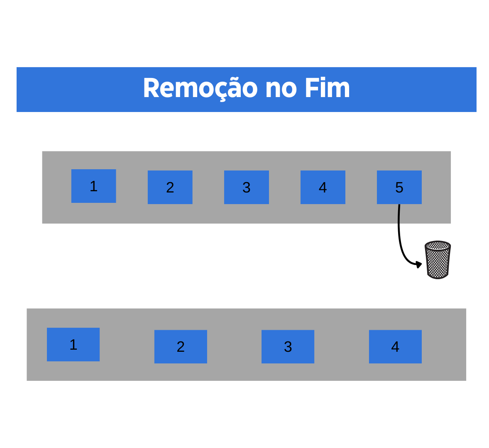

# Arrays

## Sumário

- [O qué é um Array?](#o-qué-é-um-array)
- [Armazenamento em Memória de um Array](#armazenamento-em-memória-de-um-array)
- [Um array possui um tamanho fixo?](#um-array-possui-um-tamanho-fixo)
- [Arrays Multidimensionais: Explorando Múltiplas Dimensões](#um-array-possui-um-tamanho-fixo)
- [Operações comuns em Arrays](#operações-comuns-em-arrays)
    - [Inserção](#inserção)
        - [Inserção no Início](#inserção-no-início)
        - [Inserção no Meio](#inserção-no-meio)
        - [Inserção no Fim](#inserção-no-fim)
    - [Remoção](#remoção)
        - [Remoção no Início](#remoção-no-início)
        - [Remoção no Meio](#remoção-no-meio)
        - [Remoção no Fim](#remoção-no-fim)
    - [Leitura](#leitura)
- [Referências](#referências)

## O qué é um Array?

> Um Array é uma coleção de itens do mesmo tipo de dados armazenados em locais de memória contínuos 

Podemos imaginar um array como uma sequência de degraus de uma escada, onde cada degrau contém um valor específico. Analogamente, podemos associar cada valor a um amigo diferente. Para acessar um amigo específico, precisamos contar os degraus até chegar ao amigo desejado.

Assim como subimos ou descemos os degraus para alcançar um determinado amigo, percorremos os elementos do array para encontrar o valor desejado.

Na imagem, podemos visualizar uma representação de um array, que é uma lista contínua de valores. 
Cada elemento está associado a uma posição específica, chamada de índice. 
Esses índices servem como referências para acessar e manipular os valores ou elementos dentro do array. 
Assim, podemos pensar no array como uma série ordenada de elementos, onde cada elemento possui sua própria posição identificável.

Dessa forma, calcular a posição de cada elemento torna-se simples, bastando adicionar um deslocamento ao valor base, que é a localização na memória do primeiro elemento do array (geralmente indicado pelo nome do array). O valor base é o índice 0, e a diferença entre os índices é o deslocamento. Isso significa que podemos determinar a posição de qualquer elemento dentro do array adicionando o deslocamento ao índice desejado, o que facilita o acesso e a manipulação dos elementos.

## Armazenamento em Memória de um Array

Levando em consideração que ao acessar o primeiro valor da memória conseguimos percorrer todo o array, é crucial abordar um aspecto importante: o deslocamento.

> A localização do próximo índice depende do tipo de dados que usamos

O próximo índice no array depende do tipo de dados que estamos lidando.  Se estamos lidando com o tipo `int` na linguagem C, por exemplo, cada elemento consumirá de 4 a 8 bytes, dependendo da arquitetura do sistema. 

Isso influencia diretamente a quantidade de memória requerida para armazenar cada elemento do array. Portanto, ao levar em conta a estrutura e o tamanho dos dados, podemos calcular com precisão a posição de cada índice subsequente no array. Essa precisão é fundamental para assegurar uma manipulação precisa e eficiente dos dados dentro do array, contribuindo para um código robusto e livre de erros.

## Um array possui um tamanho fixo?

Em uma lista que acessa cada valor de memória sequencialmente, é necessário determinar um limite para evitar a sobregravação de elementos já armazenados.

Então, em linguagens como C e Java, é necessário determinar um limite de memória que um array pode acessar. Isso é feito ao declarar o tamanho do array durante sua criação. Esse tamanho fixo define a quantidade máxima de elementos que o array pode armazenar e acessar. Essa abordagem é crucial para garantir que o programa não acesse áreas de memória não alocadas, prevenindo assim erros de segmentação ou falhas de memória.

Mas então, em linguagens como Python e JavaScript, é possível incrementar elementos em um array sem a necessidade de definir um limite inicial. O que geralmente ocorre é que elas implementam uma estratégia dinâmica de gerenciamento de memória para os arrays. Ao criar um array, um tamanho inicial é alocado na memória. Quando esse array atinge sua capacidade máxima, em vez de resultar em um erro de estouro de memória, essas linguagens realocam automaticamente mais espaço para o array.

Essa realocação geralmente envolve a criação de um novo array com capacidade maior, comumente o dobro do tamanho do array original, e então copiando os elementos do array antigo para o novo. Esse processo acontece nos bastidores, sem a necessidade de intervenção direta do programador.

Essa abordagem oferece flexibilidade e conveniência ao lidar com arrays de tamanho variável, permitindo que os desenvolvedores se concentrem na lógica do programa sem se preocupar com a gestão manual da memória.

## Arrays Multidimensionais: Explorando Múltiplas Dimensões

Os arrays têm a capacidade de possuir múltiplas dimensões, o que significa que podem conter outras arrays aninhadas, formando uma estrutura de dados mais complexa. Isso possibilita a criação de arrays bidimensionais, tridimensionais e até mesmo arrays com um número arbitrário de dimensões. Cada dimensão adicionada oferece uma nova camada de organização e acesso aos dados, permitindo representar informações de forma mais estruturada e matricial.

Essa capacidade de trabalhar com arrays multidimensionais é especialmente útil em problemas que envolvem dados tabulares, imagens, representações espaciais e muitas outras aplicações onde a organização em várias dimensões é necessária para uma modelagem precisa e eficiente.

Entretanto, isso acarreta em uma complexidade maior tanto para acessar quanto para armazenar esses dados. À medida que adicionamos mais dimensões aos arrays, a gestão e manipulação dos elementos torna-se mais intricada. O acesso aos dados requer a especificação de índices para cada dimensão, o que pode aumentar a complexidade do código e exigir uma compreensão mais profunda da estrutura do array.

Isso implica que o armazenamento de dados em arrays multidimensionais pode consumir mais recursos de memória, especialmente quando lidamos com arrays de grande tamanho ou com múltiplas dimensões. Esse aumento no consumo de memória pode impactar diretamente o desempenho do programa, uma vez que pode levar a uma utilização mais intensiva dos recursos do sistema. Como resultado, é necessário realizar uma cuidadosa análise e consideração do equilíbrio entre eficiência e complexidade na implementação de arrays multidimensionais.

## Operações comuns em Arrays

### Inserção

Operações de inserção de elementos dentro de um array podem ser trabalhosas em alguns casos.

#### Inserção no Início

A inserção no início de um array é uma operação que pode demandar esforço, uma vez que requer o deslocamento de todos os elementos em uma posição para abrir espaço para o novo elemento. Esse deslocamento pode ser computacionalmente custoso, especialmente em arrays de grande tamanho, pois exige a realocação de cada elemento existente para posições subsequentes.

Esta operação é frequentemente utilizada quando a ordem dos elementos no array é importante e o novo elemento precisa ser adicionado no início da sequência.

Isso faz com que a complexidade de inserção no início seja linear, representada por `O(n)`, onde "n" é o número de elementos no array. Isso ocorre porque, para inserir um novo elemento no início, é necessário percorrer todo o array para deslocar cada elemento uma posição para a direita, a fim de abrir espaço para o novo elemento. Assim, quanto maior o tamanho do array, maior será o tempo necessário para realizar essa operação de inserção no início.

#### Inserção no Meio

A inserção de um elemento no meio de um array também é uma operação trabalhosa, pois mais uma vez requer o deslocamento de todos os elementos subsequentes. Assim como na inserção no início, inserir um elemento no meio implica em mover todos os elementos à direita da posição de inserção para criar espaço para o novo elemento.

Essa movimentação de elementos torna a inserção no meio uma operação com complexidade linear `O(n)`, com tempo proporcional ao número de elementos no array. Portanto, quanto maior o array, mais demorada será essa operação.

#### Inserção no Fim

A inserção de um elemento no fim de um array não é tão trabalhosa quanto nas outras posições. Isso ocorre porque não é necessário deslocar nenhum outro elemento para abrir espaço, uma vez que o novo elemento será adicionado após o último elemento existente.

Dessa forma, a inserção no fim é uma operação que tende a ser mais eficiente, especialmente em termos de tempo, em comparação com a inserção no meio ou no início do array. Em muitos casos, essa operação pode ser realizada em tempo constante `O(1)`, independentemente do tamanho do array, desde que haja espaço disponível na memória para acomodar o novo elemento.

#### Complexidades de Inserção

| Inserção | Complexidade |
|---|---|
| Início | O(n) |
| Meio | O(n) |
| Fim | O(1) |

### Remoção

Operações de remoção de elementos dentro de um array também podem apresentar desafios em alguns casos.

#### Remoção no Início

A remoção no início de um array é uma operação que pode demandar esforço, uma vez que requer o deslocamento de todos os elementos em uma posição para cobrir o espaço do elemento removido. Esse deslocamento pode ser computacionalmente custoso, especialmente em arrays de grande tamanho, pois exige a realocação de cada elemento existente para posições anteriores.

Essa realocação é necessária para manter a ordem dos elementos no array após a remoção. Portanto, quanto maior o tamanho do array, mais tempo pode ser necessário para realizar essa operação.

Essa operação possui uma complexidade de tempo de `O(n)`, onde "n" representa o número de elementos no array. Isso significa que o tempo necessário para executar a remoção no início aumenta linearmente com o número de elementos no array.

#### Remoção no Meio

A remoção no meio de um array é uma operação que pode demandar esforço considerável, pois requer o deslocamento de todos os elementos subsequentes em uma posição para preencher o espaço do elemento removido. Esse deslocamento pode ser computacionalmente custoso, especialmente em arrays de grande tamanho, onde a quantidade de elementos a serem deslocados pode ser significativa.

Essa realocação de elementos existentes para posições anteriores é necessária para manter a ordem dos elementos no array após a remoção. Quanto maior o tamanho do array, maior será o tempo necessário para realizar essa operação, já que o número de elementos a serem deslocados aumenta com o tamanho do array.

Portanto, a remoção no meio possui uma complexidade de tempo de O(n), onde "n" representa o número de elementos no array. Isso significa que o tempo necessário para executar a remoção no meio aumenta linearmente com o número de elementos no array.

#### Remoção no Fim

A remoção no fim de um array geralmente demanda menos esforço computacional em comparação com a remoção no início ou no meio. Isso ocorre porque, ao remover o último elemento do array, não é necessário deslocar nenhum outro elemento, já que não há elementos subsequentes que precisem ser movidos para preencher o espaço deixado pela remoção.

Na imagem acima, ilustra-se a remoção no fim de um array, onde apenas o último elemento é removido, sem a necessidade de deslocamento de outros elementos.

Portanto, a remoção no fim é uma operação que, na maioria dos casos, possui uma complexidade de tempo constante, representada por O(1). Isso significa que o tempo necessário para executar a remoção no fim será o mesmo, independentemente do tamanho do array.

#### Complexidades de Remoção

| Remoção | Complexidade |
|---|---|
| Início | O(n) |
| Meio | O(n) |
| Fim | O(1) |

### Leitura

A operação de leitura de um array não demanda muito esforço computacional.

Isso acontece porque, ao acessar um elemento específico do array, o acesso direto à posição de memória onde o elemento está armazenado é realizado, o que constitui uma operação de tempo constante, representada por `O(1)`. Portanto, o tempo necessário para ler um elemento do array não aumenta à medida que o tamanho do array cresce.

Essa característica torna a leitura de um array uma operação eficiente e rápida, independentemente do tamanho do array.

## Referências

Geek for Geeks: <a href="https://www.geeksforgeeks.org/what-is-array/">O que é um Array?</a>

Rajput-Ji: <a href="https://www.geeksforgeeks.org/how-do-dynamic-arrays-work/">How do Dynamic arrays work?</a>

Livro: <a href="https://novatec.com.br/livros/entendendo-algoritmos/">Entendendo Algoritmos</a>
