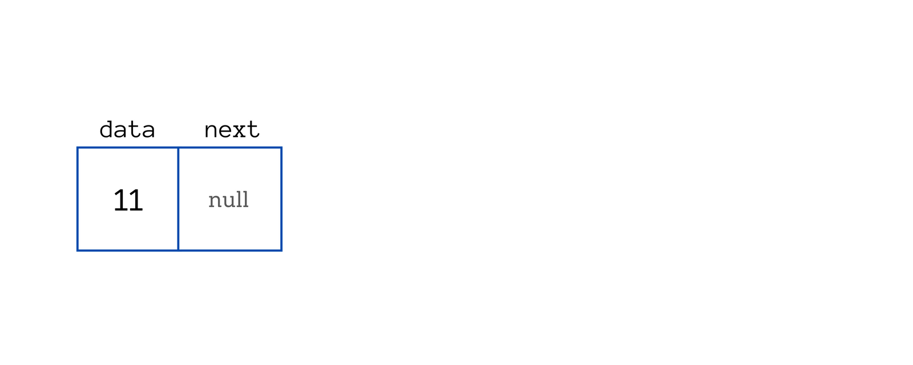

  # Linked List

## Sumário

- [O que é uma Linked List?](#o-que-é-uma-linked-list)
- [O que é um Nó?](#o-que-é-um-nó)
- [Vincular os nós em uma lista encadeada](#vincular-os-nós-em-uma-lista-encadeada)
- [Operações comuns em Listas Encadeadas](#operações-comuns-em-listas-encadeadas)
     - [Inserção de um Novo Nó](#inserção-de-um-novo-nó)
     - [Remoção de um Nó Existente](#remoção-de-um-nó-existente)
     - [Leitura da Lista](#leitura-da-lista)
- [Referências](#referências)


**Os Exemplos serão exemplificados em Linguagem C.**
> Neste repositorio possui como fazer uma Linked List em três linguagens C, Javascript e Rust.

## O que é uma Linked List?

Uma lista encadeada é uma estrutura de dados linear usada para armazenar uma coleção de elementos. Ao contrário dos arrays, as listas encadeadas usam nós para armazenar elementos que não estão armazenados em locais de memória contíguos.

Uma lista encadeada é uma estrutura de dados que consiste em uma sequência de elementos, chamados de nós. Cada nó contém dados e um ponteiro (ou referência) para o próximo nó na lista. Essa característica de "vinculação" entre os nós é fundamental para a estrutura, permitindo que os elementos sejam organizados de forma dinâmica na memória.

Ao contrário de estruturas de dados estáticas, como arrays, onde os elementos são armazenados em posições contíguas de memória, os nós de uma lista encadeada podem estar dispersos em diferentes locais da memória. Isso confere flexibilidade à lista, pois novos elementos podem ser adicionados ou removidos de forma eficiente, sem a necessidade de realocação contígua de memória.

Essa flexibilidade torna as listas encadeadas uma escolha popular em muitas aplicações, especialmente quando o tamanho da lista é desconhecido antecipadamente ou sujeito a alterações frequentes. No entanto, é importante notar que o acesso aos elementos em uma lista encadeada pode ser menos eficiente do que em estruturas de dados estáticas, já que o acesso sequencial pode exigir a travessia de todos os nós anteriores até chegar ao desejado.


Aqui você pode ver que os endereços dos nós não são necessariamente sequenciais imediatamente. O primeiro nó tem um endereço 200 e o segundo nó tem um endereço 801, em vez de 201 como seria de esperar.

Então, como os nós são armazenados linearmente?

Mesmo que os nós não estejam em uma memória contígua, os nós são armazenados linearmente através de links. Cada nó possui o endereço do nó seguinte. É assim que cada nó pode acessar o nó seguinte.

## O que é um Nó?

Um Nó (Node) é a unidade básica de uma lista encadeada (Linked List) em computação.  Imagine a lista como uma corrente onde cada elo é um Nó.



Cada Nó possui pelo menos dois componentes:

- Dados: Essa é a informação que o Nó armazena. Pode ser um número, um texto, um objeto, ou qualquer tipo de dado que a Lista precisa armazenar.

- Referência (pointer): Esta referência aponta para o próximo Nó na lista. É o que dá o sentido de "ligação" à Lista Ligada, pois une os Nós sequencialmente.

Cada Nó é ligado formando uma lista encadeada. Veja como pode ser criado um Nó:

```
struct Node {

    int data;           // Dados armazenados no Nó
    struct Node* next;  // Ponteiro para o próximo Nó
};
```
A struct Node representa um nó em uma lista encadeada, com duas variáveis: data (mantém os dados armazenados no nó) e next (mantém uma referência ao próximo nó na lista).

Agora você pode criar nós e adicionas dados a eles:

```
int main() {

    // Criando novos Nós
    struct Node* newNode1 = (struct Node*)malloc(sizeof(struct Node));
    struct Node* newNode2 = (struct Node*)malloc(sizeof(struct Node));
    struct Node* newNode3 = (struct Node*)malloc(sizeof(struct Node));

    // Verificando se a alocação de memória foi bem-sucedida
    if (newNode1 == NULL || newNode2 == NULL || newNode3 == NULL) {
        printf("Erro: Falha ao alocar memória para o novo Nó.\n");
        return 1;  // Encerra o programa com código de erro
}

    // Atribuindo valores aos dados do Nó
    newNode1->data = 11;     
    newNode2->data = 18;     
    newNode3->data = 24;  

    // Inicialmente, o próximo Nó é NULL
    newNode1->next = NULL;   
    newNode2->next = NULL;   
    newNode3->next = NULL;   
}
```

Crianmos 3 nós.


## Vincular os nós em uma lista encadeada

Após criar e adicionar os dados nos nós, é necessário estabelecer as ligações entre eles para formar a lista encadeada.

Para conectar os nós em uma lista encadeada, o processo envolve atribuir o endereço de memória do próximo nó ao ponteiro next do nó atual. Isso cria uma cadeia de referências que conecta cada nó ao seu sucessor na lista.

Por exemplo, suponha que temos três nós, newNode1, newNode2, e newNode3, com dados distintos armazenados neles. Para vincular esses nós, podemos usar a seguinte abordagem:

```
newNode1->next = newNode2;
newNode2->next = newNode3;
```

Nesse caso, newNode1 aponta para newNode2 como seu próximo nó, e newNode2 aponta para newNode3. Isso cria uma sequência ordenada em que cada nó conhece o próximo nó na lista.


## Operações comuns em Listas Encadeadas

Algumas Operações comuns em listas encadeadas.

### Inserção de um Novo Nó
Para inserir um novo nó em uma lista encadeada, geralmente é necessário atualizar os ponteiros dos nós vizinhos para que o novo nó seja corretamente inserido na sequência. Existem diferentes abordagens para inserção, como no início, no final ou em uma posição específica da lista.

Operações de adicionar nós tem uma complexidade **O(1)** pois exigem apenas uma modificação do ponteiro do nó anterior para indicar o próximo nó.

### Remoção de um Nó Existente
Para remover um nó de uma lista encadeada, é necessário ajustar os ponteiros dos nós vizinhos para "pular" o nó a ser removido. Após isso, o nó removido pode ser liberado da memória para evitar vazamentos de memória.

Operações de remoção de nós também possui uma complexidade de **O(1)** pois é necessário mudar apenas o endereço para o qual o elemento anterior está apontando. 

### Leitura da Lista
Na leitura da lista, o objetivo é acessar um elemento específico na lista.

Operações de leitura já possuem uma complexidade linear ***O(n)***  pois para acessar determinado elemento é necessario percorrer toda a lista, você precisa visitar cada nó uma vez.

| - | Complexidade |
|---|---|
| Escrita | O(1) |
| Remoção | O(1) |
| Leitura | O(1) |


Embora essa abordagem garanta que o elemento será encontrado, em alguns casos pode ser desejável implementar estratégias mais eficientes, como manter um índice dos elementos para acesso direto ou usar uma estrutura de dados diferente que permita acesso mais rápido aos elementos desejados.

## Referências

Palistha: <a href="https://www.freecodecamp.org/news/how-linked-lists-work/" target="_blank" >How Does a Linked List Work?</a>

João Arthur Brunet: <a href="https://joaoarthurbm.github.io/eda/posts/linkedlist/" target="_blank" >Listas Ligadas (LinkedList)
</a>


Thomas Cormen - <a href="https://www.amazon.com.br/Algoritmos-Teoria-Pr%C3%A1tica-Thomas-Cormen/dp/8535236996" target="_blank">Algoritmos: Teoria e Prática | Capítulo 10.2
</a>